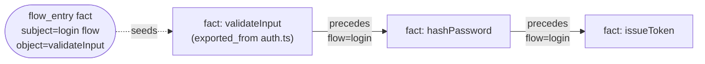
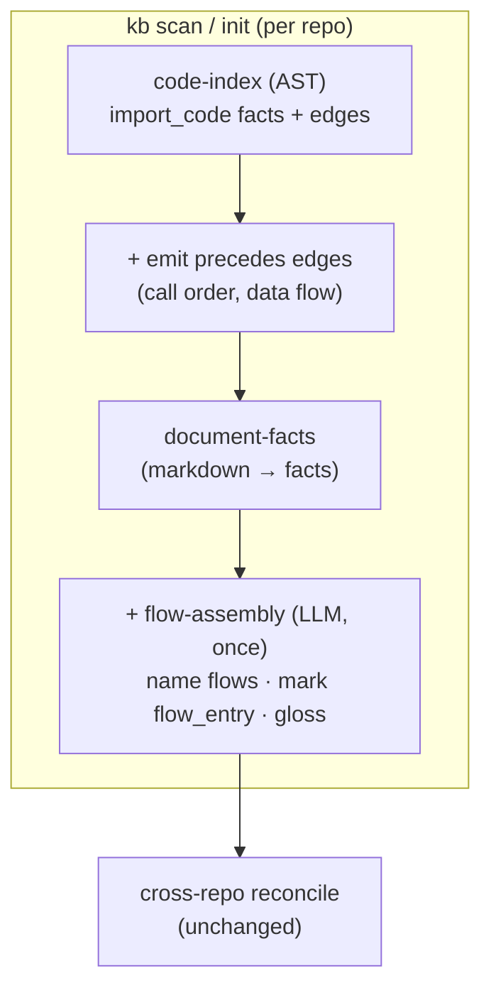
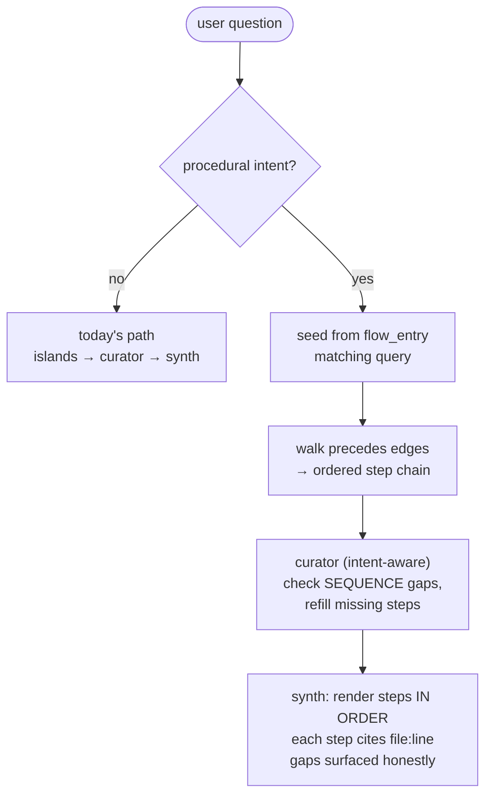

<!-- SCRATCH: throwaway design note for the Flow Facts feature. Delete after merge. -->

# Flow Facts — playbook

**Status:** Proposed · **Owner:** chat quality · **Bump:** docs-only until code lands

## TL;DR

Procedures fail today because facts encode *truth* but not *order*. We add **one
new edge kind — `precedes`** — plus a thin **flow-entry** marker, emit them at
**scan time** from the AST, and **walk** them at query time to assemble an ordered
runbook. The expensive "figure out the sequence" work moves offline and is
amortized; query time stays cheap retrieval. No live code reading.

---

## 1. Data model — one edge, one marker

We reuse the existing `facts` + `fact_edges` tables. No new tables.

| Addition | Where | Meaning |
|---|---|---|
| `fact_edges.type = 'precedes'` | existing edge table | happens-before between two code facts, tagged with a `flow` label (group id) |
| predicate `flow_entry` | existing facts table | names a procedure + its entry symbol; the retrieval seed |
| optional `gloss` on step fact | fact metadata | plain-language framing, precomputed (audience win, no query-time rewrite) |

A **procedure = the ordered `precedes` chain sharing a `flow` label**, rooted at a
`flow_entry`. Nothing else changes shape.

---

## 2. Discovery (scan) impact

`precedes` edges are emitted deterministically from the AST during **`code-index`**
(intra-function call order + obvious produce→consume). A new **flow-assembly**
cycle runs once, offline, after code-index — the *only* LLM step — to name
coherent flows, mark `flow_entry`, and optionally write glosses. Incremental:
re-runs only for changed files, like the rest of scan.

**Cost:** deterministic `precedes` is nearly free (already walking the AST).
Flow-assembly is one bounded LLM pass per changed file, cached — this is the
"pay once offline" bet.

---

## 3. Query impact

A **procedural intent gate** routes how-to questions down an ordered-walk path.
Everything else keeps today's behavior untouched.

- **Retrieval** becomes a cheap graph-walk over precomputed order, not a re-derivation.
- **Curator** gains a second job in this mode: detect *missing steps* (a `precedes`
  gap), not just off-topic facts — reuses its existing bounded re-discovery.
- **Synthesis** renders in edge order; unbacked steps are marked, never fabricated.
- **Audience:** if `gloss` present and the asker is non-technical, serve glosses —
  zero extra query-time passes.

---

## 4. Rollout

| Phase | Ships | Query behavior |
|---|---|---|
| **1 — edges** | `precedes` type + AST emission + backfill on scan | none yet (data only) |
| **2 — walk** | intent gate + seeded ordered walk + ordered synthesis | procedural answers get real order |
| **3 — assembly** | offline flow naming, `flow_entry`, glosses | seeds get precise; audience switch |
| **4 — curator** | sequence-gap logic + eval axis for procedures | gaps refilled, honest coverage |

Each phase is independently shippable and inert without the next.

---

## 5. Invariants & risks

- **Backward compatible:** no `precedes` edges → query path is exactly today's.
- **Incremental or bust:** flow-assembly must key on file hash; never full-repo re-LLM.
- **AST honesty:** dynamic dispatch / async gaps → low-confidence edge, mark the step
  "unverified," don't invent order.
- **Curator rule holds:** assembly/curation decisions stay out-of-band; only the
  ordered facts enter the synthesis prompt.
- **Coverage tradeoff:** precomputed order can't cover every ad-hoc question. Fallback
  is "distill better offline," never "read code live."

## 6. The payoff

Same or fewer facts than today, but **ordered** — so procedural answers stop being
a re-sequencing gamble under latency. Reasoning is amortized to scan; serving stays
thin. This is the token/speed moat, made concrete.
