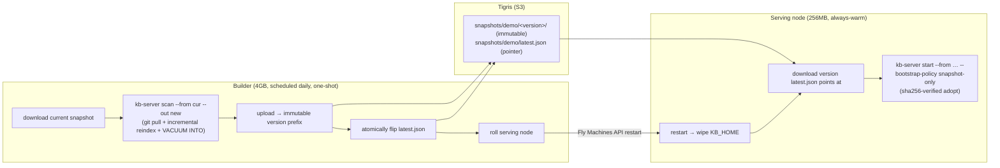

# Fly.io build-to-serve orchestration for the kb chat demo

This is the automated, corruption-safe orchestration behind
[`https://kb-demo.fly.dev`](https://kb-demo.fly.dev). It splits the demo into a
cheap always-warm **serving node** and a daily one-shot **builder**, so the
expensive index build never happens on the machine answering chat, and the
served index can never be torn or corrupted.

It serves **many bases** from one process: the golden default `demo` (this repo)
plus one base per eval-suite repo. The full set is the committed manifest
[`scripts/fly/bases.json`](scripts/fly/bases.json), generated from
`eval/suites/*.yaml` by [`scripts/fly/gen-bases.mjs`](scripts/fly/gen-bases.mjs)
(deduped by repo, excluding the repo-neutral `generic`/`course` packs). The
builder builds and publishes each base independently; the serving node downloads
them all and the chat demo picks one per request via `X-KB-Base`.

It is a concrete Fly.io mapping of the vendor-agnostic
[build-to-serve handoff model](packages/kb-server/HANDOFF.md).

## What runs where

| | Serving node (`kb-demo`) | Builder (`kb-demo-builder`) |
|---|---|---|
| Config | [`fly.toml`](fly.toml) | [`fly.builder.toml`](fly.builder.toml) |
| Size | `shared-cpu-1x` / **1024MB**, always-warm | `shared-cpu-2x` / **4GB**, daily one-shot |
| Volume | **none** (stateless) | none (ephemeral `/work`) |
| Command | [`scripts/fly/serve-entrypoint.sh`](scripts/fly/serve-entrypoint.sh) | [`scripts/fly/refresh.sh`](scripts/fly/refresh.sh) |
| Bases | imports **all** of [`bases.json`](scripts/fly/bases.json) (default via `start --from`, rest via verified `import`) | builds + publishes **each** base in [`bases.json`](scripts/fly/bases.json) |
| Policy | `--bootstrap-policy snapshot-only` (frozen: no git, no reindex) | `auto` (clones/pulls + indexes) |
| Cost | one tiny machine 24/7 | ~minutes of 4GB per day |

Both run the **same image** ([`Dockerfile.fly`](Dockerfile.fly)); the Fly config
picks the command and VM size.

## The daily loop



1. **Rescan (builder).** The scheduled 4GB machine downloads the current
   snapshot, then `kb-server scan --from cur --out new` adopts it, `git pull`s
   every tracked repo, incrementally reindexes only what changed, and exports a
   fresh snapshot via SQLite `VACUUM INTO` (one consistent `.kb-index.sqlite`,
   no WAL sidecars, sha256 recorded in `kb-snapshot.json`).
2. **Publish (builder).** It uploads the fresh snapshot to an **immutable**
   `snapshots/demo/<version>/` prefix, then — as the single commit point —
   atomically overwrites the tiny `snapshots/demo/latest.json` pointer.
3. **Swap (builder → serving).** It calls the Fly Machines API to restart the
   serving machine(s) **one at a time**, waiting for `/healthz` `ok:true` before
   touching the next. Restart re-runs the serving entrypoint, which wipes
   `KB_HOME`, downloads the version `latest.json` now points at, and warm-starts
   frozen. The old machine keeps serving until the new one is healthy.
4. **Stop (builder).** `refresh.sh` exits; the scheduled machine stops until the
   next day.

## Why it cannot corrupt the index (your requirement #4)

Corruption windows come from writing an index in place or sharing a live volume.
This design has neither:

- **No shared/live volume.** The serving node has **no volume at all** — it is a
  pure function of the latest snapshot. The builder works only on its own
  ephemeral `/work`. Two machines never touch one SQLite file.
- **Atomic, consistent snapshots.** `VACUUM INTO` takes a read transaction and
  folds the WAL into a single file, so an export is safe even against a live
  writer and yields exactly one `.kb-index.sqlite`.
- **Immutable versions + atomic pointer.** Readers only ever see a
  fully-uploaded `snapshots/demo/<version>/` prefix; the pointer flip is a single
  small-object PUT. A torn or half-uploaded snapshot is never pointed at.
- **Verified on adopt.** `kb-server import` / `start --from` verify the
  manifest's sha256 before serving and refuse an incompatible or corrupt
  snapshot **before binding the port** — a bad byte fails loudly (non-zero exit)
  instead of reaching users.
- **Health-gated swap.** The old serving machine drains only after the new one
  reports `ok:true`.

## Downtime (your requirement #3)

- **1 serving machine (default):** a few seconds during its restart —
  `snapshot-only` boot only downloads + opens SQLite (no index build).
- **2+ serving machines:** **zero downtime** — the builder rolls them one at a
  time behind Fly's load balancer. To get this, raise `min_machines_running`
  and scale the serving app to 2; no other change needed.

## One-time setup

```bash
# 0. Provider key on both apps
fly secrets set -a kb-demo GEMINI_API_KEY=...

# 1. Tigris bucket for snapshot transport (injects AWS_* + BUCKET_NAME secrets)
fly storage create --app kb-demo

# 2. Serving app (stateless; no volume to create)
fly deploy -a kb-demo -c fly.toml

# 3. Builder app — shares the image, gets bucket access + a deploy token so it
#    can roll the serving app
fly apps create kb-demo-builder
fly deploy -a kb-demo-builder -c fly.builder.toml
fly storage update <tigris-id> --app kb-demo-builder      # or copy AWS_*/BUCKET_NAME secrets
fly secrets set -a kb-demo-builder \
    GEMINI_API_KEY=... \
    SERVE_APP=kb-demo \
    FLY_API_TOKEN="$(fly tokens create deploy -a kb-demo --expiry 8760h | tail -n1)"

# 4. Seed all bases (cold build) + create the daily scheduler machine (4GB)
fly machine run . -c fly.builder.toml -a kb-demo-builder \
    --schedule daily --restart no --vm-memory 4096 \
    bash /app/scripts/fly/refresh.sh
```

The first builder run takes the **cold path** for every base (no `latest.json`
yet): for each base in [`bases.json`](scripts/fly/bases.json) it boots
`kb-server start` to clone that base's repo and build, then exports and
publishes. Every subsequent daily run takes the cheap **warm path**
(`scan --from cur`) per base. Because each base is isolated, a single flaky
clone leaves that base's previous snapshot live while the rest still refresh.

To seed immediately without waiting for the first schedule tick, run the machine
once on demand (the first full cold build of ~10 repos takes a while):

```bash
fly machine run . -c fly.builder.toml -a kb-demo-builder --rm --vm-memory 4096 \
    bash /app/scripts/fly/refresh.sh
```

### Bases

The base set is data-driven from the eval suites. To add or remove a base, edit
`eval/suites/*.yaml` and regenerate the manifest, then redeploy the builder:

```bash
node scripts/fly/gen-bases.mjs        # rewrite scripts/fly/bases.json
node scripts/fly/gen-bases.mjs --check # verify it is up to date (CI-friendly)
```

## Deploying an update in your org (worked example)

This is the exact flow used to grow the public demo from a **single `demo` base**
into a **multi-base** deployment that indexes every eval-suite repo — reuse it
whenever you roll a change (new bases, a bigger builder, a schedule change) into
your own copy. The apps/bucket/secrets already exist; this is an *upgrade*, not a
first-time setup. Two facts make it safe:

- `fly deploy` builds from your **local checkout**, so you can deploy from a
  branch without merging. Merging to `main` only republishes the static chat page
  ([`.github/workflows/pages.yml`](.github/workflows/pages.yml)).
- The default base keeps its snapshot prefix, so its existing snapshot stays
  valid; new bases only *add* `snapshots/<name>/`. The serving node **skips bases
  that aren't built yet**, so nothing breaks mid-rollout.

**1. Point the manifest at the repos you want** (org deployers swap the eval
suites for their own repos — edit `eval/suites/*.yaml` or hand-edit
`scripts/fly/bases.json`), then regenerate + sanity-check:

```bash
node scripts/fly/gen-bases.mjs
node scripts/fly/gen-bases.mjs --check   # 0 exit ⇒ manifest committed & fresh
```

**2-4. Ship builder + serving, recreate the scheduler, seed every base** — one
command, [`scripts/fly/deploy.sh`](scripts/fly/deploy.sh), does all of it:

```bash
scripts/fly/deploy.sh            # deploy builder, recreate scheduler, deploy serving, seed all bases
scripts/fly/deploy.sh --no-seed  # skip the immediate seed; bases populate on the next daily tick
```

It deploys `kb-demo-builder` (`-c fly.builder.toml`), destroys and recreates the
scheduled machine (`--schedule daily --restart no`; the vm size/memory comes
from `fly.builder.toml`'s `[[vm]]` block, not a CLI flag — a scheduled machine
pins its image *and* size, so destroy+recreate is how it picks up both), deploys
`kb-demo` (`-c fly.toml`), then seeds every base immediately instead of waiting
for the schedule (publishes each and auto-rolls the serving node onto the full
set). Override the app names with `SERVE_APP=... BUILDER_APP=...` if you're
running this against your own copy. Watch the seed with:

```bash
fly logs -a kb-demo-builder     # a base that fails to clone is skipped, others proceed
```

**5. Verify**, then merge to republish the page:

```bash
curl -s https://<serve-app>.fly.dev/healthz | jq            # ok:true
curl -s https://<serve-app>.fly.dev/v1/bases | jq '.bases[].name'   # all bases present
```

Open the chat page, confirm the header **base picker** lists every base, switch
base, and click a Source link — it should point at *that base's* repo (proof the
per-base `/v1/bases` repos wired through). During the first seed the page works
with just the default base until the rest finish — expected.

## Configuration knobs

Set as env/secrets on the relevant app.

| Var | Where | Default | Meaning |
|---|---|---|---|
| `BUCKET_NAME`, `AWS_ACCESS_KEY_ID`, `AWS_SECRET_ACCESS_KEY`, `AWS_ENDPOINT_URL_S3` | both | from `fly storage create` | Tigris / S3 transport |
| `KB_BASE` | both | `demo` | default base name (fallback when `bases.json` has no `default`) |
| `BASES_MANIFEST` | both | `scripts/fly/bases.json` | the base set to build/serve |
| `SNAPSHOT_ROOT` | both | `snapshots` | object-store root; each base lives at `<root>/<base>` |
| `SNAPSHOT_KEEP` | builder | `6` | immutable versions retained **per base** |
| `SNAPSHOT_NO_REPOS` | builder | `true` | ship tiny serve-only snapshots (drops working trees); set `false` for full trees |
| `SERVE_APP` | builder | — | serving app to roll |
| `FLY_API_TOKEN` | builder | — | deploy token scoped to `SERVE_APP` |
| `SERVE_HEALTH_URL` | builder | `https://<SERVE_APP>.fly.dev/healthz` | health gate for the roll |
| `COLD_BUILD_TIMEOUT` | builder | `1800` | seconds to wait for each base's cold build |

The repo each base indexes is read from `bases.json`, not an env var — cold
builds clone per-base.

Using a non-Tigris S3 endpoint (R2/MinIO/AWS): set the same `BUCKET_NAME` +
`AWS_*` vars — the transport in [`scripts/fly/lib.sh`](scripts/fly/lib.sh) is a
thin AWS-CLI wrapper you can point anywhere (or swap for `rclone`/`gsutil` in one
place).

## Operate

```bash
fly logs -a kb-demo                 # serving node
fly logs -a kb-demo-builder         # last builder run
fly machine list -a kb-demo-builder # the scheduled machine (stopped between runs)
curl -sS https://kb-demo.fly.dev/healthz   # ok:true when serving a snapshot

# Force a refresh now (outside the daily schedule):
fly machine run . -c fly.builder.toml -a kb-demo-builder --rm --vm-memory 4096 \
    bash /app/scripts/fly/refresh.sh
```

## Files

| Path | Role |
|---|---|
| [`fly.toml`](fly.toml) | serving app (256MB, stateless, snapshot-only) |
| [`fly.builder.toml`](fly.builder.toml) | builder app (4GB, scheduled one-shot) |
| [`Dockerfile.fly`](Dockerfile.fly) | shared image: server + AWS CLI + `scripts/fly` |
| [`scripts/fly/bases.json`](scripts/fly/bases.json) | committed base manifest (default + one per eval-suite repo) |
| [`scripts/fly/gen-bases.mjs`](scripts/fly/gen-bases.mjs) | regenerate `bases.json` from `eval/suites/*.yaml` |
| [`scripts/fly/serve-entrypoint.sh`](scripts/fly/serve-entrypoint.sh) | serving boot: wipe → import every base → warm-start frozen on the default |
| [`scripts/fly/refresh.sh`](scripts/fly/refresh.sh) | builder: for each base rescan → publish → prune, then roll once |
| [`scripts/fly/deploy.sh`](scripts/fly/deploy.sh) | one command: deploy builder + recreate scheduler + deploy serving + seed all bases |
| [`scripts/fly/roll-serving.mjs`](scripts/fly/roll-serving.mjs) | health-gated rolling restart via Fly Machines API |
| [`scripts/fly/lib.sh`](scripts/fly/lib.sh) | shared config + S3 transport helpers |

## Related docs

- Handoff model → [`packages/kb-server/HANDOFF.md`](packages/kb-server/HANDOFF.md)
- Single-app Fly guide (superseded by this two-app split) → [`packages/kb-server/FLY.md`](packages/kb-server/FLY.md)
- Server availability semantics → [`packages/kb-server/src/SERVER.md`](packages/kb-server/src/SERVER.md)
