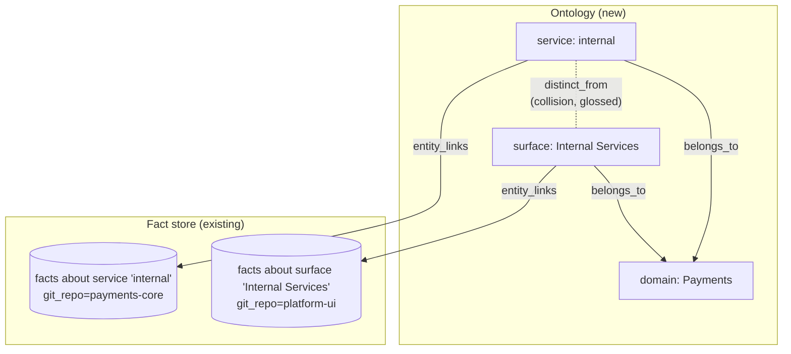
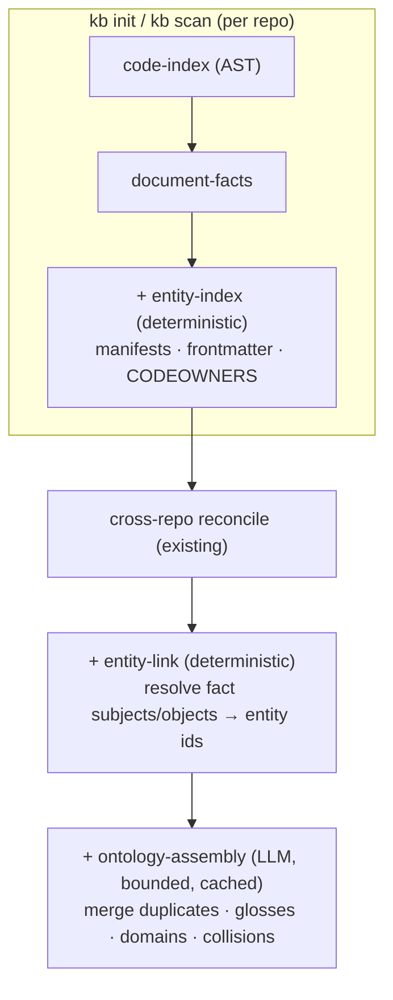
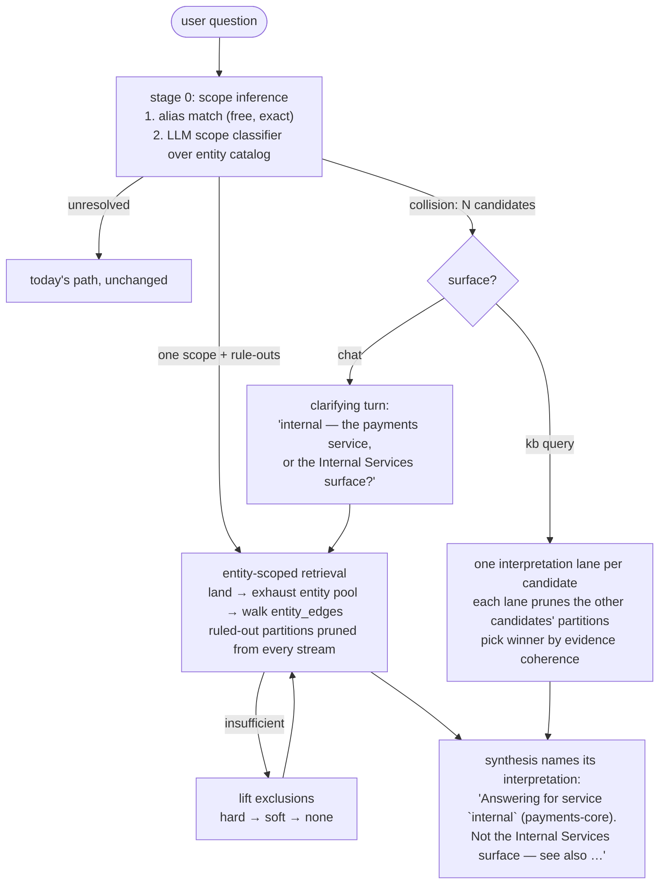

# Organizational Ontology Index — nomenclature & disambiguation

**Status:** Proposed · **Motivating issue:** [#167 — KB conflates issues](https://github.com/rosenjcb/kb/issues/167)

## TL;DR

KB conflates similarly named things — a microsurface called **"Internal Services"**
and a service called **"internal"** collapse into one blurry answer — because the
index has **no concept of named organizational things**. Subjects and objects on
fact rows are raw strings, retrieval scopes only by `git_repo`, and scoring leans
on token overlap, which *rewards* the collision instead of resolving it.

The fix is not a smarter prompt. It is a **new indexing layer**: a canonical
**entity registry** (domains → services → surfaces → repos → modules) with
aliases, collision detection, and fact↔entity links — built at scan time, then
used at query time as a **scope-inference first step**: infer which
domain/service/api the question is about *before retrieving*, land the walk in
that partition, and **rule out** the partitions it is provably not about, so
the walk never spends budget in the wrong neighborhood. Repo-level scoping
already proved the pattern (land → exhaust → walk edges); this plan generalizes
it from "which repo" to "which named thing" — and adds the negative direction.

---

## 1. Why queries conflate today

The failure in #167 is structural, and every stage compounds it:

| Stage | Mechanism today | How it conflates |
|---|---|---|
| **Ingest** | `facts.subject` / `object` are free-text strings from triplet extraction; the "graph" (`kb graph`) is derived by string equality over those columns | `"internal"` and `"Internal Services"` are two unrelated strings — nothing records that they are *different things*, or even that they are *things* |
| **Query expansion** | `expandQueryWithGraph()` widens via `LIKE` on `facts.subject`/`object` | `%internal%` matches **both** entities, actively pulling the wrong neighborhood into the query string |
| **Scoring** | Doc facts: `overlapScore × 0.45` (token overlap) | Every token of the query "internal" appears in "Internal Services" facts — overlap scoring can't tell a substring collision from a match |
| **Scoping** | Deep walk lands in the strongest hit's `git_repo`, exhausts it, then walks repo edges | The *only* organizational unit retrieval understands is the repo. If both entities live in one repo — or the wrong repo wins the landing — there is no finer boundary to hold the walk |
| **Curation** | Fact curator judges topical relevance per fact | It has no signal that half the pool belongs to a *different entity that happens to share a name* |
| **Synthesis** | Answers from the merged pool | The answer silently blends two things, and never states which one it thought you meant |

The one-line diagnosis: **we index which repo knowledge came from, but not what
thing the knowledge is about.** Repos are the only first-class citizens. Services,
domains, surfaces, teams, APIs — the vocabulary people actually query with — exist
only as recurring strings.

---

## 2. The vision: knowledge indexed at every organizational level

Introduce an **Organizational Ontology Index** alongside facts: a small, curated
graph of *named things* at every level of the org, each with a canonical name,
kind, aliases, a gloss, and links to the facts that mention it.



Levels, top-down:

| Level | Kind | Where it comes from |
|---|---|---|
| Org / domain | `domain` | Ontology assembly (LLM, offline), OKF frontmatter, directory conventions |
| Team / owner | `team` | CODEOWNERS, OKF metadata |
| Service / app | `service` | Deploy + manifest signals: `package.json` names, docker-compose service keys, k8s manifests, Backstage `catalog-info.yaml`, Terraform, fly.toml, OpenAPI `info.title` |
| Surface / product area | `surface` | Docs headings, OKF `title`/`tags`, ontology assembly |
| Repo | `repo` | Already known (`git_repo`, repo slugs in `storage/`) — becomes an entity node so one scoping mechanism covers all levels |
| Module / API | `module`, `api` | Exported symbol clusters, OpenAPI paths, package boundaries |

Two hard rules carried over from the facts-first architecture:

- **Deterministic first, LLM second.** Manifest/AST/frontmatter extraction is
  free and runs every scan; the LLM pass (consolidation, glosses, domain
  grouping) is bounded, offline, cached by content hash — the same
  "pay once offline" bet as flow-assembly.
- **Inert without data.** No entities in the base → every query path behaves
  exactly as today.

---

## 3. Data model

Four small tables next to `facts` (SQLite, same `.kb-index.sqlite`, normal
`db-migrations.ts` migration):

```sql
CREATE TABLE entities (
  id             TEXT PRIMARY KEY,
  kind           TEXT NOT NULL,        -- domain|team|service|surface|repo|module|api
  canonical_name TEXT NOT NULL,
  gloss          TEXT,                 -- one-line "what this is", disambiguation-grade
  git_repo       TEXT,                 -- home repo slug when applicable
  source_kind    TEXT NOT NULL,        -- manifest|frontmatter|codeowners|assembly|manual
  content_hash   TEXT,                 -- incremental skip, like tree-sitter indexing
  confidence     REAL NOT NULL DEFAULT 0.9,
  tombstoned_at  TEXT,
  created_at     TEXT NOT NULL,
  updated_at     TEXT NOT NULL
);

CREATE TABLE entity_aliases (
  entity_id  TEXT NOT NULL REFERENCES entities(id) ON DELETE CASCADE,
  alias      TEXT NOT NULL,            -- "internal-svc", "int. services", "IS"
  normalized TEXT NOT NULL,            -- match key (lowercase, de-punctuated)
  source     TEXT NOT NULL,            -- manifest|docs|assembly|manual
  confidence REAL NOT NULL DEFAULT 0.8,
  PRIMARY KEY (entity_id, normalized)
);

CREATE TABLE entity_edges (
  from_entity_id TEXT NOT NULL,
  to_entity_id   TEXT NOT NULL,
  edge_type      TEXT NOT NULL,        -- belongs_to|owned_by|part_of|depends_on|distinct_from
  gloss          TEXT,                 -- for distinct_from: the contrastive sentence
  weight         REAL NOT NULL DEFAULT 1.0,
  created_at     TEXT NOT NULL,
  PRIMARY KEY (from_entity_id, to_entity_id, edge_type)
);

CREATE TABLE entity_links (             -- fact ↔ entity, the load-bearing join
  fact_id    TEXT NOT NULL REFERENCES facts(id) ON DELETE CASCADE,
  entity_id  TEXT NOT NULL REFERENCES entities(id) ON DELETE CASCADE,
  role       TEXT NOT NULL,            -- subject|object|mention
  confidence REAL NOT NULL DEFAULT 0.8,
  PRIMARY KEY (fact_id, entity_id, role)
);
```

Notes:

- **`distinct_from` is the anti-conflation edge.** It is written whenever
  collision detection (§4) finds confusable names, and its `gloss` is the
  contrastive sentence retrieval and synthesis will lean on: *"`internal` is a
  backend service in `payments-core`; `Internal Services` is a UI microsurface
  in `platform-ui`. They are unrelated."*
- Repos become entity rows (`kind='repo'`) so the existing repo-scoped walk and
  the new entity-scoped walk are one mechanism with one edge vocabulary —
  cross-repo `fact_edges` (`depends_on_repo` etc.) stay, entity edges layer above.
- No new FTS table: mention matching goes through `entity_aliases.normalized`
  exact/prefix lookup, which is precisely the point — **entity resolution must be
  higher-precision than the fuzzy channels it disambiguates.**

---

## 4. Scan-time: three new cycles

Slot into the existing per-repo cycle order (`code-index` → `document-facts` →
`import-docs` → `write`), then after cross-repo reconciliation:



1. **`entity-index`** — deterministic candidate harvest. Walk manifest-class
   files (package manifests, compose/k8s/Backstage/Terraform/fly, OpenAPI, OKF
   frontmatter, CODEOWNERS) and emit entity rows + aliases with provenance.
   Content-hashed per file for incremental skip, exactly like the tree-sitter
   indexer.
2. **`entity-link`** — resolve `facts.subject`/`object` (and high-signal
   mentions in `fact_text`) against `entity_aliases.normalized`; write
   `entity_links`. Longest-alias-match wins so `"internal services"` binds to
   the surface *before* `"internal"` can claim the substring. Unresolved
   frequent subjects are recorded as **candidate entities** for assembly to
   review — this is how the ontology grows beyond what manifests declare.
3. **`ontology-assembly`** — the only LLM step, offline and cached. Merges
   duplicate candidates ("payments-svc" == "Payments Service"), writes glosses,
   proposes `belongs_to` domain groupings, and — critically — runs **collision
   detection**: any two entities whose names/aliases are substrings, acronyms,
   or near-duplicates of each other but which manifest evidence says are
   different things get a `distinct_from` edge with a contrastive gloss.

Collision detection is cheap and deterministic at candidate level (normalized
substring / edit-distance screen); the LLM only writes the human-grade gloss.

### 4a. Ecosystem harvesters — the `entity-index` internals, TS first

`entity-index` is a registry of per-ecosystem **harvesters**, the same shape as
`LANG_CONFIGS` in the tree-sitter indexer: a routing map in front, declarative
deterministic extraction behind, one entry per ecosystem. `LANG_CONFIGS`
answers "what symbols does this *file* declare"; a harvester answers "what
*deployable things* does this repo declare." The contract is small and pure:

```ts
harvest(fileSet) → { candidates, aliases, edges }   // deterministic, no LLM
```

Signal tiers, strongest first — each tier degrades to the one below when its
inputs are missing, bottoming out at repo-level (today's behavior):

| Tier | Signal | Language-dependence |
|---|---|---|
| 1 | Deploy/infra manifests: compose service keys, k8s names, Backstage `catalog-info.yaml`, `fly.toml`, Procfiles | **None** — ops artifacts converged even though web frameworks didn't |
| 2 | Package manifests: `package.json`, `go.mod`, `Cargo.toml`, `pyproject.toml` | Small fixed set per ecosystem |
| 3 | Interface contracts: OpenAPI, protobuf `service` blocks, GraphQL schemas | None, when present |
| 4 | In-code route/decorator AST queries | Per-framework, **optional enrichment only** — best-effort, low-confidence, never load-bearing; frameworks it can't parse lose endpoint granularity, nothing else |

**TypeScript harvester (first entry).** In order: workspace topology
(`pnpm-workspace.yaml` / `workspaces` / turbo / nx) enumerates packages — the
candidate atoms; `package.json` supplies identity (`name`), gloss material
(`description`), and classification features (`bin` ⇒ cli, server frameworks in
deps + `start` script ⇒ service, `react`/`next` ⇒ surface, `exports` only ⇒
library) fed to a deterministic kind rubric — a decision table, not an LLM;
then the **infra join**: a compose/k8s entry whose build context contains a
package is the *same entity* — merged aliases, raised confidence — which
resolves most multi-name cases before assembly ever runs. Optional tier-4
enrichment adds NestJS decorator / literal-route queries to the existing TS
grammar config. Everything emits with provenance and per-file content hashes.

**Dogfood acceptance test:** run against this monorepo, the harvester must
emit `@kb/client` (cli, alias `kb`), `@kb/server` (service, alias
`kb-server`), `@kb/core` (library) — ground truth we already know.

Support will be uneven across ecosystems, by design: a language with no
harvester simply never resolves past repo level and keeps today's behavior.
That asymmetry is acceptable because of the additivity contract (§8a).

---

## 5. Query-time: infer scope first, then retrieve

The through-line: **the first step of every query is scope inference** — work
out which domain / service / api / surface the question is about *before any
fuzzy retrieval runs* — and use the verdict both ways: land the walk in the
right partition, and **rule out** the partitions the question is provably not
about. `entity_links` is what makes rule-out possible at all: it partitions the
fact pool by entity, so "not about Internal Services" becomes a set of fact ids
the walk never has to visit.

### Stage 0 — scope inference

Two tiers, cheap-first:

1. **Deterministic mention resolution** — `resolveQueryMentions()`:
   longest-alias match of the query text against `entity_aliases.normalized`.
   Free, exact, catches every query that names a known thing.
2. **LLM scope classifier** — when nothing matched (or matches collide), one
   bounded routing call over the **entity catalog** — kinds, canonical names,
   one-line glosses; a compact routing table, not the fact store. It returns
   a verbal confidence label per candidate scope ("this is a deploy question
   about the payments domain; it is certainly not about the platform-ui
   surface"). Cached by `query_fingerprint`, logged like lane-routing events —
   the same shape as the existing `retrieval_lane_routing_events` machinery.

The classifier does **not** emit numeric confidence — LLM probability numbers
are noise. It emits a **multiclass verbal label per candidate scope**, and a
deterministic gate maps labels to actions.

### Confidence gates (multiclass labels, not scores)

Each candidate entity in the verdict gets exactly one label:

| Label | Meaning | Effect on retrieval |
|---|---|---|
| `very_confident` | The query is about this scope | Land here; **hard-prune** partitions labeled `certainly_incorrect`; soft-penalize the rest |
| `confident` | Probably this scope | Land here; **soft prune only** (score penalty on non-scope partitions) — no hard exclusion anywhere |
| `unsure` | Can't tell | No scoping effect from this candidate |
| `very_unsure` | Probably not, but can't rule out | No scoping effect — explicitly **not** an exclusion signal |
| `certainly_incorrect` | The query is provably not about this scope (e.g. it names a `distinct_from` sibling) | Eligible for hard exclusion — but **only** when some other candidate is `very_confident` |

The verdict travels with the query envelope as
`{ candidates: [{entityId, label}], unresolved }`.

Two rules make the gate safe, and they are the whole point:

- **No positive identification → no exclusions.** If nothing reaches
  `very_confident`/`confident` — the classifier couldn't sniff out the initial
  surface(s) — the verdict is discarded wholesale and retrieval runs exactly
  today's path. `certainly_incorrect` labels alone never prune anything: ruling
  out requires first ruling *in*.
- **Hard pruning needs both ends:** a `very_confident` landing *and* a
  `certainly_incorrect` exclusion. Anything softer than that pair degrades to
  score penalties, which evidence can overcome.

Deterministic alias hits skip the classifier and enter the gate as
`very_confident` (exact unique match) or as a collision (N candidates → §lanes).

**Un-pruning is the safety valve:** if the walk ends `insufficient` or the
sufficiency judge balks, exclusions lift progressively (hard → soft → none) and
the walk resumes — a wrong scope verdict costs iterations, never the answer.
Scope verdicts, per-candidate labels, and any un-pruning are recorded
out-of-band and shown in `--trace`. Label calibration gets its own eval check
(§rollout phase 6): seeded off-scope queries must land `unsure`, not
`certainly_incorrect`.



Note what ambiguity lanes become under this framing: each candidate's lane
**prunes the other candidates' partitions**, so the two interpretations of
"internal" retrieve from disjoint evidence pools and the coherence comparison
is honest — today they'd raid each other's facts and both look plausible.

### Concrete changes, mapped to existing seams

| Seam | Change |
|---|---|
| **`expandQueryWithGraph()`** (`graph-query-expansion.ts`) | Becomes **entity-guarded**: when a mention resolves, expansion draws only from the resolved entity's `entity_links` neighborhood — the `LIKE '%internal%'` blowup dies here. Unresolved queries keep today's behavior. |
| **Deep walk** (`facts-query-research-orchestrator.ts`) | Landing generalizes from `git_repo` to **entity scope**: land in the resolved entity's fact pool, exhaust it, then walk `entity_edges` (then repo edges) outward. Ponds seeded from the entity's aliases instead of raw token pairs. Ruled-out partitions are pruned from all five candidate streams per the confidence tiers above, with progressive un-pruning on insufficiency. |
| **Scope classifier** (new, stage 0) | One bounded LLM routing call over the entity catalog when alias matching comes up empty or collides; emits a multiclass label per candidate (`very_confident` … `certainly_incorrect`), gated deterministically per §confidence-gates, cached by `query_fingerprint`, logged alongside `retrieval_lane_routing_events`. No catalog → skipped entirely. |
| **Ambiguity lanes** | A detected collision spawns one retrieval lane per candidate — this reuses the existing hypothesis/lane machinery (`retrieval-lane-router.ts`, `retrieval_hypotheses`) rather than inventing a new loop. Winner picked by evidence coherence (score mass, graph connectivity); the losing interpretation is reported out-of-band and named in the answer. |
| **Scoring** | New term for entity-linked facts: `entityMatchScore` (1.0 exact canonical/alias binding to the resolved entity, 0 for facts linked to a `distinct_from` sibling) folded into the doc-fact formula; substring overlap with a *different* entity's name stops counting as relevance and starts counting **against**. |
| **Fact curator** (`fact-curator.ts`) | Gains an **entity-consistency check**: facts linked to a `distinct_from` sibling of the resolved entity are flagged for the judge with the contrastive gloss in the verdict prompt — the exact evidence it needs to hard-drop the wrong half of a conflated pool. Decisions stay out-of-band on `retrieval.curation`, per the existing rule. |
| **Chat** (`chat-synthesis.ts`) | Unresolved collisions become a **clarifying turn** instead of a silent guess — chat is multi-turn; asking is cheap and correct. `kb query` (one-shot) never blocks: it lanes, picks, and discloses. |
| **Synthesis** | The interpretation is stated in the answer, always, whenever resolution happened. Silent disambiguation is how trust dies; *"answering about X, not Y"* turns the failure mode in #167 into a feature. |

---

## 6. Operator surface

- **`kb entities`** — list/show entities (`--kind service`, `--entity internal`
  shows canonical name, kind, gloss, aliases, home repo, linked-fact count,
  collisions).
- **`kb entities collisions`** — the nomenclature audit: every `distinct_from`
  pair with glosses. This is the report that tells an org *"you have a naming
  problem between these six things"* — valuable even before query-time wiring
  lands.
- **`kb entities merge|alias|set`** — manual curation, preview-by-default with
  `--apply`, mirroring `kb graph` mutation safety. Assembly proposes; humans can
  correct; corrections are `source='manual'` and never overwritten by re-scans.
- **`kb graph`** upgrades from string-derived triplets to the real registry when
  entities exist.

---

## 7. Rollout

| Phase | Ships | Query behavior change |
|---|---|---|
| **1 — entity spine** | Migration (4 tables), `entity-index` + `entity-link` cycles, backfill on scan | none (data only) |
| **2 — nomenclature audit** | Collision detection, `distinct_from` + glosses, `kb entities` CLI | none — but operators can already *see* the #167 collisions |
| **3 — scope inference + guarded retrieval** | `resolveQueryMentions()`, LLM scope classifier over the entity catalog, multiclass confidence gates, entity-guarded expansion, entity-scoped landing, partition rule-out + un-pruning, interpretation named in answers | conflation drops on resolvable queries; walks stop spending budget in ruled-out partitions |
| **4 — ambiguity lanes** | Per-candidate lanes on collisions, chat clarifying turns, entity-aware curator, `entityMatchScore` | collisions handled explicitly, never silently |
| **5 — ontology assembly** | LLM consolidation, domain grouping, per-entity "card" rollup facts, publish disambiguation pages | domain-level questions get first-class answers |
| **6 — eval axis** | Nomenclature-collision eval suite: fixtures with seeded confusable names ("internal" vs "Internal Services"), a **conflation-rate** metric (answers mixing facts across `distinct_from` pairs), entity-on vs entity-off baseline comparison enforcing the additivity contract (§8a), label-calibration checks (seeded off-scope queries must land `unsure`, not `certainly_incorrect`), wired into the harness + dogfood | regression guard on all of the above |

Each phase is independently shippable and inert without the next; phase 2 alone
already pays for itself as an audit tool.

---

## 8. Invariants & risks

### 8a. Additivity contract

The whole layer must **enrich answers or leave them unchanged — never degrade
them**. That is a property we enforce, not one the design gets for free. The
gates in §5 already make the *classifier* fail toward inaction; the remaining
hazard is **partial-registry confidence**: a harvested TS service `billing`
binds a query cleanly while an un-harvested Python service `billing` is
invisible — a wrong binding caused by registry incompleteness, not classifier
error, which no confidence label can catch. Four rules close it:

1. **Unlinked facts are never prunable.** Only facts explicitly linked to an
   entity labeled `certainly_incorrect` may be excluded. Facts with no
   `entity_links` row — the entire un-harvested world — remain reachable by
   every candidate stream, always. Registry blind spots may slow an answer;
   they can never hide one.
2. **Coverage-aware confidence caps.** When harvest coverage for a base is low
   (few entities relative to repos / fact volume), resolutions cap at
   `confident` — soft penalties only, no hard pruning — until the registry has
   earned trust.
3. **Collisions screen against the unresolved pool.** A registry name that
   also appears as a frequent *unresolved* subject elsewhere in the fact store
   likely has an un-harvested twin: flag it and withhold `very_confident`
   binding instead of trusting it.
4. **The conflation-rate eval is the enforcement mechanism.** Phase 6's suite
   runs entity-on vs entity-off on the same fixtures; any query the layer
   answers *worse* than baseline is a regression, and the gate fails. Additive
   stays additive because CI says so, not because the design intends it.

### 8b. General invariants

- **Backward compatible:** empty ontology → byte-for-byte today's retrieval.
- **Precision over recall at the resolution gate:** a wrong entity binding is
  *worse* than no binding. Alias matching is exact/longest-match, never fuzzy;
  classifier output is verbal multiclass labels gated deterministically — no
  positive identification means no exclusions, ever, and `certainly_incorrect`
  alone never prunes without a `very_confident` counterpart.
- **Incremental or bust:** all three cycles key on content hashes; ontology
  assembly never re-LLMs an unchanged base.
- **Out-of-band stays out-of-band:** resolution traces, lane losers, and
  curator entity-drops go to `retrieval.*` telemetry and `--trace` dumps, never
  into the synthesis prompt (beyond the one disclosed interpretation line).
- **Ontology drift:** orgs rename things; scan-time re-harvest plus
  `supersedes`/tombstone semantics (same as facts) keep the registry current;
  manual rows are sacred.
- **Over-asking risk in chat:** clarify only on true collisions
  (`distinct_from` pairs with comparable evidence mass), not on every
  multi-candidate match — otherwise the feature nags.

## 9. The payoff

Issue #167 stops being possible to hit silently: either the query resolves and
the walk never leaves the right entity's neighborhood, or it collides and KB
*says so* — asks in chat, lanes-and-discloses in one-shot query. Beyond the bug,
KB gains the index layer it has been missing: knowledge organized by **what
things are called and how they nest** — repo-level scoping was the first rung;
services, surfaces, domains, and teams are the rest of the ladder.
