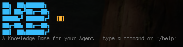

<p align="center">
  
</p>

<p align="center">
  <a href="#"></a>
  <a href="#"></a>
</p>

<h1 align="center">KB</h1>
<p align="center">A Knowledge Base for your Agent – see where your AI coding tokens go.</p>

KB is a local-first knowledge layer for development workflows.

It gives you a CLI and runtime that capture what your project learns over time—so decisions, fixes, and context don’t disappear into chat history or PR threads.

Instead of re-deriving the same answers, KB lets you:

Record decisions and facts as you work
Query past context before making changes
Validate assumptions against what’s already known

All of it lives alongside your code, versioned in Git, and queryable like a lightweight memory system.

## What it actually does

KB turns day-to-day development into a feedback loop:

* Capture — Save facts, decisions, and discoveries as you go
* Recall — Query relevant context when you need it
* Verify — Check assumptions before they turn into bugs

## Quick Start

### 1) Install and verify

```bash
pnpm install
pnpm run check
npm run refresh:global
npm run which:kb
```

### 2) Configure `~/.kb/config.json`
Provider is auto-detected from whichever key is present. To set one explicitly:

```bash
kb config set llm.provider openai
```

### 3) Set your KB base

```bash
kb base use dogfood            # switch the active base for this session
kb base use --default dogfood  # save a persistent default
kb base use --show             # show active base and config default
kb base delete ci-test --force # delete a base and all its data
```

Base resolution order (both live in `~/.kb/config.json`):
1. `activeBase` — current working base from `kb base use <base>`
2. `defaultBase` — persistent default from `kb base use --default <base>` (or `kb default <base>`)

Named bases store their SQLite data under `~/.kb/sessions/<base>/`.

Prerequisites are validated separately: if no base is configured you get a **knowledge base** error; if no LLM credentials/provider are available you get an **LLM** error (never combined as either/or). Canonical copy lives in `src/cli/cli-prerequisites.ts`.

### 4) Start using intent commands

```bash
kb submit "Document writer now supports sqlite index sync"
kb query "sqlite index sync behavior" --limit 5
kb validate "kb base use sets the active session base"
kb invalidate "kb use should persist across sessions" "kb base use is session-scoped; use kb base use --default to write a persistent default"
```

## CLI Reference

### Intent commands

```
kb submit "<fact>" [--domain ops] [--source runbook] [--target doc-id] [--output human|json]
kb validate "<fact>" [--domain ops] [--output human|json]
kb query "<topic>" [--limit 5] [--type decision] [--discovery shallow|deep] [--session] [--verbose] [--debug] [--output human|json]
kb explain "<change id|fact>" [--output human|json]
kb invalidate "<old-fact>" ["<replacement-fact>"] [--preview|--apply]
```

### Document browsing

```
kb docs list [--base <name>] [--limit <n>] [--output human|json]
kb docs view <document-id> [--base <name>]
kb docs view --title "<exact title>" [--base <name>]
```

### Other commands

```
kb base use <base>             — switch the active base for the current session
kb base use --default <base>   — save persistent default to ~/.kb/config.json
kb base use --show             — show active base and config default
kb base delete <base>          — delete a base and all its data (prompts unless --force)
kb config get
kb config set <key> <value>
kb config unset <key>
kb init [--base <name>] [--detach | --resume] [--stop-after <cycle>]
kb publish [options]
kb chat [--verbose] [--debug] [--base <name>]
```

### Notes

- `kb base use <base>` writes `activeBase` to `~/.kb/config.json` so future `kb` commands keep using that base until you switch again.
- `kb base use --default <base>` writes `defaultBase` to `~/.kb/config.json`.
- `kb base delete <base>` removes `~/.kb/sessions/<base>/` and clears it from config. Use `--force` to skip confirmation.
- `kb use <base>` still works as a backward-compatible alias for `kb base use <base>`.
- `kb init` defaults to base `default` if `--base` is omitted.
- Typing `kb --help` shows the full help message.
- **`kb query`** uses **deep** retrieval by default (same research path as **`kb chat`** QUERY turns); pass **`--discovery shallow`** for a lighter first pass when you need it.
- **`--session`** on **`kb query`** / **`kb explain`** opts into **`query-session.json`** under the active base (follow-up rewrite + enrichment context + append). Omit it for standalone questions so behavior matches chat (no silent LLM rewrite of your retrieval string).
- In **human** output, `kb query` and `kb chat` print a slim orchestration footer after the answer: **`retrieval>`**, **`matches>`**, then a single **`sources>`** line listing every matched document by **title** (or id if there is no title). Pass **`--verbose`** on the same invocation (before a chat session starts) to also print **`summary>`**, **`status>`**, and **`confidence>`**. Pass **`--debug`** for one detailed **`source>`** line per document (paths, snippets, highlights). **`--output json`** is unchanged. In the TUI shell, use `query "…" --verbose`, `chat --verbose`, `query "…" --debug`, or `chat --debug` as needed.

## Optional: SQLite Hybrid Search

Enable when your knowledge corpus grows and lexical search isn't enough.

### 1) Enable native SQLite dependency (if needed)

```bash
pnpm approve-builds --all
pnpm rebuild better-sqlite3
```

### 2) Verify

```bash
kb submit "SQLite hybrid search enabled for this workspace"
kb query "hybrid sqlite retrieval" --limit 5
```

If hybrid retrieval is unavailable or exceeds the latency budget, KB automatically falls back to lexical markdown query.

## Daily Workflow

```bash
kb query "topic"
kb submit "new fact" --target <doc-id>
kb validate "assumption I want to check"
```

## Agent skill: use KB while you develop

Shipped as a real Cursor-style skill (YAML frontmatter + full instructions):

- **Template:** [`skills/kb-dev-workflow/SKILL.md`](skills/kb-dev-workflow/SKILL.md)

The skill is self-contained (workflow + full command shapes). The [CLI Reference](#cli-reference) section above stays the in-repo quick reference for humans.

## Development Commands

```bash
pnpm run test
pnpm run type-check
pnpm run lint
pnpm run build
```

## Project Map

```text
src/core   — provider abstraction, intent loop, agent loop, runtime types
src/cli    — CLI entrypoint, intent command parsing, base selection, kb init
src/tools  — write/query tools, markdown + sqlite index integration
```
