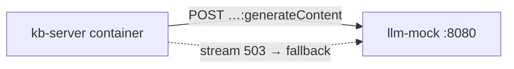

# WireMock LLM Sidecar

`llm-mock` in `docker-compose.yml` mounts this directory into `wiremock/wiremock:3.9.1`. Integration tests and CI point `GEMINI_API_BASE_URL` at `http://llm-mock:8080` so query, chat, and fact-judge paths exercise real HTTP without billing a provider.

## Role in the stack

`GeminiProvider` (`src/core/llm-provider.ts`) honors `GEMINI_API_BASE_URL`. `scripts/integration-test.mjs` **forces** mock URL + dummy key and clears other provider keys so local `.env` cannot bypass the stub.

## Mappings (`mappings/`)

| File | Priority | Matches | Returns |
|---|---|---|---|
| `generate-structured-json.json` | 10 | `POST` `…:generateContent` + `responseMimeType: application/json` | JSON doc stub in `candidates[0].content.parts[0].text` |
| `generate-text-default.json` | 1 | `POST` `…:generateContent` | Plain mock answer text |
| `stream-generate-fail.json` | 20 | `POST` `…:streamGenerateContent` | `503` — chat uses non-stream fallback |

**Path pattern:** Gemini REST uses a **colon** before the method, e.g. `/v1beta/models/gemini-2.5-flash:generateContent`. Stubs must use `urlPathPattern: "/v1beta/models/.*:generateContent"` — a slash before `generateContent` never matches and WireMock returns HTML 404 (`Request was not matched`), which breaks `response.json()` in the provider.

Query params (`?key=…`) are ignored by `urlPathPattern`; no change needed for `integration-mock-key`.

## Integration

- **Compose:** `docker-compose.yml` service `llm-mock`, volume `./docker/wiremock:/home/wiremock`.
- **Host debug:** port `18080` → container `8080` (`LLM_MOCK_PORT`).
- **Manual runs:** leave `GEMINI_API_BASE_URL` unset and set a real `GEMINI_API_KEY` in `.env` instead.

## Invariants

- Integration/CI must never require a real LLM secret — mock path is mandatory in `integration-test.mjs`.
- Any new Gemini endpoint the server calls in integration flows needs a matching stub here.
- Stubs return valid Gemini JSON shapes (`candidates`, `usageMetadata`) so `GeminiProvider` parsing succeeds.
- Changing mappings requires container recreate (`docker compose up --build`) to reload files.

## Extension checklist

1. Reproduce unmatched request via `docker compose logs llm-mock`.
2. Add mapping with correct `:methodName` path pattern and body matcher if needed.
3. Re-run `pnpm run integration:test`.

## Related docs

- [`../../http/HTTP.md`](../../http/HTTP.md) — suite that consumes these stubs
- [`../../scripts/INTEGRATION_TEST.md`](../../scripts/INTEGRATION_TEST.md) — env wiring
- [`../../src/core/llm-provider.ts`](../../src/core/llm-provider.ts) — `GEMINI_API_BASE_URL`
