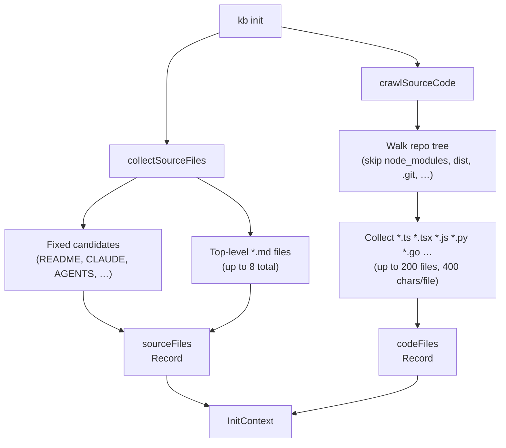
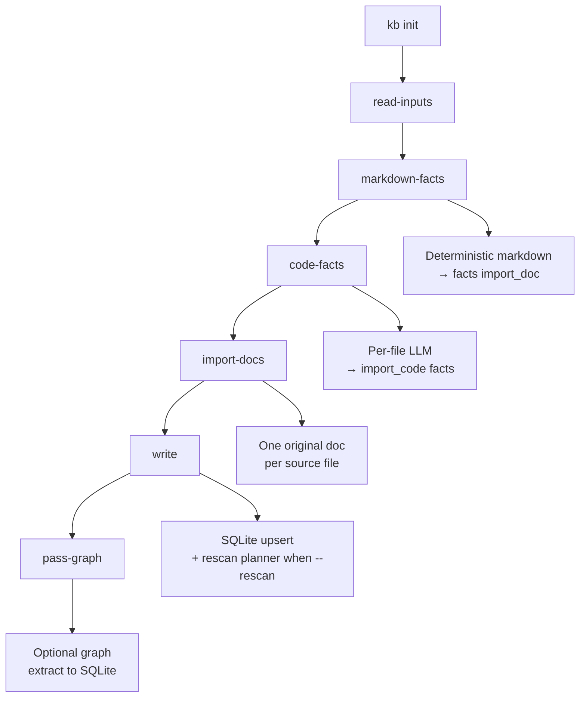

# KB Init Pipeline

`kb init` bootstraps a knowledge base from a repo. It runs **input collection** (README-like docs + optional source-code crawl), **`markdown-facts`** (deterministic sentence ingest from collected markdown into the `facts` table), **`code-facts`** (per-file LLM extraction into `import_code` facts), **`import-docs`** (one verbatim original SQLite doc per discovered markdown file), **`write`** (persist docs; with **`kb init --rescan`** this stage also plans/applies claim mutations), then **`pass-graph`** when enabled. There is **no** separate `kb scan` command — use **`kb init --rescan`** to refresh sources against an existing base.

## Input Collection

- `sourceFiles` — human-readable documentation files collected for **`import-docs`** (verbatim originals) and for **`markdown-facts`** / prompts.
- `codeFiles` — structural index of source code. Fed into **`code-facts`** extraction.

## Init cycles

## Jekyll Routing

After `kb publish jekyll`, documents are routed by provenance:

| `is_original` | Collection | Directory |
|---|---|---|
| `1` | `original_docs` | `_original_docs/` |
| `0` | `autogenerated_docs` | `_autogenerated_docs/` |

Originals are **frozen snapshots** of source files (we do not rewrite or “correct” them in the KB pipeline). Autogenerated docs are the **curated layer** we refine for retrieval and demos; they may overlap originals on purpose.

README.md is excluded from both — it is the site homepage (`docs/index.md`).

## Title Conventions

| Context | Rule | Example |
|---|---|---|
| Autogenerated docs | Cap Every Word (`toTitleCase`) | `"Project Overview"` |
| Original/source docs | Basename as-is (`basenameTitle`) | `"CLAUDE.md"` |
| Jekyll filenames | Slugified basename, no extension | `claude-instructions.md` |

## Facts extracted from written documents

When the init pipeline (or any path using **`SqliteDocumentWriter`**) persists markdown documents, the writer **indexes candidate facts** from document bodies (deterministic sentence segmentation, length filters, and capped inserts into the **`facts`** table). That is **incremental** fact growth alongside init; see **`facts-architecture.md`** §2 / §7 for the full ingest model.

## Code-derived facts

The **`code-facts`** cycle ([src/core/code-fact-extract.ts](code-fact-extract.ts)) makes source code a **first-class fact source** without mirroring the AST:

1. **Skeleton** — a deterministic regex pass per file extracts top-level exports, imports, and the leading doc block. The skeleton is used only as **prompt context** and as the **anchor namespace**; it does not write fact rows.
2. **LLM semantic pass** — one structured JSON call per file (system prompt: [src/prompts/code-fact-extract.md](../prompts/code-fact-extract.md)) returns a `module_summary` plus up to **`KB_CODE_FACTS_MAX_PER_FILE`** semantic facts. Each fact carries a `triplet` (subject/predicate/object) and an `anchor` that is either `module` or one of the symbols from the skeleton.
3. **Repair-friendly upsert** — every row is stored with `source_kind = 'import_code'` and `source_ref = code:<path>@<anchor>#<contentHash>`. On re-run we group prior rows by `<path>@<anchor>` (via `SqliteKbIndexer.listActiveFactsBySourceRefPrefix`) and:
   - identical normalized text → no-op (dedupe in `upsertFact`),
   - reworded text → tombstone the old rows and insert the new one with `supersedes_fact_id`,
   - anchor missing in the new payload → tombstone all rows for that anchor.
4. **Rescan** — `kb init --rescan` reads `code-facts-manifest.json` (per-base sidecar) and only re-extracts files whose `sha256` changed. The per-anchor diff guarantees that unchanged files don't churn the `facts` table.

Budget knobs (env, sane defaults): `KB_CODE_FACTS_MAX_FILES=40`, `KB_CODE_FACTS_PER_FILE_CHARS=6000`, `KB_CODE_FACTS_MAX_CONCURRENCY=4`, `KB_CODE_FACTS_MAX_PER_FILE=8`. The graph builder (`rebuildFactGraph`) consumes the new triples directly — there is **no separate AST table**.

## Configuration Constants

| Constant | Value | Purpose |
|---|---|---|
| `MAX_SOURCE_SIZE` | 20 000 chars | Per-file cap for documentation files |
| `SOURCE_CODE_PER_FILE_CHARS` | 400 chars | Per-file snippet length for code crawl |
| `SOURCE_CODE_MAX_FILES` | 200 | Max source files indexed |
| `SOURCE_CODE_MAX_TOTAL_CHARS` | 60 000 chars | Total code index budget |
| `INIT_SOURCE_SHARD_MAX_FILES` | (see code) | Max shards when expanding |
| `INIT_SOURCE_SHARD_MAX_CHARS` | 8 000 chars | Per-shard content cap |
