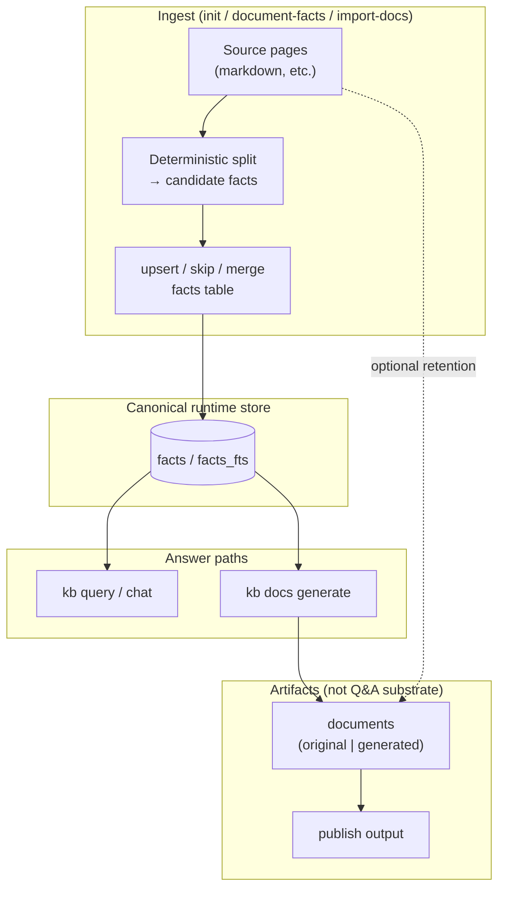

# Facts-first KB architecture

**Contract:** the KB answers questions and drives authoring from **atomic facts** in the `facts` store. **Markdown documents are not a retrieval substrate for Q&A.** They exist as human-readable artifacts: originals (with facts extracted from them) or generated synthesis, and they matter most at **publish** time.

This is the platform mental model for `kb query`, `kb docs generate`, ingest (`kb init` / `kb scan`), and `kb publish`.

---

## 1. Facts are the only “live” knowledge for answering

| Surface | Role |
|--------|------|
| **`facts` / `facts_fts`** | Canonical store for retrieval, dedupe keys (`normalized_text`), provenance (`source_kind`, `source_ref`), tombstones, lanes. |
| **`kb query` / chat** | **Target:** form answers **only** from retrieved facts (plus graph neighborhood over fact-linked entities)—not from full document bodies as evidence. |
| **`kb docs generate`** | **Target:** generate documents **from facts** (questionnaire + LLM shaping), cite facts; documents are outputs, not inputs to retrieval. |

---

## 2. Ingest: init / `kb scan` → facts, not “index pages for hybrid search”

**Target pipeline** when reading source pages (README, docs, crawled markdown, etc.):

1. **Deterministic segmentation** — walk the page in order; each sentence or paragraph (configurable grain) becomes a **candidate fact** text.
2. **Upsert policy** — for each candidate:
   - if **no** existing fact matches (normalized text / fuzzy policy TBD): **insert**;
   - if **duplicate**: **skip**;
   - if **mergeable** with an existing fact (same claim, tighter wording): **merge / update** the row (preserve lineage where the schema allows).
3. **Original documents** may still be stored for audit and publish, but **truth for automation** is the fact rows extracted from them.

`kb submit` / `upsert_fact` remain the interactive escape hatch for humans and agents; ingest should converge on the same store.

---

## 3. Documents: two kinds, publish-facing

| Kind | Meaning |
|------|---------|
| **Original** | Authored or imported markdown representing source material; facts were (or will be) **extracted** from it. |
| **Generated** | Produced by tools such as **`kb docs generate`** (or init synthesis outputs treated as generated docs), grounded in facts + prompts. |

**Neither kind is used directly** to answer ad-hoc questions in the target architecture. Readers see them on **publish** (static site, export, “view doc”), not as chunks inside **`read_facts`** for chat.

---

## 4. End-to-end (target) data flow

---

## 5. `kb docs generate` in this model

- **Inputs:** user prompt, questionnaire, optional chat transcript, **retrieved facts** for the session (by query built from prompt + answers).
- **Output:** a **generated** document; footer references fact ids.
- **Not in scope:** pulling markdown document chunks into the draft model as “evidence” (that would contradict facts-only retrieval).

**Implemented:** `buildDocgenFactContext` + injection **before** draft and revision LLM calls; **zero** supporting facts → **error** (no finalize); `## References` still appended from the same fact set. See `src/core/doc-generate-orchestrator.ts`.

---

## 6. Alignment with **this repository** (today)

| Area | Status |
|------|--------|
| **`kb query` / chat** | **`read_facts`** in **`createKBToolsRegistry`** → **`FactsDocumentReader`** / **`FactsQueryResearchOrchestrator`**. No workspace markdown fallback on the shared retrieval path (`runQueryTruthRetrieval`). |
| **`kb docs generate`** | Draft/revise user messages include a **KB facts** block; empty FTS → orchestrator throws; **`## References`** from the same grounded set. |
| **`kb facts`** | CLI + TUI **`/facts`** for list / search / show (`src/cli/facts-cli.ts`). |
| **Fact categories** | Interactive step in `kb init` (skipped on `kb scan`): user supplies comma-separated category names + optional descriptions; facts are assigned to categories via TF-IDF cosine similarity (`threshold = 0.3`) and stored in `fact_categories` / `fact_category_assignments`. HDBSCAN auto-discovery is scaffolded in `src/core/fact-categories.ts` and `scripts/fact_categories_hdbscan.py` but currently bypassed pending UX validation. |
| **`kb docs merge`** | Removed (deterministic doc merge lived only in that CLI path). |
| **`kb init`** | Runs **`document-facts`** (deterministic markdown segmentation → `import_doc`) and **`code-facts`** (per-file LLM extraction → `import_code`, anchored by `code:<path>@<symbol>`), then **`import-docs`** (verbatim originals) and **`write`**. **`SqliteDocumentWriter`** also indexes incremental fact rows from document bodies when docs are persisted. |
| **Publish** | Unchanged: reads stored documents for export. |

Remaining gap vs “gold”: optional **`read_documents`** naming cleanup for agents, and ongoing prompt/UI wording to say “fact” where the wire is fact-shaped.

---

## 7. Code roadmap (remaining)

### Phase A — Query / chat (done for default path)

Policy, workspace removal, **`read_facts`**, tests, and **`CHAT.md` / `QUERY_INTERNALS.md`** updates for the facts path are in place. Optional: env flag for any future non-fact evidence mode.

### Phase B — `kb docs generate` (done)

Fact block in prompts; refuse when no facts; **`acceptDraft`** guards zero **`supportingFactIds`**.

### Phase C — Ingest: deterministic + semantic facts from sources (**done**)

**Done:**
- **`document-facts`** init cycle runs after **`read-inputs`**, calling `ingestSourceMarkdownFilesAsFacts` (`src/core/scan-fact-ingest.ts`) over `context.sourceFiles` — same segmentation policy as document writer ingest, `source_ref` like `README.md#s0`, placeholder triplets.
- **`code-facts`** init cycle runs right after **`document-facts`**. It calls `ingestCodeFilesAsFacts` (`src/core/code-fact-extract.ts`) over `context.codeFiles`: a per-file LLM call returns `{ module_summary, facts: [{ sentence, triplet, anchor }] }`; rows land as `source_kind = 'import_code'` with `source_ref = code:<path>@<anchor>#<contentHash>`. Per-anchor diff against prior rows handles supersede/tombstone, so **rerunning on unchanged content is idempotent** and `kb scan` only re-extracts files whose `sha256` changed (tracked in `code-facts-manifest.json`). The graph is still built from fact triples (`rebuildFactGraph`); **no separate AST table**.

**Surface for refreshing sources:** **`kb scan`**.

**Fact categorisation** runs after `document-facts` + `code-facts` during interactive `kb init`. See `INIT.md §Fact Categories` for the full flow. `kb scan` preserves existing categories without re-prompting.

### Phase D — Documents as artifacts

Browse via **`kb docs`** / **`kb facts`**; query path does not read markdown chunks.

### Phase E — Docs, eval, dogfood

Keep **`facts-architecture.md`**, **`EVALUATION.md`**, and eval harness assertions aligned as behavior evolves.

### Exit criteria (“gold”)

- **Ingest** fills **`facts`** deterministically from markdown sources as the default bootstrap story.
- Tests + eval harness green; surfaces consistently describe **facts** as the live Q&A substrate.
