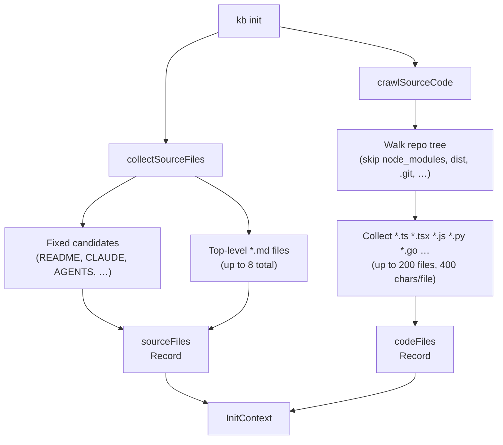
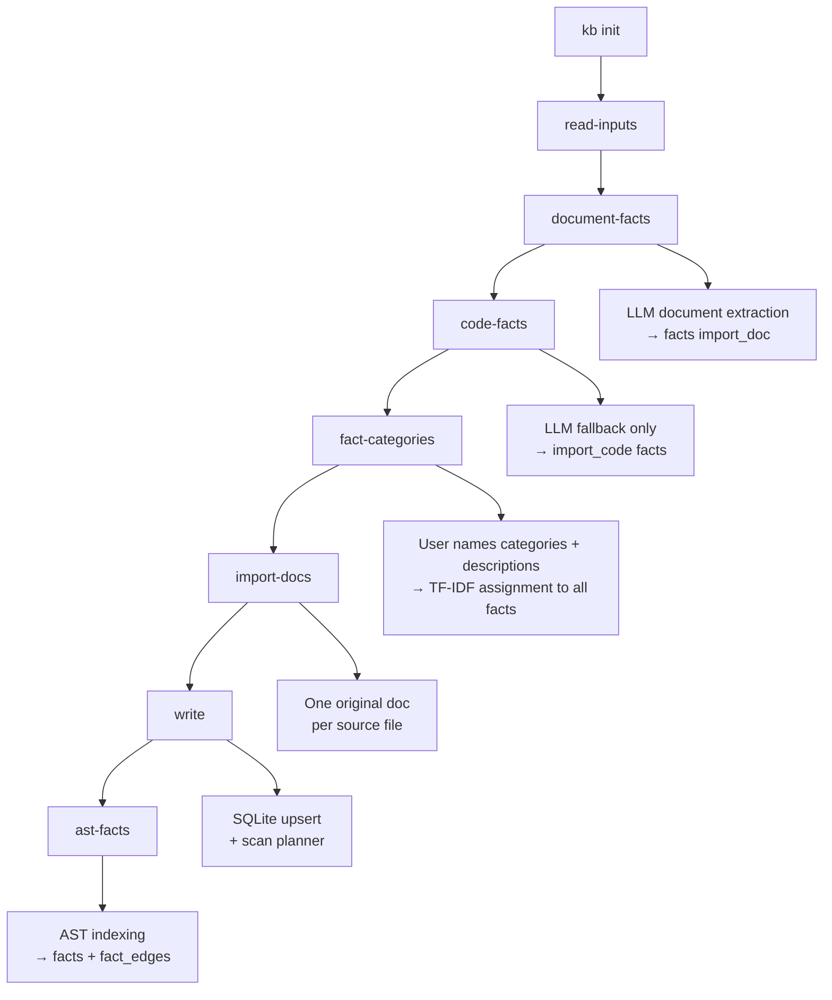

# KB Init Pipeline

`kb init` bootstraps a knowledge base from a repo. It runs **input collection** (README-like docs + optional source-code crawl), **`document-facts`** (document facts from markdown sources), **`code-facts`** (LLM fallback facts for source code when AST providers are unavailable), **`fact-categories`** (interactive step: user defines named categories with descriptions, facts are then assigned via TF-IDF cosine similarity), **`import-docs`** (one verbatim original SQLite doc per discovered markdown file), **`write`** (persist docs; with **`kb scan`** this stage also plans/applies claim mutations), and **`ast-facts`** (deterministic AST indexing directly into `facts` + `fact_edges`). Use **`kb scan`** to refresh sources against an existing base.

In the TUI, init/scan progress is rendered as a dedicated live status line instead of transcript history. Any phase that iterates over a collection of files, docs, facts, claims, or mutations emits incremental progress while that collection is being processed; only atomic operations stay start/finish-only. Progress lines include counts and, when useful, the current item. The long-running deterministic phases also yield cooperatively to the event loop between batches so the terminal can repaint and interrupts remain responsive during large scans.

## Input Collection

- `sourceFiles` — human-readable documentation files collected for **`import-docs`** (verbatim originals) and for **`document-facts`** / prompts.
- `codeFiles` — structural index of source code. Fed into **`code-facts`** extraction.

## Init cycles

## Fact Categories

After `document-facts` and `code-facts` have populated the facts table, `kb init` (interactive mode only, skipped on `kb scan`) prompts the user to define **fact categories** — named buckets that help organise retrieval.

**Flow:**

1. User enters a comma-separated list of category names (blank → skip).
2. The list is echoed back for review.
3. User types `/accept` or `/reject` (reject loops back to step 1).
4. On `/accept`, each category gets an optional description prompt — blank uses the default `"Facts about <name>"`.
5. Categories are saved to `fact_categories`; all facts are assigned via TF-IDF cosine similarity (`threshold = 0.3`) against each category's name + description text.

**Tables written:**

| Table | Content |
|---|---|
| `fact_categories` | id, name, description, status (`edited`), createdBy (`user`) |
| `fact_category_assignments` | fact_id → category_id with cosine similarity score |

**`kb scan` behaviour:** category prompting is skipped on rescan — categories defined at init time are preserved. Re-run `kb init` to redefine them.

**Future:** HDBSCAN-based auto-discovery (currently commented out in `src/cli/init-cli.ts`) will run before the manual step to suggest categories derived from the actual fact corpus.

## Jekyll Routing

After `kb publish jekyll`, documents are routed by provenance:

| `is_original` | Collection | Directory |
|---|---|---|
| `1` | `original_docs` | `_original_docs/` |
| `0` | `autogenerated_docs` | `_autogenerated_docs/` |

Originals are **frozen snapshots** of source files (we do not rewrite or “correct” them in the KB pipeline). Autogenerated docs are the **curated layer** we refine for retrieval and demos; they may overlap originals on purpose.

README.md is excluded from both — it is the site homepage (`docs/index.md`).

## Title Conventions

| Context | Rule | Example |
|---|---|---|
| Autogenerated docs | Cap Every Word (`toTitleCase`) | `"Project Overview"` |
| Original/source docs | Basename as-is (`basenameTitle`) | `"CLAUDE.md"` |
| Jekyll filenames | Slugified basename, no extension | `claude-instructions.md` |

## Facts extracted from written documents

When the init pipeline (or any path using **`SqliteDocumentWriter`**) persists markdown documents, the writer **indexes candidate facts** from document bodies (deterministic sentence segmentation, length filters, and capped inserts into the **`facts`** table). That is **incremental** fact growth alongside init; see **`facts-architecture.md`** §2 / §7 for the full ingest model.

## Code-derived facts (AST-first)

Source code facts are AST-first. Supported languages are indexed deterministically by the AST pipeline and promoted into facts. The **`code-facts`** cycle ([src/core/code-fact-extract.ts](code-fact-extract.ts)) is a fallback path for languages or environments where AST indexing is unavailable.

1. **Skeleton** — a deterministic regex pass per file extracts top-level exports, imports, and the leading doc block. The skeleton is used only as **prompt context** and as the **anchor namespace**; it does not write fact rows.
2. **LLM semantic pass** — one structured JSON call per file (system prompt: [src/prompts/code-fact-extract.md](../prompts/code-fact-extract.md)) returns a `module_summary` plus up to **`KB_CODE_FACTS_MAX_PER_FILE`** semantic facts. Each fact carries a `triplet` (subject/predicate/object) and an `anchor` that is either `module` or one of the symbols from the skeleton.
3. **Repair-friendly upsert** — every row is stored with `source_kind = 'import_code'` and `source_ref = code:<path>@<anchor>#<contentHash>`. On re-run we group prior rows by `<path>@<anchor>` (via `SqliteKbIndexer.listActiveFactsBySourceRefPrefix`) and:
   - identical normalized text → no-op (dedupe in `upsertFact`),
   - reworded text → tombstone the old rows and insert the new one with `supersedes_fact_id`,
   - anchor missing in the new payload → tombstone all rows for that anchor.
4. **Scan** — `kb scan` reads `code-facts-manifest.json` (per-base sidecar) and only re-extracts files whose `sha256` changed. The per-anchor diff guarantees that unchanged files don't churn the `facts` table.

Budget knobs (env, sane defaults): `KB_CODE_FACTS_MAX_FILES=40`, `KB_CODE_FACTS_PER_FILE_CHARS=6000`, `KB_CODE_FACTS_MAX_CONCURRENCY=4`, `KB_CODE_FACTS_MAX_PER_FILE=8`. The graph builder (`rebuildFactGraph`) consumes the new triples directly — there is **no separate AST table**.

## Code-graph cycle (cycle 7)

The **`code-graph`** cycle runs at the end of every `kb init` and `kb scan`. It performs deterministic AST indexing of every file in the repo — no LLM involved — and writes directly into `facts` (`source_kind='import_code'`) and `fact_edges` in the same `.kb-index.sqlite` database.

### Two indexers

| Indexer | Files | When it runs |
|---|---|---|
| `TsMorphIndexer` (`src/tools/code-graph-indexer.ts`) | `.ts`, `.tsx`, `.js`, `.jsx` | When `tsconfig.json` is found; uses the TypeScript compiler for type-aware analysis |
| `TreeSitterIndexer` (`src/tools/tree-sitter-indexer.ts`) | All other files | Always; uses WASM grammars via `web-tree-sitter` |

When both run (TS project with Go files), `TsMorphIndexer` runs first and produces richer TS data (type-aware import resolution, `EXTENDS`/`IMPLEMENTS` edges). `TreeSitterIndexer` then covers everything else and uses `ON CONFLICT DO UPDATE` so it never overwrites TsMorphIndexer's richer TS nodes.

### File handling by extension

`TreeSitterIndexer` uses an explicit **allowlist** — not a denylist:

- **AST-able** — extensions in `EXT_MAP` (`src/tools/tree-sitter-indexer.ts`): Go, TS/TSX, JS/JSX, Python, Rust, Ruby, Java, C/C++, C#, CSS, Bash, PHP, Scala, HTML, etc. → file node + symbol nodes + import/export edges where queries exist
- **Text/config** (`.md`, `.yaml`, `.json`, `.toml`, `.sql`, `.tf`, etc.) → file node only, `language='text'`, no symbols
- **Everything else** (images, binaries, lock files, compiled artifacts) → silently ignored

WASM grammars ship in `tree-sitter-*` npm packages — no native compilation, all platforms.

### What gets written

- **`facts`** (`source_kind='import_code'`) — one fact per exported symbol (`"Foo is a Class exported from src/foo.ts"`) with `source_text` set to the raw declaration (capped at 1500 chars)
- **`fact_edges`** — structural edges: `IMPORTS_FILE`, `EXPORTS_SYMBOL`, `EXTENDS`, `IMPLEMENTS`
- **`code_file_state`** — per-file content hash for incremental skip on re-run

### Incremental behaviour

Both indexers store a `content_hash` per file in `code_file_state`. On re-run (including `kb scan`), files whose hash hasn't changed are counted as `skipped` and not re-processed. Only changed or new files are re-indexed.

To keep the TUI responsive, the deterministic ingest/index loops yield back to the Node.js event loop between batches. That lets progress updates paint incrementally and gives `Ctrl-C` / terminal interrupts a chance to land between chunks instead of waiting for an entire repo walk to finish.

## Language Support

Two pipelines index source code. **Code-graph** (`TsMorphIndexer` / `TreeSitterIndexer`) is deterministic AST-based. **Code-facts** (`code-fact-extract.ts`) is an LLM semantic pass. They are independent — a language can appear in one, both, or neither.

| Language | Extensions | Code-graph (AST) | Code-facts (LLM) |
|---|---|---|---|
| TypeScript | `.ts` `.tsx` `.mts` `.cts` | yes — TsMorphIndexer (type-aware) + TreeSitter | yes |
| JavaScript | `.js` `.jsx` `.mjs` `.cjs` | yes — TsMorphIndexer + TreeSitter | yes |
| Python | `.py` | yes | yes |
| Go | `.go` | yes (uppercase-export convention) | yes |
| Ruby | `.rb` | yes | yes |
| Java | `.java` | yes | yes |
| Rust | `.rs` | yes | yes |
| Swift | `.swift` | no — no tree-sitter grammar | yes |
| Kotlin | `.kt` | no — no tree-sitter grammar | yes |
| C / C++ | `.c` `.h` `.cpp` `.cc` `.hpp` … | yes | no |
| C# | `.cs` | yes | no |
| PHP | `.php` | yes | no |
| Scala | `.scala` | yes | no |
| Bash | `.sh` `.bash` `.zsh` | yes | no |
| CSS | `.css` | yes (selectors) | no |
| HTML | `.html` `.htm` | yes (id elements) | no |

Code-graph import/export edges: TS/JS have full import resolution; Go uses uppercase-initial convention; Python/Rust/Ruby/Java/C/C#/PHP/Scala/HTML extract exports but not imports (except Ruby `require` and PHP `require`/`include`).

**Text-only** (file node, no symbols): `.md`, `.yaml`, `.json`, `.toml`, `.sql`, `.tf`, `.proto`, `.graphql`, `.scss`, `.xml`, extensionless files (Makefile, Dockerfile).

**Ignored entirely**: images, binaries, lock files, compiled artifacts.

To add a language to code-graph: install `tree-sitter-<lang>`, add to `LANG_CONFIGS` + `EXT_MAP` in `src/tools/tree-sitter-indexer.ts`. To add to code-facts: add the extension to `LANG_BY_EXT` in `src/core/code-fact-extract.ts`.

## Configuration Constants

| Constant | Value | Purpose |
|---|---|---|
| `MAX_SOURCE_SIZE` | 20 000 chars | Per-file cap for documentation files |
| `SOURCE_CODE_PER_FILE_CHARS` | 400 chars | Per-file snippet length for code crawl |
| `SOURCE_CODE_MAX_FILES` | 200 | Max source files indexed |
| `SOURCE_CODE_MAX_TOTAL_CHARS` | 60 000 chars | Total code index budget |
| `INIT_SOURCE_SHARD_MAX_FILES` | (see code) | Max shards when expanding |
| `INIT_SOURCE_SHARD_MAX_CHARS` | 8 000 chars | Per-shard content cap |
