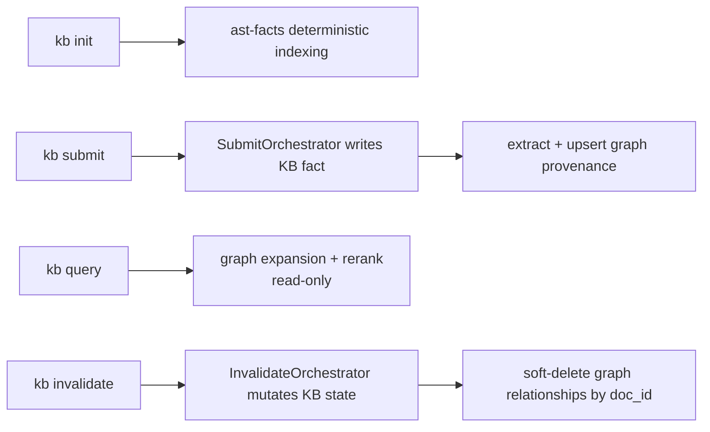
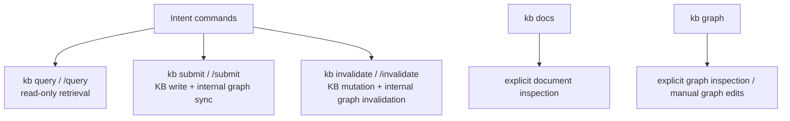

# Knowledge Graph

KB maintains a property graph alongside its SQLite document store. The graph tracks concepts, systems, tools, decisions, and people as **entities**, connected by typed **relationships** (e.g. `uses`, `depends_on`, `implements`).

## What it does for you

As you build up your knowledge base, the graph gives you a structural view of how ideas connect — something the flat SQLite full-text index cannot express.

**Navigation:** You can ask "what does X depend on?" or "what implements Y?" by name, without writing a query.

**Path finding:** "How is A related to B?" runs a shortest-path traversal over the graph, surfacing non-obvious connections across documents.

**Query expansion:** Graph neighbors of a query term are added as synonyms before **`read_facts`** hits the **fact** full-text index, improving recall when exact phrasing differs between a query and a stored fact.

**Export:** The full graph can be dumped as Graphviz DOT (for visualisation tools like Gephi or Mermaid) or JSON (for your own analysis).

**Manual curation:** You can add nodes, descriptions, and directed edges from the CLI (preview by default, `--apply` to commit). Automated extraction from `kb submit` / `kb init` merges with hand-authored graph data in the same SQLite database as the document index.

**Session override:** Pass `--base <name>` on `kb graph` (same as other KB commands) to target a specific session without switching your active base.

## Storage

Graph tables live in **`<base-dir>/.kb-index.sqlite`** (`kb_graph_entities`, `kb_graph_relationships`), alongside documents, chunks, and facts.

Graph mode is enabled by default. You can disable graph extraction and graph-augmented lookup with either:

- `graph.enabled: false` in `~/.kb/config.json`
- `KB_GRAPH=false` as a one-off environment override

Schema:

```sql
kb_graph_entities       — id, name, type, doc_id, description, created_at
kb_graph_relationships  — id, from_id, to_id, type, doc_id, weight, created_at
```

- `type` on entities: `concept | system | tool | decision | person`
- `type` on relationships: canonical extractor labels (`depends_on`, `contradicts`, `related_to`, `replaces`, `implements`, `uses`) **or** any snake_case label you set via `kb graph edge add --verb` (free text is normalized to snake_case for storage)
- `weight`: 1.0 for live edges, 0 for soft-deleted edges (set by `kb invalidate`)
- Traversal uses SQLite recursive CTEs.

## How it stays up to date



| Trigger | What happens |
|---|---|
| `kb submit "<fact>"` | `SubmitOrchestrator` writes the KB fact, then extracts and upserts graph entities + relationships when graph mode is enabled |
| `kb invalidate "<old>"` | All edges whose `doc_id` matches the affected documents are soft-deleted (weight → 0) |
| `kb init` / `kb scan` — `ast-facts` cycle | Deterministic code graph indexing updates `kg_*`; semantic graph remains incremental via submit/invalidate |

## CLI

```
kb graph                          # Summary: entity count, relationship count, top nodes by connections
kb graph --entity <name>          # Outgoing + incoming edges for a named entity
kb graph --path <from> <to>       # Shortest path between two entities (max 6 hops)
kb graph --format dot             # Export as Graphviz DOT to stdout
kb graph --format json            # Export full graph as JSON to stdout

# Edits (dry-run until you add --apply — see TUI.md / AGENTS.md mutation safety)
kb graph node add --name "..." [--id ...] [--type concept|system|tool|decision|person] [--description "..."] [--doc-id ...] [--apply]
kb graph node set --entity <id-or-name> [--name "..."] [--description "..."] [--type ...] [--apply]
kb graph edge add --from <id-or-name> --to <id-or-name> --verb "<label>" [--doc-id ...] [--apply]
kb graph edge remove --from ... --to ... --verb ... [--apply]
```

## Graph-augmented query

When graph mode is enabled, **`expandQueryWithGraph`** runs **before** the **`query_truth`** envelope is executed. It widens the **query string** that **`read_facts`** will search (fact FTS + deep facts loop), not a separate markdown document index.

1. The query terms are slugified and looked up as entity IDs.
2. For every live edge touching those entities, expansion adds **semantic triplets** as natural-language phrases (`Subject <predicate phrase> Object`, plus the stored predicate slug and a spaced variant, e.g. `retrieves_via` and `retrieves via`) and then **neighbor entity names** (same star neighborhood as before).
3. The expanded term set is capped and concatenated to the original query for fact retrieval.
4. Retrieval may attach **typed edge hints** (entity names plus stored relationship `type`, e.g. `one-hop:kb-query-[retrieves_via]->KbGraphWriter`) to top **fact** hits; **answer enrichment** can include those hints so prose reflects real edges when they align with fact text.

This means a query for "KbGraphWriter" can still surface facts that mention "SQLite" or "property graph" if those edges exist in the graph — even when the literal query string did not include those words.

## Surface ownership



## Code graph (kg_* tables)

Alongside the semantic graph (`kb_graph_entities` / `kb_graph_relationships`), KB maintains a separate **code graph** in `kg_*` tables. These are populated deterministically by the `code-graph` cycle during `kb init` and `kb scan` — no LLM.

### What it stores

```sql
kg_nodes           — file nodes and symbol nodes extracted from source code
kg_edges           — IMPORTS_FILE, EXPORTS_SYMBOL, EXTENDS, IMPLEMENTS
kg_nodes_fts       — full-text search over node names and paths
kg_file_state      — content hashes for incremental re-indexing
kg_semantic_bridge — name-matched links between code symbols and semantic entities
```

### How it connects to the semantic graph

The `kg_semantic_bridge` table is the join layer. After indexing, symbol names are slugified and matched against `kb_graph_entities` names. A match creates a bridge row at confidence 0.8. This enables `CodeGraphStore.expandWithCodeNeighbors` to answer "which files are structurally related to semantic entity X?" without any LLM call — it follows bridge rows then traverses `IMPORTS_FILE` edges.

### Language support

- **TypeScript / JavaScript** — `TsMorphIndexer` (type-aware; runs when `tsconfig.json` is present)
- **Go** — `TreeSitterIndexer` with `tree-sitter-go.wasm`
- **Text / config files** (`.md`, `.yaml`, `.json`, `.toml`, etc.) — `TreeSitterIndexer` text fallback: file node only, no symbols
- Adding a new language requires one entry in the `LANG_CONFIGS` registry in `src/tools/tree-sitter-indexer.ts` plus the corresponding `tree-sitter-<lang>` npm package

All WASM grammars ship as npm package assets — no native compilation, no platform-specific binaries.

## Implementation

| File | Role |
|---|---|
| `src/tools/kb-graph-writer.ts` | Semantic graph schema in SQLite, upsert, soft-delete, traversal, export |
| `src/tools/graph-entity-extractor.ts` | LLM-based entity + relationship extraction from text |
| `src/cli/graph-cli.ts` | `kb graph` command parsing and output formatting |
| `src/tools/submit-orchestrator.ts` | KB write orchestration plus graph extraction/upsert |
| `src/tools/invalidate-orchestrator.ts` | KB invalidation orchestration plus graph provenance cleanup |
| `src/cli/init-cli.ts` | `ast-facts` cycle in `kb init` / `kb scan` |
| `src/tools/code-graph-indexer.ts` | `TsMorphIndexer` — TS/JS AST indexing via ts-morph |
| `src/tools/tree-sitter-indexer.ts` | `TreeSitterIndexer` — multi-language AST indexing via web-tree-sitter |
| `src/tools/code-graph-store.ts` | Read-only queries over `kg_*` tables including `expandWithCodeNeighbors` |
