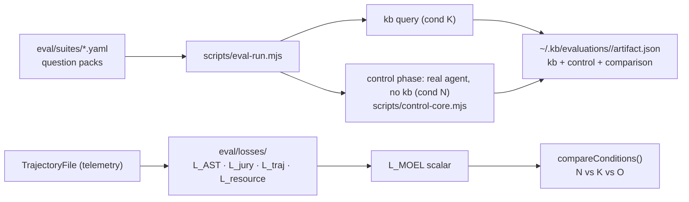
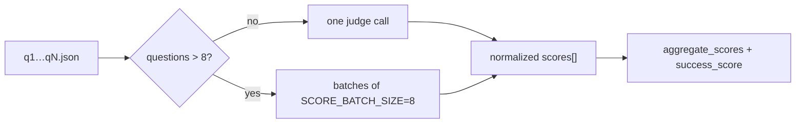

# Eval Directory

Houses the MOEL (Multi-Objective Exploration Loss) evaluation framework — a quantitative harness for proving that `kb`-equipped agents produce correct answers with less exploration and fewer tokens than raw-filesystem agents.

## Role in the stack



Two evaluation pipelines co-exist:

1. **Query harvest** (`scripts/eval-run.mjs`, suites `raylib`/`kb`/`fzf`/…/`generic`) — runs the **kb side** (condition **K**) and, by default, the **control side** (condition **N**) side-by-side into one unified artifact. kb scores `kb query` answers via auto-score (Gemini/OpenAI); the control hands each question to a *real coding agent* (Claude Code headless, no kb) and scores it with the **same rubric/judge**. Artifacts under `~/.kb/evaluations/<run>/artifact.json` hold both (kb at top level + a `control` block + a `comparison`). `--skip-control` runs kb only; `--score-runs N` averages the scorer. **Multi-suite:** `--suites a,b` / `--all-suites` runs a Node-native parallel batch (default); `--sequential` or `--parallel N` to tune. See [Control vs kb](#control-vs-kb-the-real-baseline).

2. **MOEL pipeline** (`scripts/moel-run.mjs`, suite `moel-kb`) — measures exploration efficiency across conditions per task. Loss functions live in `eval/losses/`; the harness is `scripts/moel-run.mjs`.

## Three evaluation conditions

| Condition | Setup | Purpose |
|-----------|----------------|---------|
| **N** (Control) | A **real coding agent (Claude Code headless), no kb** — explores the clone with its own Read/Grep/Glob/Bash tools. Runs as a phase of `eval-run.mjs` (`scripts/control-core.mjs`). | Real-world baseline |
| **K** (kb-enabled) | `kb query` over a built knowledge base. Run via `scripts/eval-run.mjs`. | Primary experiment |
| **O** (Oracle) | Minimal target facts injected as system prompt | Theoretical ceiling |

The hypothesis is **K beats N**: `kb query` answers should match or exceed the control agent's quality while using far fewer tokens/turns. For the MOEL deep pipeline this is `L_MOEL(N) > L_MOEL(K)`; for the harvest pipeline the **headline grade** is `ΔS = success_score_K − success_score_N` from `artifact.comparison` (see [Headline verdict](#headline-verdict-kb-vs-control-δs) below).

## Headline verdict: kb vs control (ΔS)

The harvest suite's single scalar grade is **`comparison.success_score.delta_kb_minus_control`** (ΔS). Both kb (K) and control (N) get the same `success_score` formula; ΔS ≥ +0.02 ⇒ kb ahead, ΔS ≤ −0.02 ⇒ kb behind. Requires both phases in one `pnpm run eval` (no `--skip-control`). See `EVALUATION.md` § Headline verdict.

## Success score (harvest headline metric)

The query-harvest pipeline's primary scalar is `success_score ∈ [0,1]` (higher is better), a weighted blend that rewards good answers that are cheap and fast:

$$\text{success} = 0.60 \cdot \text{quality} + 0.30 \cdot \text{token\_efficiency} + 0.10 \cdot \text{speed}$$

- **quality** = mean of per-axis adequacy utilities φ(s) over **correctness, usefulness, and relevance** (τ=3, β=0.2). Relevance penalizes answers that pad in unrelated facts; omitting it (old artifacts) falls back to the two-axis mean.
- **token_efficiency** = `1 − min(weighted_tokens / token_budget, 1)` where `weighted_tokens = input + output + 0.1 × cache_read` (control cache reads discounted like MOEL)
- **speed** = `1 − min(total_duration_ms / time_budget, 1)`

The headline **pass rate** gates on `correctness ≥ 3 AND usefulness ≥ 3 AND relevance ≥ 3` (`pass_rate_quality_axes_at_least_3`; the legacy correctness+usefulness gate is still recorded). A kb-side **`curation_summary`** (`retrieval_precision = kept/(kept+dropped)`, harvested from the curator's `retrieval.detail` audit) is reported as a retrieval-side relevancy diagnostic.

**Judged axes use labels, not bare numbers.** The judge picks a named label per axis (e.g. correctness ∈ `correct`/`mostly_correct`/`mixed`/`mostly_wrong`/`no_answer`) instead of guessing an integer — a classification task, not a magnitude guess. Each label maps to an ordinal level `0–4`, so the φ utility, the `≥3` gates, and `success_score` above are computed on the same scale as before. The labels are defined once in `scripts/eval-score.mjs` (`RUBRIC_AXES`); see `EVALUATION.md` § Scoring Rubric for the full per-axis vocabulary. Deterministic indicators (tokens, latency) stay numeric.

Normalization is **budget-absolute** (not relative to control), so the number is stable run-to-run. Defaults live in `scripts/eval-shared.mjs`: `token_budget = 1,000,000`, `time_budget = 600,000 ms`. Both kb and control are scored with the identical formula and budgets, so `success_score` is directly comparable head-to-head; the per-component parts (`quality_score`, `token_efficiency`, `speed_score`) show where a win or loss originates. KB-side telemetry comes from `kb_query_telemetry` (read from `~/.kb/logs`), the control's from `control_telemetry`.

## Run timeline (where the query budget went)

The headline scores say *whether* kb won; the **timeline** says *where each query spent its
budget* — the signal a cloud task session needs to diagnose "why are we slow / heavy now?".
Every harvest artifact carries two extra blocks:

- **`query_timeline[]`** — one entry per question, joining that question's telemetry `RunReport`
  with its retrieval trace:
  - **`tokens`** / **`token_share`** — split into **thinking** (the retrieval + sufficiency-judge
    + curator loop, the `*:llm` stage) vs **synthesis** (the one-shot `*:answer-enrichment` stage).
    This is what surfaces "how many tokens went to thinking in this round."
  - **`timing`** — `synthesis_ms` (measured) and `retrieval_ms` (= `total − synthesis − other`,
    since loop-LLM stages are logged with `durationMs: 0`).
  - **`retrieval`** — `passes`, `graph_hops`, `ponds`, `stop_reason`, `facts_returned`, per-pass
    **`hops[]`** loop-trace lines, `checkpoints[]`, and a **`curation`** record
    (`kept`/`dropped`/`requeried`/`rounds` + `dropped_fact_ids` — the facts kicked out between hops).
  - **`stages[]`** — the raw per-stage token/duration rows.
- **`timeline_summary`** — the run-level diagnosis: mean token/time splits, `thinking_token_share`,
  `retrieval_time_share`, `mean_passes`, `curator_drop_rate`, the slowest / heaviest-thinking
  question, and a plain-language **`diagnosis[]`** (e.g. *"Thinking is 62% of query tokens — the
  loop dominates cost"*). Printed as a compact `TIMELINE` block at the end of every harvest.

The per-hop trace is sourced from `RunReport.retrieval` (persisted by `kb query` via
`summarizeQueryRetrievalTrace`, `packages/kb-core/src/core/telemetry.ts`); older logs without it fall back to
parsing the `retrieval>` detail line (`parseRetrievalDetailTrace`), so counts still appear but
per-hop lines / dropped ids may be empty.

## Control vs kb (the real baseline)

The **control** is the thing kb is compared against: instead of querying a knowledge base, a real agent gets the *same* question and explores the codebase itself. It runs by default as part of `pnpm run eval` — no separate command.

```bash
# kb + control → ONE artifact.json with comparison block (control on by default)
pnpm run eval -- --suite raylib --auto-score

# kb only — no ΔS verdict (iteration / CI without agent binary)
pnpm run eval -- --suite raylib --auto-score --skip-control

# All 10 benchmark suites — Node-native parallel by default
pnpm run eval -- --all-suites --control-agent cursor --control-model composer-2.5
```

The single `~/.kb/evaluations/<run>/artifact.json` holds the kb results (top level, `run.condition = "kb"`), a `control` block (real agent, no kb — its own `aggregate_scores` + `control_telemetry`), and a `comparison` block of kb-minus-control deltas including **`success_score.delta_kb_minus_control` (ΔS)**. Both sides answer the same questions and are scored by the same rubric/judge. The end-of-run summary prints **this run's** kb vs control row first; the trends table is diagnostic only.

The control agent is invoked headless with `--bare --strict-mcp-config` so **no MCP servers, skills, or kb tools load** — it truly explores raw files. Tunables: `--control-prompt` / `KB_CONTROL_PROMPT` (wrapper prompt, must contain `{{question}}`), `--control-model`, `--control-max-turns`, and `--control-agent-cmd` / `KB_CONTROL_AGENT_CMD` to swap the whole agent command (e.g. Cursor).

> **Note:** `eval/tools/filesystem-tools.ts` (`read_file` / `list_directory` / `search_file_contents`) is a **legacy** toy approximation of condition N, kept only for its unit test. The real control is `scripts/control-core.mjs` driving an actual agent inside `eval-run.mjs` — do not treat the toy tools as the baseline.

## Directory layout

```
eval/
  losses/          Five loss functions + LOSSES.md
  validators/      ManifestValidator, MutationValidator (programmatic checks)
  tools/           filesystem-tools.ts — LEGACY toy approximation of Condition N (superseded by scripts/control-core.mjs)
  reports/         summary.ts — buildSummaryMarkdown / buildSummaryJson from moel_results.json
  calibration/     calibrate.py, apply_calibration.py, calibration_data.json (Python, logistic regression)
  benchmarks/      alignment.md — mapping to SWE Atlas / SWE-ContextBench / CodeScaleBench
  config/          Runtime weight and cost JSON (fallback defaults hardcoded in each module)
  prompts/         LLM prompt templates
  suites/          YAML question packs for the query harvest pipeline
```

## Config files

| File | Controls |
|------|---------|
| `config/moel-weights.json` | `wC`, `wT`, `wR`, `mu` mixing weights |
| `config/provider-costs.json` | `delta` (cached-token discount), `gamma` (output-token weight) |
| `config/bias-config.json` | `BiasConfig` defaults for the jury (veto threshold, debiasing flags) |

All config files are loaded at runtime with hardcoded defaults as fallback — deleting a file does not break the pipeline.

## MOEL formula

$$L_{\text{correctness}} = \mu \cdot L_{\text{AST}} + (1 - \mu) \cdot L_{\text{jury}}$$

$$L_{\text{MOEL}} = w_C \cdot L_{\text{correctness}} + w_T \cdot L_{\text{trajectory}} + w_R \cdot L_{\text{resource}}$$

Default weights: `wC=0.5, wT=0.3, wR=0.2, mu=0.6`. Weights must sum to 1.0 within `1e-6`. All loss terms are in `[0, 1]` — zero is perfect, one is maximum failure.

## Scoring stability

The query harvest pipeline's scorer (Gemini/OpenAI) is non-deterministic even at `temperature=0` due to distributed inference. To get stable scores:

- Use `--score-runs 3` when running `eval-run.mjs` — scores the same answers three times and averages per question, reducing scorer noise by √3.
- Query expansion and **`kb query` answer synthesis** both use `temperature=0` to minimize answer variation between runs.
- **`kb query`** uses one-shot `enrichReadDocumentsAnswerWithLLM()` (no chat agent loop). **`kb chat`** uses multi-turn `runChatSynthesis()` with optional `query_kb` tool rounds.

## Auto-scorer (`scripts/eval-score.mjs`)

Single implementation shared by kb (K) and control (N) so rubric and judge are identical. Entry: `runAutoScoreFile({ workdir, questions, … })` — reads `workdir/q{n}.json` written by either runner (`readQueryResultFile` handles control JSON sentinel vs raw `kb query` text).



**Batching:** `SCORE_BATCH_SIZE = 8`. Larger suites (e.g. 12-question `kb.yaml`) score in multiple judge calls so the returned JSON array is not truncated mid-parse (which previously zeroed control rubrics). Batches are contiguous question slices in order.

**Answer fidelity:** The judge receives each stored answer **in full** — no `clipText` on the answer body. Retrieval JSON summaries and optional reference answers are still clipped for prompt size only.

**Label rubric:** `RUBRIC_AXES` defines allowed label strings per axis; `scoreFromLabel()` maps to ordinal 0–4. Judge `notes` capped at 30 words in the schema hint to keep batch JSON compact. `parseJsonObjectFromLLM()` accepts a top-level JSON array as well as `{ scores: [...] }` when the model omits the wrapper object.

**Variable suite size:** `eval-shared.mjs` / `eval-run.mjs` accept any non-empty `questions[]` in suite YAML — no fixed question count.

## Client-server eval (1.0+)

After the `@kb/client` / `@kb/server` split, **`kb query` defaults to remote mode** — it
expects a live `kb-server` on `localhost:38117` (or `KB_HOST` / `KB_PORT` / `KB_SERVER_URL`). The harvest and MOEL harnesses **orchestrate `kb-server` automatically** via
`scripts/eval-server.mjs` before the kb phase of each run.

### Orchestration (default)

1. **`eval-run.mjs`** — **init/scan run in-process** (`KB_LOCAL_MODE=true`) so SQLite is not
   contended, then **`kb-server` starts** for the query loop with `--base eval-{suiteId}` (or your
   `--base` override). Subprocess `kb query` calls use `KB_SERVER_URL` + `KB_SERVER_API_KEY`.
   The harness polls `/healthz` until `ok: true` before queries. Server logs land in
   `<run-dir>/eval-server.log`; the process is stopped when the kb phase finishes (including on error).

2. **`moel-run.mjs`** — init in-process per condition, then one `kb-server` per condition
   (`moel-{suite}-{N|K|O}`) for the remote query.

**Base lifecycle:** the server serves one base chosen at startup (`--base` / env). Client
`kb base use` updates the client profile only — eval starts the server with the eval base
explicitly. The harvest logs a one-line note when calling `kb base use --default`.

### Attach to a sidecar (optional)

Skip in-process server spawn when a pinned sidecar is already running:

```bash
export KB_EVAL_SERVER_URL=http://localhost:38117
export KB_SERVER_API_KEY=your-bearer-token   # must match the sidecar
pnpm run eval -- --suite kb --auto-score --skip-control
```

Ensure the sidecar was started with the same base the harness will use (e.g.
`kb-server start --base eval-kb`). The harness still health-checks before queries.

### Env knobs

| Variable | Role |
|----------|------|
| `KB_EVAL_SERVER_URL` | Attach to existing server (no spawn/stop) |
| `KB_EVAL_SERVER_BIN` | Override `packages/kb-server/dist/bin/kb-server.js` |
| `KB_EVAL_SERVER_PORT` | Pin port when spawning (default: 38117) |
| `KB_EVAL_SERVER_API_KEY` | Bearer token for spawned server (default: `eval-local-key`) |
| `KB_QUERY_TIMEOUT` | Client + server query timeout (e.g. `180s`; default 60s) |

### Health poll

```bash
until curl -sf http://localhost:38117/healthz | jq -e '.ok == true' >/dev/null; do sleep 2; done
```

The harness uses the same readiness gate (two consecutive `ok: true` reads with `indexMtime`).

### CI

| Path | When |
|------|------|
| **In-process server** (default for `pnpm run eval` / `moel`) | Harness spawns built `kb-server.js` on an ephemeral port — no Docker required. Needs LLM provider keys in env like any kb run. |
| **Docker sidecar** (`pnpm run integration:test`) | Full REST/SSE suite via httpyac against compose; set `KB_EVAL_SERVER_URL` to reuse that container for eval without respawning. |

`KB_LOCAL_MODE=true` remains for **Vitest unit tests** and other fast in-process paths — not
for harvest/MOEL.

### Remote-mode prerequisites

| Prerequisite | Status | Notes |
|--------------|--------|-------|
| `/healthz` readiness | Done (#120) | `ok: false` → HTTP 503 while bootstrap indexing, after bootstrap failure, or before index exists. Poll until `ok: true`. |
| `KB_QUERY_TIMEOUT` | Done (#120) | Client + server knob (e.g. `KB_QUERY_TIMEOUT=180s`). Default 60s. |
| Remote `kb query --trace` | Done (#120) | `trace: true` on `/v1/query`; returns `traceFile`. |
| `kb base use` in remote mode | Follow-up | Client-local only; server base fixed at startup. Eval sets server base via orchestration. |
| Harness starts `kb-server` | Done (#118) | `scripts/eval-server.mjs` |
| Drop `KB_LOCAL_MODE` from eval/MOEL | Done (#118) | |

## Invariants

- One `TrajectoryFile` per condition per task — written by `TrajectoryCollector.writeTrajectory()`.
- `initAstLossParser()` must be called once per process before any `computeAstLoss` call.
- The query harvest pipeline and the MOEL pipeline are independent — neither replaces the other.
- Do not hardcode question text; always load from `eval/suites/<suite>.yaml`.

## Related docs

- Behavioral spec → [`EVAL.spec.md`](EVAL.spec.md)

- `losses/LOSSES.md` — per-function API, invariants, extension checklist
- `../../PLAN.md` — 12-ticket backlog (all ✅ Implemented)
- `../../TESTING.md` — test conventions including eval-specific patterns
- `../../skills/kb:evaluation-run/SKILL.md` — agent-facing evaluation run instructions
