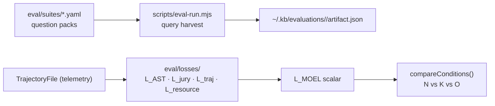

# Eval Directory

Houses the MOEL (Multi-Objective Exploration Loss) evaluation framework — a quantitative harness for proving that `kb`-equipped agents produce correct answers with less exploration and fewer tokens than raw-filesystem agents.

## Role in the stack



Two evaluation pipelines co-exist:

1. **Query harvest** (`scripts/eval-run.mjs`, suites `raylib`/`kb`/`generic`) — existing rubric-based Q&A scoring. Measures answer quality via auto-score (Gemini/OpenAI). Artifacts under `~/.kb/evaluations/<run>/`. Use `--score-runs N` to average the scorer N times for more stable results.

2. **MOEL pipeline** (`scripts/moel-run.mjs`, suite `moel-kb`) — measures exploration efficiency across three conditions per task. Loss functions live in `eval/losses/`; the harness is `scripts/moel-run.mjs`.

## Three evaluation conditions

Every task runs under three controlled conditions:

| Condition | Tools available | Purpose |
|-----------|----------------|---------|
| **N** (Baseline FS) | Raw filesystem only (`read_file`, `list_directory`, `search_file_contents`) | Worst-case baseline |
| **K** (kb-enabled) | Full kb tool registry (`read_facts`, `search_code_symbols`, etc.) | Primary experiment |
| **O** (Oracle) | Minimal target facts injected as system prompt | Theoretical ceiling |

The hypothesis is `L_MOEL(N) > L_MOEL(K)` — kb reduces loss. `compareConditions()` in `losses/moel.ts` checks this automatically.

## Directory layout

```
eval/
  losses/          Five loss functions + LOSSES.md
  validators/      ManifestValidator, MutationValidator (programmatic checks)
  tools/           filesystem-tools.ts — read_file / list_directory / search_file_contents for Condition N
  reports/         summary.ts — buildSummaryMarkdown / buildSummaryJson from moel_results.json
  calibration/     calibrate.py, apply_calibration.py, calibration_data.json (Python, logistic regression)
  tasks/           Per-task reference answers and optimal-action sets (moel-kb-*/)
  benchmarks/      alignment.md — mapping to SWE Atlas / SWE-ContextBench / CodeScaleBench
  config/          Runtime weight and cost JSON (fallback defaults hardcoded in each module)
  prompts/         LLM prompt templates
  suites/          YAML question packs for the query harvest pipeline
```

## Config files

| File | Controls |
|------|---------|
| `config/moel-weights.json` | `wC`, `wT`, `wR`, `mu` mixing weights |
| `config/provider-costs.json` | `delta` (cached-token discount), `gamma` (output-token weight) |
| `config/bias-config.json` | `BiasConfig` defaults for the jury (veto threshold, debiasing flags) |

All config files are loaded at runtime with hardcoded defaults as fallback — deleting a file does not break the pipeline.

## MOEL formula

$$L_{\text{correctness}} = \mu \cdot L_{\text{AST}} + (1 - \mu) \cdot L_{\text{jury}}$$

$$L_{\text{MOEL}} = w_C \cdot L_{\text{correctness}} + w_T \cdot L_{\text{trajectory}} + w_R \cdot L_{\text{resource}}$$

Default weights: `wC=0.5, wT=0.3, wR=0.2, mu=0.6`. Weights must sum to 1.0 within `1e-6`. All loss terms are in `[0, 1]` — zero is perfect, one is maximum failure.

## Scoring stability

The query harvest pipeline's scorer (Gemini/OpenAI) is non-deterministic even at `temperature=0` due to distributed inference. To get stable scores:

- Use `--score-runs 3` when running `eval-run.mjs` — scores the same answers three times and averages per question, reducing scorer noise by √3.
- Query expansion and answer synthesis both use `temperature=0` to minimize answer variation between runs.

## Invariants

- One `TrajectoryFile` per condition per task — written by `TrajectoryCollector.writeTrajectory()`.
- `initAstLossParser()` must be called once per process before any `computeAstLoss` call.
- The query harvest pipeline and the MOEL pipeline are independent — neither replaces the other.
- Do not hardcode question text; always load from `eval/suites/<suite>.yaml`.

## Related docs

- `losses/LOSSES.md` — per-function API, invariants, extension checklist
- `../../PLAN.md` — 12-ticket backlog (all ✅ Implemented)
- `../../TESTING.md` — test conventions including eval-specific patterns
- `../../skills/kb:evaluation-run/SKILL.md` — agent-facing evaluation run instructions
