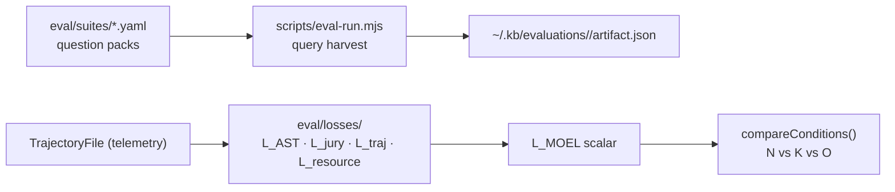

# Eval Directory

Houses the MOEL (Multi-Objective Exploration Loss) evaluation framework — a quantitative harness for proving that `kb`-equipped agents produce correct answers with less exploration and fewer tokens than raw-filesystem agents.

## Role in the stack



Two evaluation pipelines co-exist:

1. **Query harvest** (`scripts/eval-run.mjs`, suites `raylib`/`kb`/`generic`) — existing rubric-based Q&A scoring. Measures answer quality via auto-score (Gemini/OpenAI). Artifacts under `~/.kb/evaluations/<run>/`.

2. **MOEL pipeline** (`eval/losses/`) — new. Measures exploration efficiency across three conditions per task. TICKET-010 will wire these into `scripts/moel-run.mjs`.

## Three evaluation conditions

Every task runs under three controlled conditions:

| Condition | Tools available | Purpose |
|-----------|----------------|---------|
| **N** (Baseline FS) | Raw filesystem only (`read_file`, `list_directory`) | Worst-case baseline |
| **K** (kb-enabled) | Full kb tool registry (`read_facts`, `search_code_symbols`, etc.) | Primary experiment |
| **O** (Oracle) | Minimal target facts injected as system prompt | Theoretical ceiling |

The hypothesis is `L_MOEL(N) > L_MOEL(K)` — kb reduces loss. `compareConditions()` in `losses/moel.ts` checks this automatically.

## Directory layout

```
eval/
  losses/          Five loss functions + LOSSES.md
  config/          Runtime weight and cost JSON (fallback defaults hardcoded in each module)
  prompts/         LLM prompt templates
  suites/          YAML question packs for the query harvest pipeline
```

## Config files

| File | Controls |
|------|---------|
| `config/moel-weights.json` | `wC`, `wT`, `wR`, `mu` mixing weights |
| `config/provider-costs.json` | `delta` (cached-token discount), `gamma` (output-token weight) |
| `config/bias-config.json` | `BiasConfig` defaults for the jury (veto threshold, debiasing flags) |

All config files are loaded at runtime with hardcoded defaults as fallback — deleting a file does not break the pipeline.

## MOEL formula

```
L_correctness = mu * L_AST + (1 - mu) * L_jury
L_MOEL = wC * L_correctness + wT * L_trajectory + wR * L_resource
```

Default weights: `wC=0.5, wT=0.3, wR=0.2, mu=0.6`. Weights must sum to 1.0 within `1e-6`.

## Invariants

- One `TrajectoryFile` per condition per task — written by `TrajectoryCollector.writeTrajectory()`.
- `initAstLossParser()` must be called once per process before any `computeAstLoss` call.
- The query harvest pipeline and the MOEL pipeline are independent — neither replaces the other.
- Do not hardcode question text; always load from `eval/suites/<suite>.yaml`.

## Related docs

- `losses/LOSSES.md` — per-function API, invariants, extension checklist
- `../../PLAN.md` — 12-ticket backlog; TICKET-010 wires the MOEL pipeline into eval-run
- `../../docs/_original_docs/evaluation.md` — canonical evaluation procedure and artifact schema
- `../../skills/kb:evaluation-run/SKILL.md` — agent-facing evaluation run instructions
