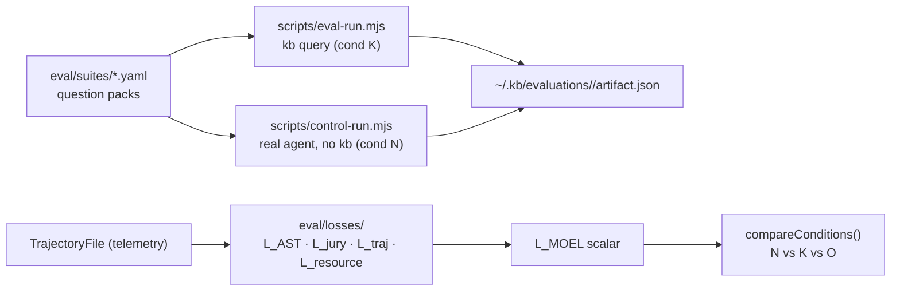

# Eval Directory

Houses the MOEL (Multi-Objective Exploration Loss) evaluation framework — a quantitative harness for proving that `kb`-equipped agents produce correct answers with less exploration and fewer tokens than raw-filesystem agents.

## Role in the stack



Three evaluation pipelines co-exist:

1. **Query harvest** (`scripts/eval-run.mjs`, suites `raylib`/`kb`/`generic`) — the **kb side** (condition **K**). Rubric-based Q&A scoring of `kb query` answers via auto-score (Gemini/OpenAI). Artifacts under `~/.kb/evaluations/<run>/` (tagged `run.condition = "kb"`). Use `--score-runs N` to average the scorer N times for more stable results.

2. **Control harvest** (`scripts/control-run.mjs`, same suites) — the **control side** (condition **N**, made real). Hands each suite question to a *real coding agent* (Claude Code headless) exploring a fresh clone with **no kb**, scored by the **same rubric/judge**. Artifacts share the harvest schema (tagged `run.condition = "control"`) plus per-question agent telemetry (tokens, turns, cost). This is the baseline kb is measured against — "what people do today". See [Control vs kb](#control-vs-kb-the-real-baseline).

3. **MOEL pipeline** (`scripts/moel-run.mjs`, suite `moel-kb`) — measures exploration efficiency across conditions per task. Loss functions live in `eval/losses/`; the harness is `scripts/moel-run.mjs`.

## Three evaluation conditions

| Condition | Setup | Purpose |
|-----------|----------------|---------|
| **N** (Control) | A **real coding agent (Claude Code headless), no kb** — explores a clean clone with its own Read/Grep/Glob/Bash tools. Run via `scripts/control-run.mjs`. | Real-world baseline |
| **K** (kb-enabled) | `kb query` over a built knowledge base. Run via `scripts/eval-run.mjs`. | Primary experiment |
| **O** (Oracle) | Minimal target facts injected as system prompt | Theoretical ceiling |

The hypothesis is **K beats N**: `kb query` answers should match or exceed the control agent's quality while using far fewer tokens/turns. For the MOEL pipeline this is `L_MOEL(N) > L_MOEL(K)`; for the harvest pipelines it is a direct rubric + telemetry comparison between a `control` artifact and a `kb` artifact for the same suite.

## Control vs kb (the real baseline)

The **control** is the thing kb is compared against: instead of querying a knowledge base, you ask a real agent the *same* question and let it explore the codebase itself.

```bash
# Control side (condition N): real agent, no kb
pnpm run control -- --suite raylib --auto-score
pnpm run control -- --suite raylib --dry-run     # print plan + the exact `claude -p …` command

# kb side (condition K): kb query
pnpm run eval -- --suite raylib --auto-score
```

Both write `~/.kb/evaluations/<run>/artifact.json` in the same schema, scored by the same rubric/judge, so the two compare head-to-head. The trends summary printed at the end of each run separates `control` from `kb` rows and prints the latest control-vs-kb deltas.

The control agent is invoked headless with `--bare --strict-mcp-config` so **no MCP servers, skills, or kb tools load** — it truly explores raw files. The wrapper prompt is configurable (`--control-prompt` / `KB_CONTROL_PROMPT`), the model via `--model`, and the whole agent command via `--agent-cmd` / `KB_CONTROL_AGENT_CMD` (e.g. to swap in Cursor).

> **Note:** `eval/tools/filesystem-tools.ts` (`read_file` / `list_directory` / `search_file_contents`) is a **legacy** toy approximation of condition N, kept only for its unit test. The real control is `scripts/control-run.mjs` driving an actual agent — do not treat the toy tools as the baseline.

## Directory layout

```
eval/
  losses/          Five loss functions + LOSSES.md
  validators/      ManifestValidator, MutationValidator (programmatic checks)
  tools/           filesystem-tools.ts — LEGACY toy approximation of Condition N (superseded by scripts/control-run.mjs)
  reports/         summary.ts — buildSummaryMarkdown / buildSummaryJson from moel_results.json
  calibration/     calibrate.py, apply_calibration.py, calibration_data.json (Python, logistic regression)
  benchmarks/      alignment.md — mapping to SWE Atlas / SWE-ContextBench / CodeScaleBench
  config/          Runtime weight and cost JSON (fallback defaults hardcoded in each module)
  prompts/         LLM prompt templates
  suites/          YAML question packs for the query harvest pipeline
```

## Config files

| File | Controls |
|------|---------|
| `config/moel-weights.json` | `wC`, `wT`, `wR`, `mu` mixing weights |
| `config/provider-costs.json` | `delta` (cached-token discount), `gamma` (output-token weight) |
| `config/bias-config.json` | `BiasConfig` defaults for the jury (veto threshold, debiasing flags) |

All config files are loaded at runtime with hardcoded defaults as fallback — deleting a file does not break the pipeline.

## MOEL formula

$$L_{\text{correctness}} = \mu \cdot L_{\text{AST}} + (1 - \mu) \cdot L_{\text{jury}}$$

$$L_{\text{MOEL}} = w_C \cdot L_{\text{correctness}} + w_T \cdot L_{\text{trajectory}} + w_R \cdot L_{\text{resource}}$$

Default weights: `wC=0.5, wT=0.3, wR=0.2, mu=0.6`. Weights must sum to 1.0 within `1e-6`. All loss terms are in `[0, 1]` — zero is perfect, one is maximum failure.

## Scoring stability

The query harvest pipeline's scorer (Gemini/OpenAI) is non-deterministic even at `temperature=0` due to distributed inference. To get stable scores:

- Use `--score-runs 3` when running `eval-run.mjs` — scores the same answers three times and averages per question, reducing scorer noise by √3.
- Query expansion and answer synthesis both use `temperature=0` to minimize answer variation between runs.

## Invariants

- One `TrajectoryFile` per condition per task — written by `TrajectoryCollector.writeTrajectory()`.
- `initAstLossParser()` must be called once per process before any `computeAstLoss` call.
- The query harvest pipeline and the MOEL pipeline are independent — neither replaces the other.
- Do not hardcode question text; always load from `eval/suites/<suite>.yaml`.

## Related docs

- `losses/LOSSES.md` — per-function API, invariants, extension checklist
- `../../PLAN.md` — 12-ticket backlog (all ✅ Implemented)
- `../../TESTING.md` — test conventions including eval-specific patterns
- `../../skills/kb:evaluation-run/SKILL.md` — agent-facing evaluation run instructions
