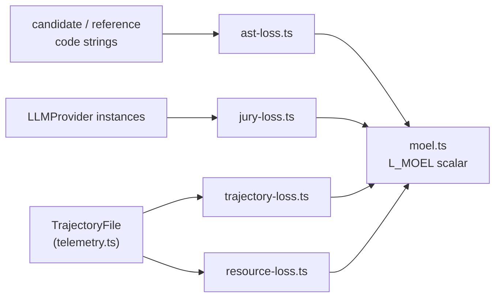

# Loss Functions

Five normalized loss components, each in `[0, 1]`, that feed the MOEL deep-pipeline aggregator (`moel-run.mjs`). Zero is perfect; one is maximum failure.

> **Suite harvest headline grade:** `pnpm run eval` uses a separate scalar **`success_score`** (S, higher is better) and reports **`comparison.success_score.delta_kb_minus_control`** (ΔS) when kb and control run in the same artifact. See `EVALUATION.md` § Headline verdict and `eval/EVAL.md`.

## Role in the stack

`TrajectoryFile` is the shared input for trajectory and resource losses — record one per task run via `TrajectoryCollector` in `src/core/telemetry.ts`.

## Core pieces

**`ast-loss.ts`** — `L_AST`. Initialise once with `initAstLossParser()` (loads WASM grammars), then call `computeAstLoss(candidate, reference, language, ctx)`. Uses tree-sitter export queries to extract named declarations from both snippets and returns their Jaccard distance:

$$L_{\text{AST}} = 1 - \frac{|\text{declarations}_{\text{candidate}} \cap \text{declarations}_{\text{reference}}|}{|\text{declarations}_{\text{candidate}} \cup \text{declarations}_{\text{reference}}|}$$

Returns `1.0` on unsupported language. Languages: `ts`, `tsx`, `python`, `js`, `jsx`, `go`, `rust`.

**`trajectory-loss.ts`** — `L_trajectory`. `computeTrajectoryLoss(trajectory, _optimalActions, hLimit=20)`. Two terms averaged equally:

$$L_{\text{trajectory}} = 0.5 \cdot \min\!\left(\frac{\text{steps}}{h_{\text{limit}}}, 1\right) + 0.5 \cdot \frac{\text{duplicate calls}}{\text{total steps}}$$

`buildOptimalActionSet()` is a future helper for oracle path deviation — not used in the formula yet.

**`resource-loss.ts`** — `L_resource`. `computeResourceLoss(trajectory, budget=250_000, delta=0.1, gamma=1.0)`. Weighted token cost normalised against budget:

$$L_{\text{resource}} = \min\!\left(\frac{C_{\text{fresh}} + \delta \cdot C_{\text{cached}} + \gamma \cdot C_{\text{output}}}{\text{budget}},\ 1\right)$$

Defaults: $\delta = 0.1$, $\gamma = 1.0$, budget $= 250\,000$. `loadProviderCosts()` reads `eval/config/provider-costs.json` for δ and γ.

**`jury-loss.ts`** — `L_jury`. `runJury(input, judges, biasConfig?, generatorProviderName?)`. Sends candidate and reference strings to an ensemble of `LLMProvider` instances. Each judge grades rubric items 0–5 and emits an optional veto flag. Minority-veto policy:

$$L_{\text{jury}} = \begin{cases} 1.0 & \text{if veto count} \geq 2 \\ \text{mean of per-judge scores (normalised to } [0,1]\text{)} & \text{otherwise} \end{cases}$$

`BiasConfig` controls four debiasing mechanisms (verbosity normalisation, position debiasing, self-enhancement down-weighting, family diversity enforcement). `parseVerdict()` is exported for testing.

**`moel.ts`** — Aggregator. `computeMoel(components, weights, taskId, condition)` validates inputs and returns `MoelResult`. The full MOEL scalar:

$$L_{\text{correctness}} = \mu \cdot L_{\text{AST}} + (1 - \mu) \cdot L_{\text{jury}}$$

$$L_{\text{MOEL}} = w_C \cdot L_{\text{correctness}} + w_T \cdot L_{\text{trajectory}} + w_R \cdot L_{\text{resource}}$$

Default weights: $w_C = 0.5$, $w_T = 0.3$, $w_R = 0.2$, $\mu = 0.6$. Constraint: $w_C + w_T + w_R = 1$ within $10^{-6}$.

`compareConditions(results)` produces pairwise deltas and sets `hypothesisConfirmed = L_MOEL(N) > L_MOEL(K)`. `loadDefaultWeights()` reads `eval/config/moel-weights.json`.

## Integration

Callers are in `tests/eval/` (Vitest) and the forthcoming `scripts/moel-run.mjs` harness (TICKET-010). The losses are pure functions with no side effects beyond filesystem reads for config.

Config files loaded at runtime (falling back to hardcoded defaults):
- `eval/config/moel-weights.json` — `{ wC, wT, wR, mu }`
- `eval/config/provider-costs.json` — `{ delta, gamma }`
- `eval/config/bias-config.json` — `BiasConfig` defaults (read by callers, not by jury-loss itself)

The jury prompt template lives at `eval/prompts/judge-meta-prompt.md` and is loaded by `runJury` on every call.

## Invariants

- Every loss value is in `[0, 1]` — `computeMoel` throws if any component is outside this range.
- `wC + wT + wR` must equal 1.0 within `1e-6` — validated on every `computeMoel` call.
- `mu` is the AST/jury balance — 0 means jury-only, 1 means AST-only.
- `TrajectoryFile` is the sole source of fresh/cached/output token counts — never use `StageMetrics.inputTokens` (it has no fresh/cached split).
- `initAstLossParser()` must be called once before any `computeAstLoss` call — the returned `AstLossParser` context is stateful and should be reused across calls.
- Veto counting in `runJury` is always unweighted — a down-weighted judge still increments the veto counter.

## Extension checklist

- New language for AST loss: add an entry to `LANG_WASM` in `ast-loss.ts` with `wasmPath` and `exportQueries`.
- New jury judge: construct an `LLMProvider` instance and pass it in `JudgeConfig.provider` — no changes to `jury-loss.ts`.
- New loss term: add it to `MoelComponents` in `moel.ts`, update the formula in `computeMoel`, update `moel-weights.json`, and add tests.
- Change token budget: set `budget` in the `computeResourceLoss` call or update `provider-costs.json`.

## Gotchas

- `initAstLossParser()` is slow (WASM load) — call it once per process, not once per file comparison.
- Position debiasing in `runJury` doubles LLM calls per judge — disable (`enablePositionDebiasing: false`) when call budget is tight.
- `computeTrajectoryLoss` returns 0 for an empty trajectory — that is correct behaviour, not a bug.
- The `_optimalActions` parameter in `computeTrajectoryLoss` is a reserved no-op — pass `[]` until TICKET-010 wires it up.

## Related docs

- `../../src/core/telemetry.ts` — `TrajectoryCollector`, `TrajectoryFile`, `TrajectoryStep`
- `../../src/tools/TREE_SITTER_INDEXER.md` — WASM grammar initialisation pattern
- `../EVAL.md` — directory overview and three-condition evaluation design
- `../../PLAN.md` — ticket backlog and implementation status
