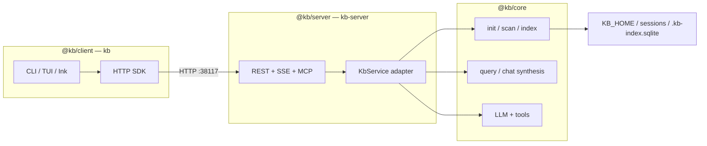

# KB Monorepo Architecture

KB 1.0 is three workspace packages: **`@kb/client`** (`kb`), **`@kb/server`** (`kb-server`), and **`@kb/core`** (shared domain). The client is a thin terminal front-end; the server owns indexing, retrieval, and LLM work; core has no transport.

## Client / server roles

| Role | KB |
|---|---|
| Server daemon | `kb-server` |
| CLI / TUI client | `kb` |
| Data home | `KB_HOME` (default `~/.kb`) |
| Host / port | `KB_HOST` / `KB_PORT` / `KB_SERVER_URL` / `kb --host` |
| Client settings | `KB_*` env vars + `~/.kb/state/` base files |

## Stack



## Package map

| Package | Binary | Owns |
|---|---|---|
| [`kb-client`](./kb-client/CLIENT.md) | `kb` | Routing, TUI, connection profile, skills install |
| [`kb-server`](./kb-server/src/SERVER.md) | `kb-server` | HTTP/MCP/Slack, boot-build, reindex scheduler |
| [`kb-core`](./kb-core/CORE.md) | — | Index, retrieval, intents, prompts, `KbService` |

Root `package.json` (`kb-workspace`) orchestrates build, test, eval — not shipped.

## Data layout (`KB_HOME`)

```
~/.kb/
  state/
    active-base           # session base (from kb base use)
    default-base          # persistent default base
  sessions/<base>/      # SQLite index, docs, repos/<slug>/
  logs/                 # RunReport NDJSON (server + local-mode CLI)
  evaluations/          # eval harvest artifacts
```

Binaries live on `PATH` or in `~/.kb/bin` — never inside `KB_HOME`.

## Runtime modes

| Mode | When | Behavior |
|---|---|---|
| **Client → host** | Always | `kb query` / chat → HTTP to live `kb-server` (localhost or remote URL) |

Eval indexing uses `scripts/eval-index.ts` (direct `@kb/core`) before attaching a server — not a client mode flag. Server down → connection error + `kb-server start` hint (`connection-error.ts`).

## Build

```bash
pnpm run install:global   # pnpm install + build + symlinks into $PNPM_HOME/bin
```

## Invariants

- Dependency graph is one-way: `client → core`, `server → core` — never `server → client`.
- Client surfaces **host + base** on every session; always HTTP to a host — indexing and LLM provider selection run on kb-server only (never print `Auto-selected LLM provider` from `kb`).
- OpenAPI + `server.http` are the wire contract; `KbService` is the in-process contract.
- Version `@kb/client` and `@kb/server` independently via changesets (user-facing). `@kb/core` is also changeset-versioned but **internal only** — never print it in CLI/TUI/`kb-server` logs/`/healthz`/MCP; it matters for workspace `package.json` bumps and snapshot manifest provenance. GitHub CLI releases and `v*.*.*` tags follow `@kb/client`; Docker image semver tags follow `@kb/server`.

## Related docs

- [`kb-client/CLIENT.md`](./kb-client/CLIENT.md) · [`kb-client/src/api/CONNECTION.md`](./kb-client/src/api/CONNECTION.md) · [`kb-core/CORE.md`](./kb-core/CORE.md) · [`kb-server/src/SERVER.md`](./kb-server/src/SERVER.md)
- Deploy → [`kb-server/README.md`](./kb-server/README.md) · Install → [`../scripts/INSTALL.md`](../scripts/INSTALL.md)
- Build-to-serve handoff (prepare on a big worker, serve on a small one) → [`kb-server/HANDOFF.md`](./kb-server/HANDOFF.md)
