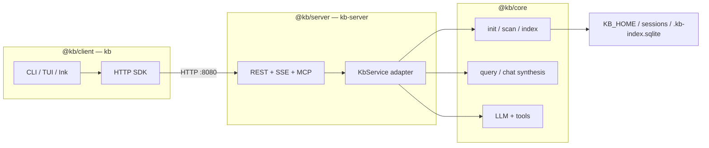

# KB Monorepo Architecture

KB 1.0 is three workspace packages: **`@kb/client`** (`kb`), **`@kb/server`** (`kb-server`), and **`@kb/core`** (shared domain). The client is a thin terminal front-end; the server owns indexing, retrieval, and LLM work; core has no transport.

## Postgres analogy

| Postgres | KB |
|---|---|
| `postgres` daemon | `kb-server` |
| `psql` client | `kb` |
| data directory | `KB_HOME` (default `~/.kb`) |
| `PGHOST` / `PGPORT` | `KBHOST` / `KBPORT` / `KB_SERVER_URL` |
| `~/.pgpass` | `~/.kb/config.json` → `server` block |

## Stack



## Package map

| Package | Binary | Owns |
|---|---|---|
| [`kb-client`](./kb-client/CLIENT.md) | `kb` | Routing, TUI, connection profile, skills install |
| [`kb-server`](./kb-server/src/SERVER.md) | `kb-server` | HTTP/MCP/Slack, boot-build, reindex scheduler |
| [`kb-core`](./kb-core/CORE.md) | — | Index, retrieval, intents, prompts, `KbService` |

Root `package.json` (`kb-workspace`) orchestrates build, test, eval — not shipped.

## Data layout (`KB_HOME`)

```
~/.kb/
  config.json           # client connection + prefs (server block, activeBase, …)
  sessions/<base>/      # SQLite index, docs, repos/<slug>/
  logs/                 # RunReport NDJSON (server + local-mode CLI)
  evaluations/          # eval harvest artifacts
```

Binaries live on `PATH` or in `~/.kb/bin` — never inside `KB_HOME`.

## Runtime modes

| Mode | When | Behavior |
|---|---|---|
| **Remote (default)** | Normal use | `kb query` / chat → HTTP to live `kb-server` |
| **Local** | `KB_LOCAL_MODE=1`, vitest | In-process `@kb/core` (eval harness, dev) |

Server down → postgres-style error + `kb-server start` hint (`connection-error.ts`).

## Build

```bash
pnpm run build          # kb + kb-server binaries
pnpm run install:global # symlinks both into $PNPM_HOME/bin
```

## Invariants

- Dependency graph is one-way: `client → core`, `server → core` — never `server → client`.
- OpenAPI + `server.http` are the wire contract; `KbService` is the in-process contract.
- Version each package independently via changesets (`@kb/client`, `@kb/server`, `@kb/core`, `kb-workspace`).

## Related docs

- [`kb-client/CLIENT.md`](./kb-client/CLIENT.md) · [`kb-core/CORE.md`](./kb-core/CORE.md) · [`kb-server/src/SERVER.md`](./kb-server/src/SERVER.md)
- Deploy → [`kb-server/README.md`](./kb-server/README.md) · Install → [`../scripts/INSTALL.md`](../scripts/INSTALL.md)
