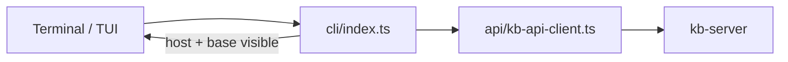

# KB Client (`@kb/client`)

Ships the **`kb`** binary: terminal UI, command router, and HTTP SDK. Default path is **remote** — all indexing and retrieval run on **kb-server**; the client connects, shows **where** it connected, and asks questions.

## Role in the stack



## Layout

| Area | Path | Role |
|---|---|---|
| Router | `src/cli/index.ts` | Subcommand dispatch; bare `kb` → TUI; prints connection context |
| Connection | `src/api/` | Profile resolution, `--host`, errors, `formatConnectionContext` |
| Remote hot path | `src/cli/remote-commands.ts` | `/v1/query`, `/v1/chat`, `/v1/admin/cli` |
| TUI | `src/tui/` | Ink session; `StatusBar` shows host + base |
| Skills | `src/cli/skill-installer.ts` | Install bundled agent skills locally |

Deep dive on HTTP wiring → [`src/api/CONNECTION.md`](./src/api/CONNECTION.md). Command routing → [`src/cli/CLI.md`](./src/cli/CLI.md).

## Connection profile

| Input | Purpose |
|-------|---------|
| `kb --host <host:port\|url>` | Per-invocation server override (preferred for ad-hoc remote) |
| `KB_HOST` / `KB_PORT` | Persistent default (e.g. `localhost` / `38117`) |
| `KB_SERVER_URL` | Full URL; wins over host+port |
| `KB_SERVER_API_KEY` | Bearer token when server auth is enabled |
| `KB_BASE` / `KB_ACTIVE_BASE` | Default base name hints |
| `~/.kb/state/active-base` | Session base (written by `kb base use`) |

**User visibility:** every session prints `host: … │ base: …` (CLI banner, TUI status bar, chat header). See [CONNECTION.md](./src/api/CONNECTION.md).

### Remote / team server (Docker / shared host)

**Humans** (CLI/TUI):

```bash
export KB_SERVER_URL=https://kb.acme.internal:38117
export KB_SERVER_API_KEY=<token>
kb query "how does auth work?"
# or: kb --host https://kb.acme.internal:38117 query "…"
```

**Agents** (Claude Code / Cursor) — same URL, MCP only:

```bash
kb skills install
kb mcp sync --host https://kb.acme.internal:38117
kb mcp status
# reconnect MCP in the agent
```

Indexing happens on the server via `KB_GIT_REPOS` — not `kb init` on the laptop. README walkthrough: [Connect to a remote / team server](../../README.md#connect-to-a-remote--team-server).

## Local vs remote

| | Remote (default) | Local (`KB_LOCAL_MODE=true`) |
|---|---|---|
| Connection label | `host: hostname:port` | `mode: local` |
| `kb query` / chat | `/v1/query`, `/v1/chat` | In-process `@kb/core` |
| `docs`, `facts`, `graph`, … | `POST /v1/admin/cli` | In-process dispatch |
| `init`, `scan` | **Not on client** | `@kb/core/ops` (eval/server only) |
| `skills`, `sync`, `base use` | Client-only | Same |

Eval harness uses `KB_LOCAL_MODE` + `scripts/eval-index.ts` until a live server takes queries.

## Invariants

- Never import `@kb/server` — server is a separate binary.
- Show connection context before retrieval or chat (except machine JSON stdout).
- Remote mode requires live server; no silent in-process fallback.
- Long-running TUI output uses `CliOutput`, not raw `console.log`.

## Related docs

- Connection → [`src/api/CONNECTION.md`](./src/api/CONNECTION.md) · [`CONNECTION.spec.md`](./src/api/CONNECTION.spec.md)
- CLI → [`src/cli/CLI.md`](./src/cli/CLI.md)
- TUI → [`src/tui/TUI.md`](./src/tui/TUI.md)
- Spec → [`CLIENT.spec.md`](./CLIENT.spec.md)
- Architecture → [`../ARCHITECTURE.md`](../ARCHITECTURE.md)
- Server → [`../kb-server/src/SERVER.md`](../kb-server/src/SERVER.md)
