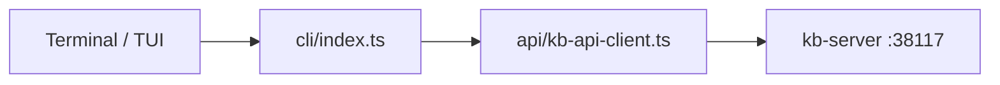

# KB Client (`@kb/client`)

Ships the **`kb`** binary: terminal UI, command router, and HTTP SDK. No tree-sitter, sqlite, or LLM SDKs in the default remote path — those live in `@kb/core` on the server.

## Role in the stack



## Layout

| Area | Path | Role |
|---|---|---|
| Router | `src/cli/index.ts` | Subcommand dispatch; bare `kb` → TUI |
| Remote hot path | `src/cli/remote-commands.ts` | All server ops over HTTP (`/v1/admin/cli`, `/v1/query`, `/v1/chat`) |
| SDK | `src/api/` | Connection profile, typed client, connection errors with start hint |
| TUI | `src/tui/`, `src/ui/` | Ink session; re-exports printer from core |
| Skills | `src/cli/skill-installer.ts` | Install bundled agent skills locally |

Command detail → [`src/cli/CLI.md`](./src/cli/CLI.md).

## Connection profile

All client settings are **environment variables**:

| Variable | Purpose |
|----------|---------|
| `KB_HOST` | Server hostname (default `localhost`) |
| `KB_PORT` | Server port (default `38117`) |
| `KB_SERVER_URL` | Full URL; wins over host+port |
| `KB_SERVER_API_KEY` | Bearer token when server auth is enabled |
| `KB_BASE` | Default base name |
| `KB_ACTIVE_BASE` | Session active base |

Base selection is also persisted in `~/.kb/state/active-base` and `~/.kb/state/default-base` (written by `kb base use`). See `server-connection.ts`.

### Remote server (Docker / shared host)

1. Run `kb-server` where the index should live — [`../kb-server/README.md`](../kb-server/README.md).
2. On your machine:

```bash
export KB_SERVER_URL=http://<host>:38117
export KB_SERVER_API_KEY=<token matching the server>
```

3. Use `kb` as usual — `query`, `init`, `scan`, TUI all hit the remote server.

## Local vs remote

| | Remote (default) | Local (`KB_LOCAL_MODE=true`) |
|---|---|---|
| `kb query` / chat | `/v1/query`, `/v1/chat` | In-process `@kb/core` |
| `init`, `scan`, `docs`, `facts`, `graph`, `logs`, `publish`, `base` (except `use`) | `POST /v1/admin/cli` | In-process `@kb/core/cli/dispatch` |
| `config`, `skills`, `uninstall`, `sync`, `base use` | Client-only (connection profile / install) | Same |

Eval harness still sets `KB_LOCAL_MODE=true` until it orchestrates a live server.

## Build

`scripts/build-client.mjs` → `dist/bin/kb`. Version from this package's `package.json` (`kb --version`).

## Invariants

- Never import `@kb/server` — server is a separate binary.
- Long-running output uses `CliOutput` (`@kb/core/ui/cli-output.ts`), not raw `console.log`, when invoked from TUI.
- Remote mode requires live server; no silent in-process fallback.

## Related docs

- CLI commands → [`src/cli/CLI.md`](./src/cli/CLI.md)
- Monorepo overview → [`../ARCHITECTURE.md`](../ARCHITECTURE.md)
- Server daemon → [`../kb-server/src/SERVER.md`](../kb-server/src/SERVER.md)
