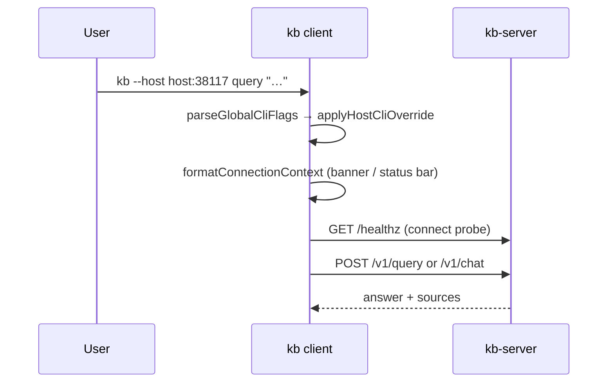

# Client ↔ Server Connection

The **`kb` client is a terminal front-end**. Default path: HTTP to **`kb-server`**, which owns indexing, retrieval, and LLM synthesis. The user must always see **which server** and **which base** a session uses — never infer it from env alone.

## Role in the stack



## Resolution order

The connection is always decomposed into **host + port + sslmode** (no URL-shaped
env var) — mirroring libpq's `PGHOST`/`PGPORT`/`PGSSLMODE`. `--host`/`KB_HOST` and
`kb://` connection strings funnel through the *same* scheme/port inference
(`buildServerUrl` in `connection-string.ts`), so a bare hostname resolves
identically no matter which surface set it.

| Priority | Source | Effect |
|----------|--------|--------|
| 1 | `--connection-string` / `KB_CONNECTION_STRING` | `kb://apikey@host:port/base` expands into `KB_HOST`/`KB_PORT`/`KB_SSLMODE` (+ `KB_SERVER_API_KEY`, `KB_BASE`) (`cli-global-flags.ts`) |
| 2 | `--host` on this invocation | Full `scheme://` URL decomposes into `KB_HOST`/`KB_PORT`/`KB_SSLMODE` (explicit scheme ⇒ explicit `sslmode`); `host:port` or bare `host` sets `KB_HOST`/`KB_PORT` only |
| 3 | `--port` / `--sslmode` / `--api-key` (`--key`) / `--base` | Each individually refines whatever `--host`/a connection string set — `KB_PORT` / `KB_SSLMODE` / `KB_SERVER_API_KEY` / `KB_BASE` |
| 4 | `KB_HOST` + `KB_PORT` + `KB_SSLMODE` | Scheme inferred via `buildServerUrl` (default `sslmode=prefer`: TLS for remote hosts, plaintext for loopback) |
| 5 | default | `http://localhost:38117` |

Auth: `KB_SERVER_API_KEY` → Bearer on every request (`kb-api-client.ts`). The client always uses HTTP.

### Base on the wire (`X-KB-Base`)

One `kb-server` process can serve **many bases** (psql/libpq's one-postmaster-many-databases model). The client selects the base **per request**: `resolveServerConnection` resolves `ServerConnection.base` (from `--base` / `--connection-string` → `KB_BASE`, then `KB_ACTIVE_BASE`, then `config.server.base`) and `kb-api-client` stamps it as the `X-KB-Base` header on every request. An **omitted** header ⇒ the server uses its boot/default base (libpq's behavior when `dbname` is omitted); an **unknown** base ⇒ `404 unknown_base`.

The server-side index for `<base>` lives under `~/.kb/sessions/<base>/` on the **server host**, not the laptop. Client-side `kb base use` only updates the local connection-profile hint (`~/.kb/state/active-base`).

### Connection string grammar

```
kb://[apikey@]host[:port]/[base][?sslmode=require|prefer|disable]
kb://localhost:38117/raylib                 # loopback ⇒ http
kb://TESTKEY@kb.example.com/raylib           # apikey in userinfo; remote ⇒ https
kb://localhost:38117/eval-raylib?sslmode=disable
```

Modelled on the libpq URI: the credential lives in userinfo (not `host:port`), TLS is chosen by `sslmode` (default `prefer`: TLS for remote hosts, plaintext for loopback) rather than the scheme, and `base` is the path segment (libpq's `dbname`). Parser: `connection-string.ts`.

## MCP client config install

**Humans** use the `kb` CLI/TUI (REST). **Agents** (Cursor / Claude Code) use Streamable HTTP MCP at `POST /mcp` only — the **kb:dev-workflow** skill teaches real NL `kb_query` + source verification and deliberately never mentions the human CLI/TUI surface.
The MCP URL follows the same connection profile as the CLI/TUI (`resolveServerConnection`): `--host` / env / `config.server.host`, defaulting to `localhost:38117`.

`syncKbMcpConfigs()` in `mcp-config-sync.ts` (used by `kb mcp install` / `kb skills install`):

| Trigger | Behavior |
|---------|----------|
| `kb mcp install --host … [--key …]` | Write Cursor/Claude `kb` → `${server}/mcp` (`--key`/`--api-key` sets the Bearer without exporting env) |
| `kb mcp install` | Same, using the active connection (localhost default) |
| `kb skills install` | Same MCP sync as `kb mcp install`, using the active connection |
| Normal `kb` / TUI startup | **No** MCP rewrite — opt-in via `kb mcp install` / `kb skills install` only |
| `kb mcp uninstall` / `kb skills uninstall` | Removes managed `kb` entries only |

`mcp install` has no flag parser of its own — `--host`/`--port`/`--sslmode`/
`--api-key`/`--key`/`--base`/`--connection-string` are global flags stripped by
`parseGlobalCliFlags` before dispatch reaches the `mcp install` handler, which
just syncs from the already-applied ambient connection (same as every other
remote command).

Host resolution: `--host` → `KB_HOST`+`KB_PORT`+`KB_SSLMODE` → `KB_CONNECTION_STRING` → `config.server.host` → `localhost` (same as CLI/TUI). TUI `/skills install` therefore points MCP at whatever host the session is connected to.

Writes `mcpServers.kb` with Bearer header from `--key`/`--api-key`, else `KB_SERVER_API_KEY` / `config.server.apiKey` (the flag wins when both are set; clears a stale Bearer when none is set). Merges into existing JSON; never clobbers other servers. Inspect with `kb mcp status`.

## User-visible connection context

Shared formatter: `formatConnectionContext(config, baseName?)` in `server-connection.ts`.

| Surface | Where it appears |
|---------|------------------|
| One-shot CLI | Line under `🤖 KB Agent Harness` banner (`index.ts`) |
| TUI | `StatusBar`: `host: … │ base: …` (pinned top row) |
| TUI startup | Same string prepended to startup notices |
| Chat | First line when `runRemoteChatSession` starts |
| Run reports | `resolveReportHost()` → telemetry `host` column |

Display: `host: hostname:port │ base: …`.

**Invariant:** Do not start retrieval or chat without showing connection context first (except machine JSON stdout paths like `docs generate --output json`).

## HTTP surface

| Client op | Endpoint | Module |
|-----------|----------|--------|
| Health probe | `GET /healthz` | `kb-api-client.connect()` |
| Query | `POST /v1/query` | `remote-commands.runRemoteIntentCommand` |
| Chat SSE | `POST /v1/chat` | `remote-commands.runRemoteChatTurn` |
| Admin CLI | `POST /v1/admin/cli` | `remote-commands.runRemoteCliCommand` |

Chat SSE events route through `dispatchRemoteChatStreamEvent`: `reasoning` → `progress` (thinking), `meta` → `log` (stage lines). **Do not merge both into progress** — stage heartbeats wipe the thinking spinner.

Unreachable server → `KbConnectionError` with `kb-server start` and `--host` / env hints (`connection-error.ts`). **No silent fallback to local mode.**

## Indexing and configuration

| Concern | Where |
|---|---|
| Git clone, scan, reindex | **kb-server** — `KB_GIT_REPOS`, `KB_REINDEX_INTERVAL` |
| Connection profile | **Environment** — `KB_HOST`, `KB_PORT`, `KB_SSLMODE`, `KB_CONNECTION_STRING`, API keys |

Operator guide copy lives in `INDEXING_SERVER_MANAGED_NOTICE` (`@kb/core/config/indexing-notice.ts`) when indexing setup is needed.

## Extension checklist

1. New global flag → extend `parseGlobalCliFlags` (+ `applyConnectionOverrides`) + help in `printCliHelp`.
2. New remote endpoint → `KbApiClient` method + `remote-commands` wrapper.
3. Any new interactive surface → call `formatConnectionContext` on open.
4. Connection errors → mention `--host` and env vars.
5. New MCP client target → extend `mcp-config-sync.ts` + keep skill/docs in sync.

## Gotchas

- `--host` applies only to the current process; profile env vars persist across shells.
- `formatServerAddress` strips scheme/path — display is `host:port`, not full URL.
- TUI `serverHost` prop is the host segment only; base updates async after `resolveEffectiveBaseDir`.
- `base use` is client-local (writes state files); other `base` subcommands hit server admin CLI in remote mode.
- `mcp`, `skills`, `uninstall`, and `sync` are always client-local — they rewrite agent configs on the laptop, not server state.
- Startup is read-only for agent wiring: no skill install, no MCP rewrite until the operator runs `kb skills install` / `kb mcp install`.
- Remote chat: keep `meta` and `reasoning` on separate output channels (`dispatchRemoteChatStreamEvent`).

## Related docs

- Package overview → [`../../CLIENT.md`](../../CLIENT.md)
- CLI routing → [`../cli/CLI.md`](../cli/CLI.md)
- Behavioral spec → [`CONNECTION.spec.md`](./CONNECTION.spec.md)
- Chat reply presentation → [`../../../kb-core/src/service/CHAT_REPLY.md`](../../../kb-core/src/service/CHAT_REPLY.md)
- Server multi-base → [`../../../kb-server/src/SERVER.md`](../../../kb-server/src/SERVER.md)
- Eval harness (shared multi-base batch) → [`../../../../eval/EVAL.md`](../../../../eval/EVAL.md)
