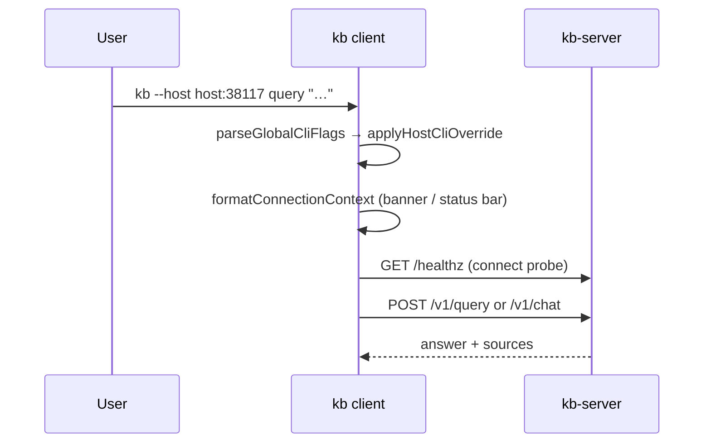

# Client ↔ Server Connection

The **`kb` client is a terminal front-end**. Default path: HTTP to **`kb-server`**, which owns indexing, retrieval, and LLM synthesis. The user must always see **which server** and **which base** a session uses — never infer it from env alone.

## Role in the stack

## Resolution order

| Priority | Source | Effect |
|----------|--------|--------|
| 1 | `--host` on this invocation | Sets `KB_SERVER_URL` or `KB_HOST`/`KB_PORT` for the process (`cli-global-flags.ts`) |
| 2 | `KB_SERVER_URL` | Full URL (wins over host+port) |
| 3 | `KB_HOST` + `KB_PORT` | Default `localhost:38117` |
| 4 | `KB_LOCAL_MODE=true` | **No HTTP** — in-process `@kb/core` (tests, eval harness) |

Auth: `KB_SERVER_API_KEY` → Bearer on every request (`kb-api-client.ts`).

Base: `resolveEffectiveBaseDir()` — session file `~/.kb/state/active-base`, default base, `.kb` marker, or `KB_BASE` / `KB_ACTIVE_BASE`. Server-side index lives under `~/.kb/sessions/<base>/` on the **server host**, not the laptop.

## MCP client config install

**Humans** use the `kb` CLI/TUI (REST). **Agents** (Cursor / Claude Code) use Streamable HTTP MCP at `POST /mcp` only — the **kb:dev-workflow** skill never investigates via CLI/TUI.
The MCP URL follows the same connection profile as the CLI/TUI (`resolveServerConnection`): `--host` / env / `config.server.host`, defaulting to `localhost:38117`.

`syncKbMcpConfigs()` in `mcp-config-sync.ts` (used by `kb mcp install` / `kb skills install`):

| Trigger | Behavior |
|---------|----------|
| `kb mcp install --host …` | Write Cursor/Claude `kb` → `${server}/mcp` |
| `kb mcp install` | Same, using the active connection (localhost default) |
| `kb skills install` | Same MCP sync as `kb mcp install`, using the active connection |
| Normal `kb` / TUI startup | **No** MCP rewrite — opt-in via `kb mcp install` / `kb skills install` only |
| `KB_LOCAL_MODE=true` | No-op |
| `kb mcp uninstall` / `kb skills uninstall` | Removes managed `kb` entries only |

Host resolution: `--host` → `KB_SERVER_URL` → `KB_HOST`+`KB_PORT` → `config.server.host` → `localhost` (same as CLI/TUI). TUI `/skills install` therefore points MCP at whatever host the session is connected to.

Writes `mcpServers.kb` with Bearer header when `KB_SERVER_API_KEY` or `config.server.apiKey` is set (clears a stale Bearer when neither is set). Merges into existing JSON; never clobbers other servers. Inspect with `kb mcp status`.

## User-visible connection context

Shared formatter: `formatConnectionContext(config, baseName?)` in `server-connection.ts`.

| Surface | Where it appears |
|---------|------------------|
| One-shot CLI | Line under `🤖 KB Agent Harness` banner (`index.ts`) |
| TUI | `StatusBar`: `host: … │ base: …` (pinned top row) |
| TUI startup | Same string prepended to startup notices |
| Chat (local) | First assistant line before the prompt hint |
| Chat (remote) | First line when `runRemoteChatSession` starts |
| Run reports | `resolveReportHost()` → telemetry `host` column |

Remote display: `host: hostname:port`. Local eval: `mode: local │ base: …`.

**Invariant:** Do not start retrieval or chat without showing connection context first (except machine JSON stdout paths like `docs generate --output json`).

## HTTP surface

| Client op | Endpoint | Module |
|-----------|----------|--------|
| Health probe | `GET /healthz` | `kb-api-client.connect()` |
| Query | `POST /v1/query` | `remote-commands.runRemoteIntentCommand` |
| Chat SSE | `POST /v1/chat` | `remote-commands.runRemoteChatTurn` |
| Admin CLI | `POST /v1/admin/cli` | `remote-commands.runRemoteCliCommand` |

Unreachable server → `KbConnectionError` with `kb-server start` and `--host` / env hints (`connection-error.ts`). **No silent fallback to local mode.**

## Indexing and configuration

| Concern | Where |
|---|---|
| Git clone, scan, reindex | **kb-server** — `KB_GIT_REPOS`, `KB_REINDEX_INTERVAL` |
| Connection profile | **Environment** — `KB_HOST`, `KB_PORT`, `KB_SERVER_URL`, API keys |

Operator guide copy lives in `INDEXING_SERVER_MANAGED_NOTICE` (`@kb/core/config/indexing-notice.ts`) when indexing setup is needed.

## Extension checklist

1. New global flag → extend `parseGlobalCliFlags` + help in `printCliHelp`.
2. New remote endpoint → `KbApiClient` method + `remote-commands` wrapper.
3. Any new interactive surface → call `formatConnectionContext` on open.
4. Connection errors → mention `--host` and env vars.
5. New MCP client target → extend `mcp-config-sync.ts` + keep skill/docs in sync.

## Gotchas

- `--host` applies only to the current process; profile env vars persist across shells.
- `formatServerAddress` strips scheme/path — display is `host:port`, not full URL.
- TUI `serverHost` prop is the host segment only; base updates async after `resolveEffectiveBaseDir`.
- `base use` is client-local (writes state files); other `base` subcommands hit server admin CLI in remote mode.
- `mcp`, `skills`, `uninstall`, and `sync` are always client-local — they rewrite agent configs on the laptop, not server state.
- Startup is read-only for agent wiring: no skill install, no MCP rewrite until the operator runs `kb skills install` / `kb mcp install`.

## Related docs

- Package overview → [`../../CLIENT.md`](../../CLIENT.md)
- CLI routing → [`../cli/CLI.md`](../cli/CLI.md)
- Behavioral spec → [`CONNECTION.spec.md`](./CONNECTION.spec.md)
- Server daemon → [`../../../kb-server/src/SERVER.md`](../../../kb-server/src/SERVER.md)
