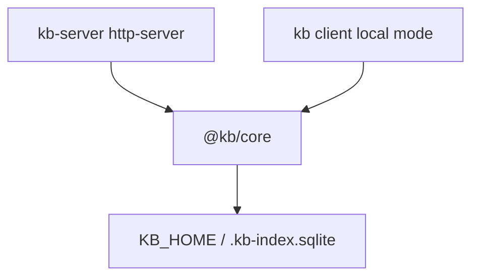

# KB Core (`@kb/core`)

Shared brain for client (local mode) and server. Owns everything that touches the SQLite index, graph, LLM providers, and retrieval pipelines. **No HTTP, Ink, or CLI routing.**

## Role in the stack

## Module map

| Directory | Responsibility |
|---|---|
| `core/` | LLM, agent loop, telemetry, doc generation, publish |
| `tools/` | SQLite index, tree-sitter, graph, fact curator |
| `intents/` | Intent router, policy |
| `prompts/` | `.md` templates + loader |
| `ops/` | `init-cli`, `scan-command`, git sync |
| `query/` | Intent CLI helpers, retrieval, `chat-synthesis` |
| `service/` | `KbService`, `query-pipeline`, serialize, session store, `chat-reply` / `markdown-to-slack` |
| `storage/` | Base selection, repo slugs + on-volume repo discovery, paths |
| `config/` | `kb-config`, cmd-ref, prerequisites |
| `ui/` | `CliOutput`, `Printer`, orchestration meta (shared with client) |

## Key seams

- **`createKbService()`** (`service/kb-service.ts`) — transport-agnostic query/chat/reindex/health.
- **`runQueryPipeline()`** (`service/query-pipeline.ts`) — shared retrieval path for CLI local mode and server.
- **`runChatSynthesis()`** (`query/chat-synthesis.ts`) — multi-turn chat loop; server streams via `chat-stream.ts`.
- **`formatChatReply()`** (`service/chat-reply.ts`) — shared answer + Sources footer (Slack mrkdwn via `markdown-to-slack.ts`).

Heavy native deps (tree-sitter, ast-grep, optional transformers) live **only here**.

## Config split

| Concern | Where |
|---|---|
| LLM keys, retrieval features | `KB_*` env vars on the server process |
| Client connection profile | `KB_HOST`, `KB_PORT`, `KB_SERVER_URL`, etc. |

## Invariants

- `@kb/core` must not depend on `@kb/client` or `@kb/server`.
- Domain ops (`init`, `scan`) stay in `ops/` — not in client CLI files.
- `getKbHomeDir()` / `KB_HOME` resolve all durable paths.
- Core package semver is **internal** (changeset bumps + snapshot `producer.coreVersion`). Never print it on user-facing CLI/TUI/`kb-server`/`/healthz`/MCP surfaces.

## Related docs

- Architecture → [`../ARCHITECTURE.md`](../ARCHITECTURE.md)
- Server transport → [`../kb-server/src/SERVER.md`](../kb-server/src/SERVER.md)
- Deep dives under `packages/kb-core/src/**/*.md` — QUERY_INTERNALS, INIT, TOOLS, [CHAT_REPLY](src/service/CHAT_REPLY.md) companions
