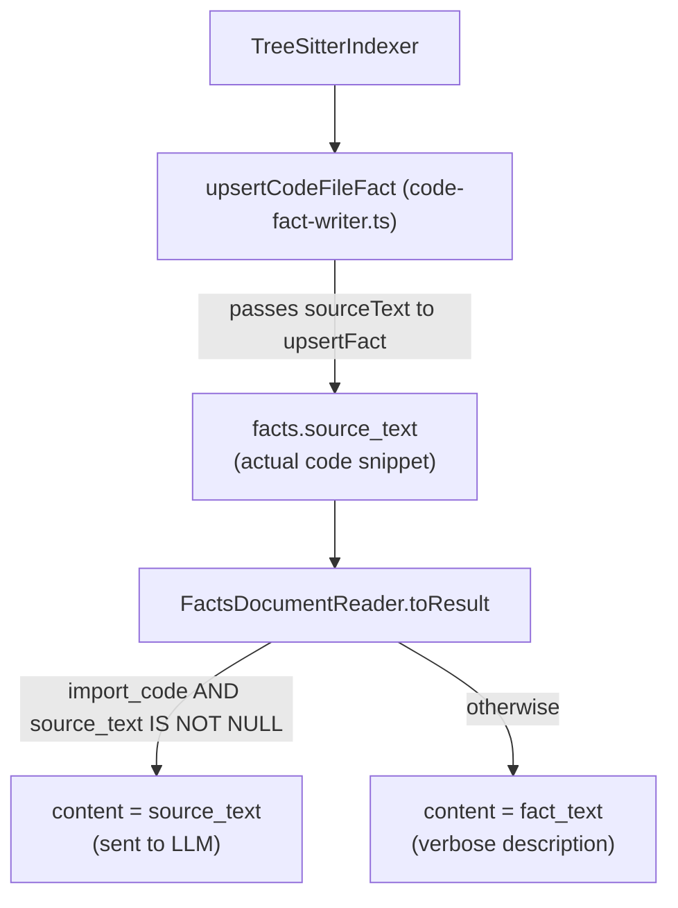

# AST source text reconstruction

When the code graph is indexed, exported symbols are promoted into the `facts` table as human-readable strings like `"Router is a Class exported from src/router.ts"`. These strings are good for search and deduplication but wasteful as LLM context — the model already knows what a class is. What it actually needs is the **source code**.

This document describes how compact, token-efficient code snippets are extracted at index time and served as fact content at retrieval time.

---

## Pipeline



---

## Index time: capturing source text

### TreeSitterIndexer (`tree-sitter-indexer.ts`)

Tree-sitter export queries capture `@name` — the identifier node, not the full declaration. A `getDeclNode` helper walks up from the identifier to the nearest top-level declaration:

```typescript
function getDeclNode(nameNode: TsNode): TsNode {
  let n: TsNode = nameNode
  while (n.parent?.parent != null) {
    n = n.parent
  }
  return n
}
```

`n.parent?.parent != null` terminates when `n` is a direct child of the root (e.g. `export_statement` or `function_declaration` at top level). The source slice uses the declaration node's spans:

```typescript
const declNode = getDeclNode(nameNode)
const rawText = src.slice(declNode.startIndex, declNode.endIndex)
```

The same 1500-char cap applies.

`fact_text` is always the human-readable description (`"Foo is a Class exported from…"`) because it drives FTS search and deduplication via `normalized_text`. `source_text` is a separate column that exists solely to enrich LLM context.

---

## Schema

**Migration 12** adds `source_text TEXT` (nullable) to the `facts` table:

```sql
ALTER TABLE facts ADD COLUMN source_text TEXT;
```

`FactRow.source_text` and `FactUpsertInput.sourceText` expose this in the TypeScript layer.

---

## Retrieval: serving code instead of descriptions

`FactsDocumentReader.toResult` chooses content based on `source_kind`:

```typescript
const content = includeContent
  ? row.source_kind === 'import_code' && row.source_text
    ? row.source_text    // actual code snippet
    : row.fact_text      // verbose description fallback
  : undefined
```

| `source_kind`  | `source_text` present | Content served to LLM        |
|----------------|-----------------------|------------------------------|
| `import_code`  | yes                   | code snippet                 |
| `import_code`  | no (legacy / old db)  | `"X is a Y exported from Z"` |
| `import_doc`   | —                     | `fact_text`                  |

---

## Token savings

A typical `import_code` fact text is ~50 chars (`"SqliteKbIndexer is a Class exported from src/tools/sqlite-kb-index.ts"`). The corresponding source snippet for a method or short function is 100–400 chars of actual code — **more informative** and not significantly longer. For large classes the 1500-char cap keeps cost bounded.

---

## Re-indexing existing bases

After upgrading, run `kb scan` to re-index all source files. The tree-sitter indexer will write `props_json.source_text` on every symbol, and `promoteAstToFactsTable` will populate `facts.source_text` on the next scan cycle. There is no data migration needed for facts already in the store — they will be updated on the next `kb scan` because `upsertFact` matches by `normalized_text` and overwrites `source_text`.
