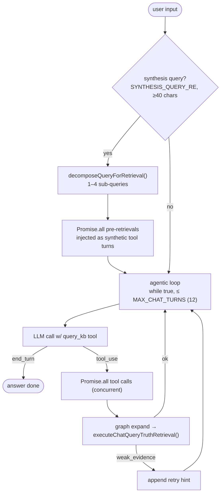

# Chat session — design

Source of truth for interactive chat turns. Update when behavior changes.

**Mental model:** each user message drives one or more `query_kb` retrievals on the same
`query_truth` path as `kb query` (including the **fact curator**). Only Q/A prose in
`messages[]` persists across turns — no cross-turn fact pool; curator re-decides relevance
per query.

## How a chat turn works

1. **Decompose pre-step** — for synthesis/elaboration queries (≥40 chars matching
   `SYNTHESIS_QUERY_RE`), a lightweight LLM call (`chat-decompose-system.md`) splits the
   query into 2–4 targeted sub-queries. All run in parallel via `Promise.all` and are
   injected as a synthetic assistant+user message pair before the main loop, giving the LLM
   grounded context from multiple angles before it starts reasoning.

2. **Agentic while loop** — replaces the old fixed `MAX_CHAT_TOOL_ROUNDS`. Runs until the
   LLM returns no `tool_use` blocks OR `MAX_CHAT_TURNS` (12) is hit. Each round calls the
   LLM with the `query_kb` tool. All tool calls in a batch execute concurrently.

3. **Graph expansion** — before each retrieval, `expandQueryWithGraph` may widen the query string.

4. **Retrieval** — `executeChatQueryTruthRetrieval()` → `runQueryTruthRetrieval()` →
   `runIntentLoop` → router → `read_facts` → `FactsQueryResearchOrchestrator` (up to 24
   passes, plateau/frontier-based early exit). Each retrieval is independent — facts are not
   carried over from prior turns (`query_truth` still accepts an optional `excludeIds`, but the
   chat path does not populate it).

5. **Curation** — when the pool exceeds 12 facts, the **fact curator**
   (`src/tools/fact-curator.ts`) judges it against the user's question, hard-drops off-topic
   facts, and runs bounded re-discovery to refill gaps. Decisions are recorded out-of-band on
   `retrieval.curation` — never added to the prompt. See `src/tools/FACT_CURATOR.md`.

6. **LLM context** — surviving `results[]` via `formatRetrievedFactsForLLM()`
   (`src/core/retrieval-context.ts`), 2000 chars per fact.

7. **Answer synthesis** — chat uses **`runChatSynthesis()`** (`chat-cli.ts`): multi-turn loop
   with optional `query_kb` tool calls. This is **not** the `kb query` path — CLI query uses
   one-shot `enrichReadDocumentsAnswerWithLLM()` instead (see `QUERY_INTERNALS.md`).

8. **Evidence header** — one `evidence>` summary line (count, mix, themes, leads, walk/stop/conf).
   See `src/core/EVIDENCE_SUMMARY.md`.

9. **Weak evidence signal** — when retrieval stops with `weak_evidence_after_exhaustion`,
   `buildToolQueryResult` appends a note telling the LLM to try different query terms before
   concluding information is unavailable.

10. **Orchestration footer** — `printReadDocumentsOrchestrationFooter()` prints `retrieval>`,
   `matches>`, `sources>`, `timing>`. Use `--verbose` for `summary>`/`confidence>` rows,
   `--debug` for per-document provenance.

11. **Presentation** — wire stays `answer` + `sources[]`; text surfaces use
    `formatChatReply` ([CHAT_REPLY.md](../service/CHAT_REPLY.md)). Demo mirrors rules in-browser.

## Prompts

| File | Role |
|------|------|
| `chat-router-system.md` | When to call `query_kb`, multi-angle + weak-evidence retry |
| `chat-decompose-system.md` | 1–4 retrieval sub-queries, one per line |

## Why not shell out to `kb query`?

CLI loop would duplicate process/env/base/errors. Orchestrator = same contract, in-process.

## Invariants

- Break on `end_turn` or zero tools; `MAX_CHAT_TURNS` is safety only.
- Tool calls in one LLM round run concurrently.
- Always append weak-evidence hint when `weak_evidence_after_exhaustion` is set.
- Decompose only when `SYNTHESIS_QUERY_RE` matches and input ≥40 chars.
- No cross-turn fact pool; curator re-decides per query; decisions stay out-of-band.

## See also

- [`../query/chat-synthesis.ts`](../query/chat-synthesis.ts) · [CHAT_REPLY.md](../service/CHAT_REPLY.md) · [FACT_CURATOR.md](../tools/FACT_CURATOR.md)
- [QUERY_INTERNALS.md](./QUERY_INTERNALS.md) · [TUI.md](./TUI.md)
- [SERVER.md](../../../kb-server/src/SERVER.md) · [demo/README.md](../../../../demo/README.md)
