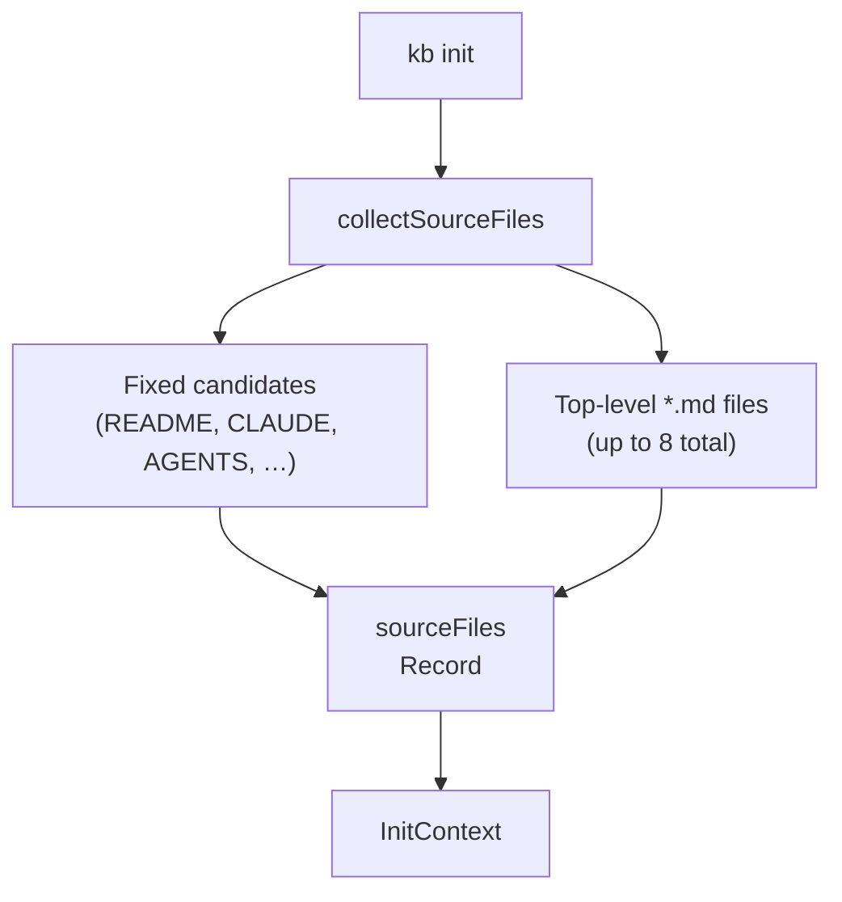
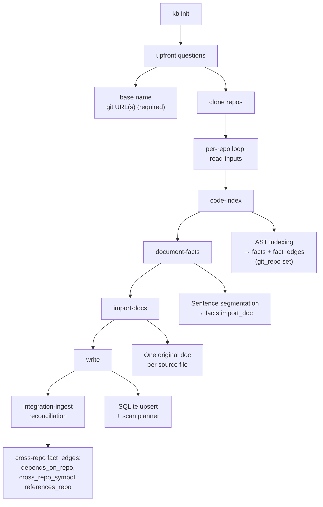
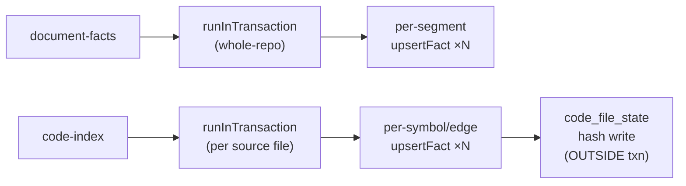

# KB Init Pipeline

`kb init` bootstraps a knowledge base from **one or more git repositories** — at least one `--git` remote is required (local-directory indexing has been removed). Each remote establishes its **primary branch** at clone time: `url#branch`, a shared `--branch` fallback, or the remote's own default HEAD when omitted. That clone HEAD is what Slack/chat source blob links use later (`discoverBaseRepos` → `gitBranch`) — there is no global source-branch env. In interactive mode it first collects user input upfront — base name and at least one git URL — then clones each repo into `~/.kb/sessions/<base>/repos/<slug>/` and runs the multi-phase scan **per repo**: **`read-inputs`** (README-like docs), **`code-index`** (deterministic AST indexing into `facts` + `fact_edges`), **`document-facts`** (sentence facts from markdown sources; OKF frontmatter is stripped first, and a doc's `resource:` scopes which exported symbol each segment anchors to), **`import-docs`** (one verbatim original SQLite doc per discovered markdown file), and **`write`** (persist docs; with **`kb scan`** this stage also plans/applies claim mutations). Each fact records its origin repo in the **`git_repo`** column.

All repos fold into **one connected graph**. After the per-repo loop, an **integration-ingest** reconciliation pass bridges the subgraphs by linking facts across repos on real integration signals — `package.json` dependencies, cross-repo symbol imports, and `.env`/service references — producing cross-repo `fact_edges` (`depends_on_repo`, `cross_repo_symbol`, `references_repo`). This runs at the end of `kb init`, after **`kb scan`**, and after auto-sync. Use **`kb scan`** to pull + re-index every tracked repo and rebuild the cross-repo links.

In the TUI, init/scan progress is rendered as a dedicated live status line instead of transcript history. Any phase that iterates over a collection of files, docs, facts, claims, or mutations emits incremental progress while that collection is being processed; only atomic operations stay start/finish-only. Progress lines include counts and, when useful, the current item. The long-running deterministic phases also yield cooperatively to the event loop between batches so the terminal can repaint and interrupts remain responsive during large scans.

## Input Collection

- `sourceFiles` — human-readable documentation files collected for **`import-docs`** (verbatim originals) and for **`document-facts`** / prompts.

## Init cycles

## Write batching & scan performance

The deterministic phases (`code-index`, `document-facts`) are write-bound, not
compute-bound: on a monorepo the original cost was thousands of individual
autocommitted SQLite writes (one bundle per segment / per symbol, each touching
3–4 tables). The fix is **transaction batching**, not a redesign — the indexers
fold many `upsertFact` calls into a single SQLite transaction.

Invariants:

- **`document-facts` ingest wraps the entire repo's files in one
  `SqliteKbIndexer.runInTransaction`** (`src/core/scan-fact-ingest.ts`). Do not
  reintroduce per-segment autocommit — it was the dominant scan cost.
- **`code-index` wraps each source file's facts in a per-file
  `runInTransaction`** (`tree-sitter-indexer.ts`).
- **`runInTransaction` is re-entrant** via `transactionDepth` — a nested call
  joins the open transaction instead of issuing a second `BEGIN`.
- **`code_file_state` (per-file content hash) is written outside the fact
  transaction**, so a rolled-back fact batch never marks a file as indexed.
- **The `write` phase batches every doc upsert in one
  `SqliteDocumentWriter.runInTransaction`** (`init-cli.ts` `writeDocs`) instead of
  autocommitting per document. Original docs each write a single `original_docs`
  row and skip fact re-indexing (see *Facts extracted from written documents*),
  so this phase is cheap relative to `code-index` / `document-facts`.
- **Per-segment symbol anchoring stays two-tier**: OKF `resource` scope first
  (candidate symbols loaded once, token-overlap scored in memory via
  `scoreSegmentInScope`), then the global FTS nearest-symbol fallback
  (`findNearest`) only when no resource scope resolves.
- **Segmentation granularity is preserved**: `segmentMarkdownForFacts` defaults
  to `minSegmentLength=8` with no merging; scan ingest calls it with no options.
  Coarse paragraph merging (`mergeShortSegmentsBelow`) exists as opt-in only.

### Tried and reverted (do not redo without re-proving quality)

These were attempted for extra speed and reverted because they changed
graph/retrieval behavior while the structural DB stayed otherwise identical:

| Experiment | Why reverted |
|---|---|
| Defer `rebuildFactGraph` to a single post-ingest batch | Changed concept/edge graph; `rebuildFactGraph` stays per `upsertFact` |
| Cache a single global symbol matcher, drop the per-segment FTS fallback | Hurt retrieval anchoring; FTS fallback retained |
| Coarsen scan segmentation by default (merge short prose) | Reduced retrieval granularity; made opt-in instead |

### Build-under-test benchmark

Speed claims are measured by indexing the **same target snapshot** with two
different `kb` binaries (main build vs feature build), not by changing the target
repo. Latest run: ~24% faster init on the kb self-check, ~46% on raylib
(`db0870f`), with fact/doc/code-fact/docs counts identical across builds. Headline
numbers live in `research/tables/results.tex` (see `research/README.md`).

## Memory scaling on large cold indexes (issue #191)

The Fly builder (`scripts/fly/refresh.sh` → `kb-server refresh`, see
`FLY_ORCHESTRATION.md`) OOM-killed on a cold index of the `brew`
(`Homebrew/brew.git`) base even at 8 GiB, while the other 9 bases in
`scripts/fly/bases.json` built fine. Investigation found several places where
memory scales with **total repo size** rather than staying bounded — some fixed,
some still open. Treat this section as the map for the next repo that's bigger
than whatever the machine was last bumped to.

### Fixed

- **`SqliteKbIndexer.embedAllFacts` (`tools/sqlite-kb-index.ts`)** used to run one
  `SELECT` pulling *every* not-yet-embedded fact (id + fact_text) into a single JS
  array before slicing it into embed-API batches of 100. The embed calls were
  already batched — the **read** wasn't. For a repo the size of `brew` (thousands
  of Ruby files → hundreds of thousands of AST facts, all generated before this
  runs once at the end of a cold `kb init`), that one array landed right on top of
  whatever else was already resident. It's now keyset-paginated by fact id (`id >
  cursor ORDER BY id LIMIT ?`), so peak memory for this stage is
  O(`KB_EMBED_FETCH_PAGE_SIZE`), not O(total facts). Page size defaults to 1000
  and is configurable via `KB_EMBED_FETCH_PAGE_SIZE`
  (`config/indexing-batch-size.ts`) independent of the embed-call batch size.
- **`assessTopicCoverage` (`ops/init-topic-coverage.ts`)** used to
  `Object.values(context.sourceFiles).join('\n').toLowerCase()` — one extra
  full-repo-sized string, on top of `context.sourceFiles` itself, just to do
  keyword `.includes()` checks. It now checks keywords against each file's
  content directly (`.some(text => text.toLowerCase().includes(needle))`),
  trading a little repeated per-call lowercasing (topic/keyword count is small,
  ~8 topics × ~5 keywords) for never holding a second full-repo copy.

### Known, not fixed — the next place to look

These are real, evidenced accumulation points that weren't in scope for this
pass (each would touch a currently-tested contract — `InitContext`,
`collectSourceFiles`, the checkpoint schema — see the tests listed below before
changing them):

- **Checkpoint content duplication (`ops/init-cli.ts` `writeCheckpoint`,
  `persist()`).** `read-inputs` persists the *entire* `context.sourceFiles`
  (path → full content) and `import-docs` persists the entire `candidateDocs`
  array (duplicate content again) to a JSON checkpoint file via
  `JSON.stringify(checkpoint, null, 2)` — **unconditionally**, on every cold
  `kb init`/`kb-server refresh` run, not just when `--stop-after`/`--resume-from`
  is explicitly used. This is intentional and tested (`tests/cli/init-cli.test.ts`
  asserts the checkpoint file contains `context.sourceFiles` and
  `candidateDocs`) — it's what lets an interactive session pause after one cycle
  and resume in a later process. But for an automated, non-interactive cold
  bootstrap (the Fly builder never passes `--stop-after`/`--resume-from`/
  `--checkpoint-file`), it means a third and fourth full copy of every
  markdown/text source file's content exist simultaneously (in-memory context +
  in-memory candidateDocs + their `JSON.stringify` output), for repos with a lot
  of doc content. `brew`'s own docs are small (~97 markdown/text files, ~a few
  hundred KB total) so this wasn't the dominant factor in the incident, but a
  doc-heavy repo would hit it hard. A real fix needs the checkpoint's heavy
  fields to be skippable when no pause/resume was requested, **plus** a
  recompute-on-missing-content fallback on resume (both `read-inputs` and
  `import-docs` are pure/local — no LLM or network calls — so recomputing them is
  safe/cheap, just not implemented today).
- **`context.sourceFiles: Record<string,string>` (`ops/init-cli.ts`
  `collectSourceFiles`) and its duplicate, `candidateDocs`.** Both hold every
  markdown/text file's full content in memory for the whole `runKbInit` call on a
  cold (non-rescan) build — `collectSourceFiles` builds the first copy,
  `buildOriginalDocumentsFromSourceFiles` builds the second. Rescans are fine
  (they already operate on `selectChangedSourceFiles`'s filtered-down delta, not
  the whole repo) — it's specifically the cold/first-index path that's
  unbounded. Not changed here because `InitContext`'s shape and
  `collectSourceFiles`'s return type are exercised directly by
  `tests/cli/collect-source-files.test.ts`, `tests/cli/init-topic-coverage.test.ts`,
  and `tests/cli/init-cli-rescan-multi-repo.test.ts` — bounding this for real
  means batching `collectSourceFiles` → `buildOriginalDocumentsFromSourceFiles` →
  `writeDocs` end-to-end (read N files, build+write+discard, repeat), which is a
  bigger, riskier change than fit in this pass.
- **`CodeIndexStats.sourceRefs: Set<string>` (`tools/tree-sitter-indexer.ts`)**
  accumulates one entry per exported symbol/edge/import across every file
  `indexProject` touches, for the blanket stale-fact tombstone reconciliation
  (`init-cli.ts` `tombstoneStaleAstFacts`). The per-file AST parse/write loop
  itself already streams correctly (one WASM tree resident at a time, freed per
  file, facts committed per file) — this Set is the one piece of code-index state
  that's still O(total symbols in the repo). Bounding it means moving the
  reconciliation from an in-memory Set diff to a SQL-based "touched in this run"
  marker, which wasn't attempted here.
- **`deleteFactsByRepo` (`tools/sqlite-kb-index.ts`)** `SELECT`s every fact id for
  a repo into memory before deleting. Only runs when a repo is removed from a
  base (not on the cold-index path this issue is about), so left as-is.

### Regression benchmark

Two complementary scripts, both manual/on-demand (not wired into `pnpm test`)
— run them after touching anything in this file's "Fixed"/"Known, not fixed"
lists above:

- **`scripts/bench/embed-all-facts-fetch-bench.mjs`** — fast, targeted check of
  the `embedAllFacts` fix specifically. Seeds a throwaway SQLite index with N
  synthetic facts via raw SQL (bypassing `upsertFact`'s per-call graph-rebuild
  cost, which is real but unrelated to this check) and runs `embedAllFacts`
  with a fake instant embedder, printing RSS at intervals. Real run: **1,000,000
  facts → peak RSS 163.7 MiB, completed in 158s** (vs. what would have been one
  multi-hundred-MB JS array allocated up front pre-fix). This is the direct
  evidence the pagination fix works, independent of how long a real repo's
  earlier phases take to reach the embedding step.
- **`scripts/bench/large-repo-memory-bench.sh`** — real-world end-to-end check:
  cold `kb-server refresh` against a shallow clone of `Homebrew/brew.git` (~3k
  files, the actual `brew` base from `scripts/fly/bases.json`) inside `docker
  run --memory=2g --memory-swap=2g`, sampling cgroup memory every 10s and
  checking `docker inspect ... State.OOMKilled` on exit. Slower than expected
  to reach the embedding phase on this repo specifically — `document-facts`
  symbol-anchors each of `brew`'s ~95 doc segments against every already-indexed
  AST fact (~9.5k for this repo), which is slow at this repo's symbol count (a
  pre-existing, unrelated cost) — so `--timeout` needs to be generous (default
  here: 60 min, vs. the CLI's own 30 min default). Not OOM-killed in the runs
  observed; memory stayed flat (~215–250 MiB) through code-index and well into
  document-facts, consistent with the `embed-all-facts-fetch-bench.mjs` result
  above.

## Upfront Questions

Before the scan begins, interactive `kb init` (no `--base`, not `kb scan`, not `--non-interactive`) asks two questions in order:

| # | Prompt | Skipped when |
|---|---|---|
| 1 | Base name | `--base` provided or resuming checkpoint |
| 2 | Git URL(s) — at least one **required** | `--base` provided, `--git` provided, or resuming |

Git URLs are mandatory; there is no blank-to-local option and no fact-category prompt. Each URL may carry an inline `#branch`; the `--branch` flag sets the default branch for repos that omit one (default `main`). `/cancel` at any prompt aborts and returns to the chat session.

## Multi-repo clone + index

After the upfront questions, each `--git` repo is cloned into `~/.kb/sessions/<base>/repos/<slug>/`. The clones under `repos/*` are the base's tracked-repo registry — each clone's `origin` remote records where it came from, so nothing is persisted alongside them (see `storage/base-repos.ts`, `discoverBaseRepos`). The per-repo loop runs `read-inputs → code-index → document-facts → import-docs → write` against each clone, tagging every fact with its `git_repo` origin.

## Integration-ingest reconciliation

Once all repos are indexed, the reconciliation pass folds the per-repo subgraphs into one connected graph. It links facts across repos on real integration signals:

- `package.json` dependencies (repo A depends on repo B's package)
- cross-repo symbol imports
- `.env` / service references

These emit bridge `fact_edges` of types `depends_on_repo`, `cross_repo_symbol`, and `references_repo`. The pass runs at the end of `kb init`, after `kb scan`, and after auto-sync.

## Document Provenance

Documents are routed by provenance via the `is_original` flag:

| `is_original` | Lane |
|---|---|
| `1` | Originals — **frozen snapshots** of source files (we do not rewrite or “correct” them in the KB pipeline) |
| `0` | Autogenerated — the **curated layer** we refine for retrieval and demos; may overlap originals on purpose |

## Title Conventions

| Context | Rule | Example |
|---|---|---|
| Autogenerated docs | Cap Every Word (`toTitleCase`) | `"Project Overview"` |
| Original/source docs | Basename as-is (`basenameTitle`) | `"CLAUDE.md"` |

## Facts extracted from written documents

When **derived** documents are persisted (the curated/autogenerated layer, or any path using **`SqliteDocumentWriter`** that writes non-original docs), the writer **indexes candidate facts** from the document body (deterministic sentence segmentation with OKF frontmatter stripped first, length filters, and capped inserts into the **`facts`** table). That is **incremental** fact growth alongside init; see **`facts-architecture.md`** §2 / §7 for the full ingest model.

**Original/source docs are excluded from this pass.** Their facts already come from the dedicated **`document-facts`** ingest (`scan-fact-ingest.ts`), which anchors triplets to AST symbols and namespaces `source_ref` as `path#sN`. Re-segmenting them again in the `write` phase was redundant churn — and it overwrote that richer `source_ref` with a bare doc-id, silently breaking per-file fact tombstoning on rescan. So `SqliteDocumentWriter.writeDocument` skips fact extraction when `isOriginal` is set; only the verbatim `original_docs` row is written.

## Code-derived facts (AST-only)

Source code facts come **only** from deterministic AST indexing (`TreeSitterIndexer`) during the **`code-index`** cycle. Supported languages get symbol facts and structural edges in `facts` / `fact_edges`. Languages without a wired WASM grammar are **not indexed** — there is no LLM fallback.

See **Language Support** below for the current AST matrix and the removed fallback list.

### One indexer

| Indexer | Files | When it runs |
|---|---|---|
| `TreeSitterIndexer` (`src/tools/tree-sitter-indexer.ts`) | All AST-able + text/config files | Always; uses WASM grammars via `web-tree-sitter` |

Every language — including TS/JS — goes through `TreeSitterIndexer`. It parses **one file at a time** (a single WASM syntax tree resident at once, freed via `tree.delete()` after each file), so peak memory is bounded by the largest file rather than the whole project graph. The earlier `TsMorphIndexer` loaded the entire TypeScript program (all source files + the type-checker dependency graph) into memory for a single pass, which dominated `kb init` memory and could OOM large repos. For TS/JS the tree-sitter path now also emits the constant-value, non-exported-constant (`defined_in`), and `EXTENDS`/`IMPLEMENTS` facts that previously only ts-morph produced (extracted by node navigation rather than the type checker).

### File handling by extension

`TreeSitterIndexer` uses an explicit **allowlist** — not a denylist:

- **AST-able** — extensions in `EXT_MAP` (`src/tools/tree-sitter-indexer.ts`): Go, TS/TSX, JS/JSX, Python, Rust, Ruby, Java, C/C++, C#, CSS, Bash, PHP, Scala, HTML, etc. → file node + symbol nodes + import/export edges where queries exist
- **Text/config** (`.md`, `.yaml`, `.json`, `.toml`, `.sql`, `.tf`, etc.) → file node only, `language='text'`, no symbols
- **Everything else** (images, binaries, lock files, compiled artifacts) → silently ignored

WASM grammars ship in `tree-sitter-*` npm packages — no native compilation, all platforms.

### What gets written

- **`facts`** (`source_kind='import_code'`) — one fact per exported symbol (`"Foo is a Class exported from src/foo.ts"`) with `source_text` set to the raw declaration (capped at 1500 chars)
- **`fact_edges`** — structural edges: `IMPORTS_FILE`, `EXPORTS_SYMBOL`, `EXTENDS`, `IMPLEMENTS`
- **`code_file_state`** — per-file content hash for incremental skip on re-run

### Incremental behaviour

The indexer stores a `content_hash` (and the extractor name) per file in `code_file_state`. On re-run (including `kb scan`), files whose hash hasn't changed **and** were indexed by the same extractor are counted as `skipped` and not re-processed. Only changed or new files — or files left behind by the legacy ts-morph extractor — are re-indexed.

To keep the TUI **and** kb-server HTTP responsive, the deterministic ingest/index loops yield back to the Node.js event loop between batches **and** on a short wall-clock timer. Count-only strides are not enough when each unit of work is slow (e.g. FTS-backed `document-facts`): without time-based yields, `/healthz` and chat can time out for many seconds during first-boot bootstrap. Yielding also lets progress updates paint incrementally and gives `Ctrl-C` / terminal interrupts a chance to land between chunks.

### Per-repo change-detection manifests

Above the in-DB `code_file_state` hash, a rescan first *selects which files to touch* by diffing content-hash manifests written by the previous cycle: `ast-files-manifest.*.json` (AST-able files) and `source-files-manifest.*.json` (markdown/text sources). These live at the **base root** — not inside `repos/<slug>/` — so they survive a `--no-repos` snapshot/adopt and are present when a re-cloned repo is rescanned.

**Invariant — manifests are namespaced per git-repo slug.** Each repo writes `ast-files-manifest.<slug>.json` / `source-files-manifest.<slug>.json`; the un-suffixed filename is only the fallback for a slug-less single-directory rescan. Manifest keys are **repo-relative** (`src/x.ts`), so two repos routinely share keys (`src/index.ts`, `README.md`). A single shared manifest therefore cannot represent a multi-repo base: because every write is a whole-file overwrite, each per-repo rescan clobbered the previous repo's entries, so on the next repo (and the next warm rescan) *every* file was absent from the manifest and treated as changed — `0 unchanged`, forcing a full re-embed of the whole base (hours). Per-slug files keep each repo's diff isolated: an unchanged repo reports 0 changed, and only files whose hash actually moved for *that* repo are re-indexed. A slug read must **never** fall back to the un-suffixed file — that file holds only one repo's data and would produce false hits.

**Invariant — a partial rescan tombstones only removed files, never unchanged ones.** The blanket AST reconciliation (`tombstoneStaleAstFacts`) purges every code fact whose `source_ref` was not re-emitted this pass. That is only safe when the whole tree was indexed (fresh init, or a rescan where every file changed). On a *partial* incremental rescan the re-emitted set covers only the changed files, so a blanket purge would delete every unchanged file's facts. The code-index cycle therefore guards on `indexedFullTree` (`candidateFiles === all files`): full tree → blanket reconcile; partial → tombstone only files removed from that repo since its last manifest (`diffRemovedAstFiles` → `tombstoneRemovedCodeFiles`, scoped by `git_repo` and matched by parsed file path, never a LIKE prefix). A pure-deletion rescan (a file removed, nothing else changed) still enters this path so the deleted file's facts are purged. Hashed import/heritage edges (`ast:import:*` / `ast:edge:*`) for a removed file are not file-mappable and are reconciled on the next full re-index. Markdown-source deletions are handled independently by `tombstoneRemovedDocSourceFiles`, which already runs every rescan against the per-slug source manifest.

## Language Support

One pipeline indexes source code: **code-graph** (`TreeSitterIndexer`), deterministic AST-based.

| Language | Extensions | Code-graph (AST) |
|---|---|---|
| TypeScript | `.ts` `.tsx` `.mts` `.cts` | yes — TreeSitter |
| JavaScript | `.js` `.jsx` `.mjs` `.cjs` | yes — TreeSitter |
| Python | `.py` | yes |
| Go | `.go` | yes (uppercase-export convention) |
| Ruby | `.rb` | yes |
| Java | `.java` | yes |
| Rust | `.rs` | yes |
| C / C++ | `.c` `.h` `.cpp` `.cc` `.hpp` … | yes |
| C# | `.cs` | yes |
| PHP | `.php` | yes |
| Scala | `.scala` | yes |
| Bash | `.sh` `.bash` `.zsh` | yes |
| CSS | `.css` | yes (selectors) |
| HTML | `.html` `.htm` | yes (id elements) |
| Swift | `.swift` | **no** — no tree-sitter WASM grammar |
| Kotlin | `.kt` `.kts` | **no** — `tree-sitter-kotlin` is native-only |

Code-graph import/export edges: TS/JS have full import resolution; Go uses uppercase-initial convention; Python/Rust/Ruby/Java/C/C#/PHP/Scala/HTML extract exports but not imports (except Ruby `require` and PHP `require`/`include`).

**Text-only** (file node, no symbols): `.md`, `.yaml`, `.json`, `.toml`, `.sql`, `.tf`, `.proto`, `.graphql`, `.scss`, `.xml`, extensionless files (Makefile, Dockerfile).

**Ignored entirely**: images, binaries, lock files, compiled artifacts.

To add a language to code-graph: install `tree-sitter-<lang>`, add to `LANG_CONFIGS` + `EXT_MAP` in `src/tools/tree-sitter-indexer.ts`.

### Removed LLM code-facts fallback (historical)

Before removal, languages **without** AST support could be indexed via an LLM semantic pass (`code-fact-extract.ts`, prompt `code-fact-extract.md`). That path is **gone** — no AST module means the language is skipped.

**Languages actually crawled for LLM fallback** (allowlist `SOURCE_CODE_EXTENSIONS` in `init-cli.ts` at removal):

| Language | Extensions | Notes |
|---|---|---|
| Swift | `.swift` | No WASM tree-sitter grammar available |
| Kotlin | `.kt`, `.kts` | `tree-sitter-kotlin` has no WASM build |

**Not LLM-fallback targets** (despite labels in the extractor's internal `LANG_BY_EXT` map): TypeScript, JavaScript, Python, Go, Ruby, Java, Rust. Those extensions were excluded from the crawl because AST indexing already handled them — the LLM pass never ran on them in production.

**How the fallback worked:** `crawlSourceCode()` walked the repo for the extensions above (up to 200 files, 400 chars/file), then one LLM call per file produced `{ module_summary, facts[] }` rows as `source_kind='import_code'`. Incremental rescans tracked file hashes in `code-facts-manifest.json`.

## Configuration Constants

| Constant | Value | Purpose |
|---|---|---|
| `MAX_SOURCE_SIZE` | 20 000 chars | Per-file cap for documentation files |
| `INIT_SOURCE_SHARD_MAX_FILES` | (see code) | Max shards when expanding |
| `INIT_SOURCE_SHARD_MAX_CHARS` | 8 000 chars | Per-shard content cap |
