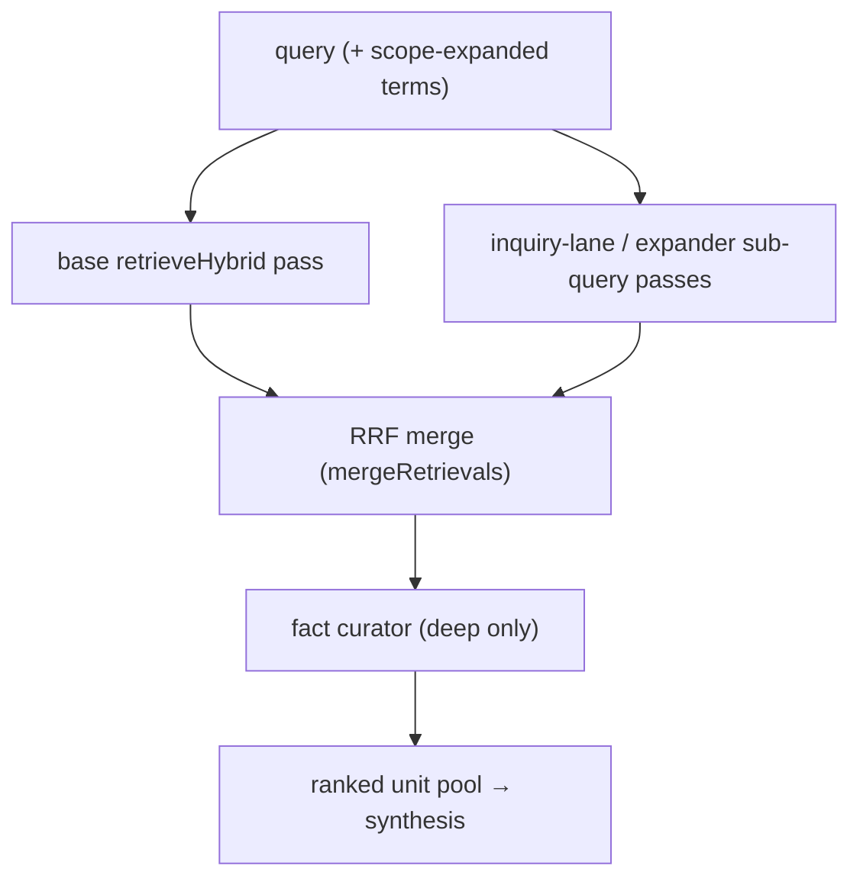

# Query internals: hybrid retrieval

`kb query` and chat QUERY turns share **`runQueryTruthRetrieval()`**
(`src/query/query-truth-retrieval.ts`): **`runIntentLoop`** → **`DefaultIntentRouter`** →
**`read_facts`** (registry in `src/tools/kb-tools-registry.ts`) →
**`FactsDocumentReader.queryDocuments()`** → **`retrieveHybrid`**. There is no workspace
README injection on this path.

> **History.** Retrieval used to be a facts-only multi-pond BFS that walked `fact_edges`
> across repos (`FactsQueryResearchOrchestrator`). That graph and orchestrator were removed
> in the indexing redesign; retrieval is now a single bounded hybrid pass (fanned out in
> deep mode). See [`tools/hybrid-retriever.ts`](../tools/hybrid-retriever.ts).

## Retrieval units

Retrieval scores **three unit types** in one fused pool — not facts alone:

- **`documents`** / `documents_fts` — whole markdown files.
- **`code_symbols`** / `code_symbols_fts` — exported AST symbols with source text.
- **`facts`** / `facts_fts` — curated atomic claims.

## `retrieveHybrid` — six lanes, RRF, one hop

Each unit type is searched by a **lexical** lane (FTS5/BM25, `LANE_DEPTH = 40`) and a
**neural** lane (embedding cosine that re-ranks the lexical pool). The six ranked lists are
fused with **Reciprocal Rank Fusion** (`score += 1 / (RRF_K + rank)`, `RRF_K = 60`), then a
**depth-1 doc↔symbol hop** over `doc_code_links` (`HOP_LIMIT = 8`) pulls in the code a top
document describes and the docs that describe a top symbol. The result is capped at
`DEFAULT_FACT_LIMIT` (40) and its `detail` string is `hybrid:docs=…,symbols=…,facts=…,hops=…`.

Embeddings are optional: with `KB_EMBEDDER=none` the neural lanes fall back to a
deterministic hash vector and the lexical lanes carry the result. The reader pre-embeds the
query once (`cacheQueryEmbedding`) so every pass scores against one vector.

## Shallow vs deep

| `discoveryDepth` | Behavior |
|------------------|----------|
| **`shallow`** | A single `retrieveHybrid` pass over the query. |
| **`deep`** (default for `kb query`) | Fan-out: the base query **plus** sub-queries, each a `retrieveHybrid` pass, fused again with RRF (`mergeRetrievals`, k=60), then curated. |

Deep-mode sub-queries come from **ontology-typed inquiry lanes** (`query/inquiry-lanes.ts`,
built by the caller from the stage-0 scope verdict — deterministic, entity-grounded, not
gated on query length). When no entity resolved, the generic LLM **query expander**
(`tools/query-expander.ts`, short-query gated) is the fallback.

## `allFacts` mode

`resolveFactRetrievalMethod(config) === 'all_facts'` (or the reader's default) dumps every
fact once via `listFactsForQuery` instead of retrieving — for agents that want the whole
store in context. Subsequent calls in the same session return empty (`already-in-context`).

## Post-retrieval curation (deep)

A **fact curator** (`src/tools/fact-curator.ts`) runs when the pool exceeds its threshold
(`shouldCurate`). It is judge-in-the-loop: deterministically auto-keeps high-overlap units,
sends the rest to a single structured LLM verdict (`{keep, gaps, sufficient}`) keyed on the
**raw user question**, then hard-drops what the judge did not keep. When it reports `gaps`
and the set is not yet `sufficient`, it issues **bounded shallow re-discovery** (a
`retrieveHybrid` pass over the gap sub-query, skipping known ids) to refill. It fails safe to
the unfiltered pool on any LLM/parse error and never returns empty. Decisions are recorded
out-of-band on **`retrieval.curation`** (kept/dropped/re-queried counts) — never injected
into the synthesis context.

## Answer enrichment

After retrieval, ranked units are turned into prose via **`formatRetrievedFactsForLLM()`**
(`src/core/retrieval-context.ts`).

| Command | Synthesis | Notes |
|---------|-----------|-------|
| **`kb query`** | **`enrichReadDocumentsAnswerWithLLM()`** (`intent-cli.ts`) | One-shot — a single LLM call over the retrieved pool. |
| **`kb chat`** | **`runChatSynthesis()`** (`chat-cli.ts`) | Multi-turn — optional `query_kb` tool rounds for targeted follow-up before the final answer. |

## Grounding: file names, and (opt-in) prose claims

Two checks guard against a synthesized answer drifting from its evidence, and they
catch different failures:

1. **Ungrounded file names** (always on). **`findUngroundedFileReferences()`**
   (`service/serialize.ts`) flags file-looking tokens in the prose that match no
   retrieved source path. On a hit, the MCP payload gains a caveat note and the
   evidence label is downgraded to `weak`. Deterministic, zero extra LLM cost.

2. **Unsupported prose claims** (opt-in, issue #223). File-name grounding does not
   notice a *claim* that is wrong even though every file it names is real — e.g.
   "`FlowsApi` confirms flow import POSTs to the backend" when the cited code only
   sets local editor state. **`verifyAnswerClaims()`**
   (`query/claim-verification.ts`) is a second LLM pass, run after synthesis, that
   re-reads the answer against the same evidence and lists claims the sources don't
   support. Hits land on **`retrieval.unsupportedClaims[]`**, which `serialize.ts`
   turns into a caveat note and a `weak` downgrade — the same posture as check 1.

### Decision: claim verification ships opt-in only

It is a **whole extra LLM round-trip per query** (added latency + tokens) to catch a
failure only some answers exhibit, so it is **off by default**. Enable per call with
`verifyClaims: true` or globally with **`KB_QUERY_VERIFY_CLAIMS=true`**. Even when
enabled it only runs on answers whose evidence is at least
**`KB_QUERY_VERIFY_MIN_CONFIDENCE`** (default `strong`): the confidently-wrong answer
is the dangerous case in #223 and the one worth a second opinion, whereas a `weak`
answer already carries a verify note and a downgrade. The pass is best-effort — a
provider failure records on `retrieval.degraded[]` and never blocks the answer.

**Whether it should ever become default-on for `strong`-evidence responses is
deferred pending a measured cost/quality tradeoff.** Run `kb:evaluation-run` with and
without `KB_QUERY_VERIFY_CLAIMS=true` and compare caught-hallucination rate against
the added latency and token spend before flipping the default. Until that data
exists, the default stays opt-in.

## When synthesis fails

Retrieval and synthesis fail independently, and the difference is load-bearing: retrieval is
deterministic, so an identical query can return identical evidence and still produce no
answer when the provider call fails. Synthesis therefore **never fails silently**.

A provider error (429, spent credits, bad key, 5xx, timeout) or an empty completion records
**`data.answerError`** — a structured `{ stage, kind, message, provider, status, retryable }`
(see `src/core/llm-error.ts`). `kind` is classified rather than inferred from the status code,
because credit exhaustion is not uniform: Anthropic reports it as `400 credit balance is too
low`, OpenAI as `429 insufficient_quota`.

Rules that hold on this path:

- **Retrieval results survive.** The sources are real; only the answer-writing step failed.
- **`status` stays `accepted`.** `isReadFactsResult()` gates on it; flipping it to `error`
  would strip sources from chat replies and skip re-synthesis on retry.
- **Best-effort stages report too.** Scope inference and the curator fail safe, each recording
  on **`retrieval.degraded[]`** instead of vanishing into a bare `catch`.
- **The curator claims nothing it did not do.** When it falls back (`fellBack`), it contributes
  no research note.

Terminal **`evidence>`** is a single summary header (`formatEvidenceSummaryHeader()` in
`src/core/evidence-summary.ts`) — count, doc/code mix, top themes, lead titles.

## Deep query trace (opt-in)

`kb query --trace` (or `KB_QUERY_TRACE=true`) writes a full content dump out-of-band to
`~/.kb/traces/<traceId>.json` (`src/tools/query-trace.ts`): what each pass discovered (with
content), what reached curation vs. what was cut, and the curator's keep/drop reasons. It is
never fed into synthesis and never affects the answer or the eval score.

## See also

- `src/query/query-truth-retrieval.ts` — shared retrieval entry for CLI query + chat
- `src/tools/facts-document-reader.ts` — shallow pass + deep fan-out + curation dispatch
- `src/tools/hybrid-retriever.ts` — six-lane RRF retriever + depth-1 doc↔symbol hop
- `src/tools/fact-curator.ts` — post-retrieval judge-in-the-loop curator
- `src/tools/query-trace.ts` — opt-in `--trace` content dump
- `src/query/claim-verification.ts` — opt-in prose-claim grounding pass (#223)
- `src/core/CHAT.md` — chat vs query alignment
- `src/core/AGENT_LOOP.md` — intent loop wiring
