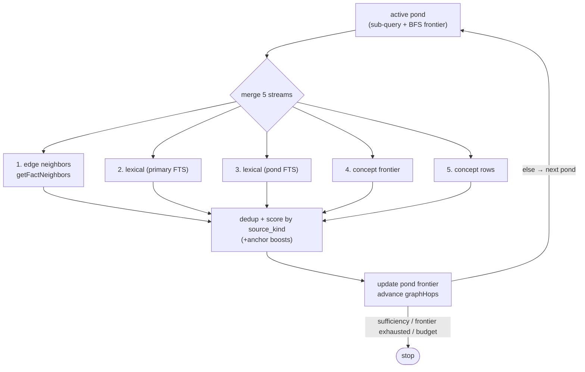

# Query internals: facts retrieval

`kb query` and chat QUERY turns share **`runQueryTruthRetrieval()`** (`src/cli/query-truth-retrieval.ts`): **`runIntentLoop`** → **`DefaultIntentRouter`** → **`read_facts`** (registry in `src/tools/kb-tools-registry.ts`). There is **no** workspace README injection and **no** markdown chunk hybrid pipeline on this path.

## Evidence store

- **`facts` / `facts_fts`** — canonical rows for Q&A (`SqliteKbIndexer.searchFacts`, concept links, deterministic semantic scores over fact ids).
- **Documents** — human-facing artifacts (`kb docs`, publish). They are **not** chunked for `read_facts`.

## Shallow vs deep discovery

The router maps the legacy **`read_documents`**-shaped envelope to **`FactsDocumentReader.queryDocuments()`** (`src/tools/facts-document-reader.ts`).

| `discoveryDepth` | Behavior |
|------------------|----------|
| **`shallow`** | Lexical FTS over facts (`searchFacts`), or `listFactsForQuery` when the query string is empty. |
| **`deep`** | **`FactsQueryResearchOrchestrator`** (`src/tools/facts-query-research-orchestrator.ts`): adaptive passes merging **BFS edge-walk neighbors** (`fact_edges`), lexical hits, concept-frontier rows, and deterministic semantic rescoring until the LLM judge confirms sufficiency, the frontier is exhausted, or a safety budget is reached. Retrieval is **repo-scoped**: expansion lands in whichever repo the strongest hit belongs to (via the fact's `git_repo` column) and exhausts that repo's fact pool first, then walks the cross-repo `fact_edges` to sibling repos (`depends_on_repo` links first). |

## Deep loop — per-iteration sources

Each pass round-robins an **exploration pond** — a sub-query with its own BFS frontier — so one code-heavy neighborhood cannot monopolize the walk.

Pond seeds come from `buildPondQueries`: the full query, token pairs (`languages supported`, `init scan`, …), and single-token fallbacks. Each pond gets a diverse lexical seed (mixed `source_kind`) before the loop starts.

Each pass merges five candidate streams before dedup and scoring:

1. **Edge neighbors** — `getFactNeighbors(activePond.frontierFactIds, seenIds, perIterationLimit)`: one BFS hop from the **active pond's** frontier only.
2. **Lexical (primary)** — FTS for the original query string.
3. **Lexical (pond)** — FTS for the active pond's sub-query (skipped when identical to primary).
4. **Concept frontier** — facts sharing any concept token in the active concept set.
5. **Concept rows** — facts sharing active concepts (broader union than frontier).



Primary lexical hits from pass 1 are tracked as **anchors** (+0.10 score boost; up to 3 reserved in the final slice). When a pond stalls (no new edge or pond-lexical facts), it is marked exhausted and the loop advances to the next pond. Fresh concept neighbors can spawn an additional pond mid-loop. `frontier_exhausted` fires only when **all ponds** are exhausted and every stream returns nothing new.

After scoring, the active pond's frontier is updated from its edge neighbors, pond-lexical hits, and local top scores. `graphHops` counts global BFS levels across ponds.

**Repo ordering:** the walk first exhausts the fact pool of the repo the strongest hit belongs to (the fact's `git_repo`), then crosses into sibling repos by following cross-repo `fact_edges` — `depends_on_repo` edges are walked before `cross_repo_symbol` / `references_repo`. There is no fact-category widening; repo edges drive the reach across subgraphs.

## Fact scoring

Scoring differs by `source_kind` because identifier-name text overlap is unreliable for code facts.

**Doc facts** (`import_doc`, `submit`):
```
score = overlapScore × 0.45 + semanticScore × 0.35 + confidence × 0.20 + boosts
```

**Code facts** (`import_code`):
```
score = overlapScore × 0.20 + graphProximityScore × 0.60 + confidence × 0.20 + boosts
```

- `overlapScore` — fraction of query tokens present in the fact text.
- `semanticScore` — deterministic hash-based cosine similarity (lexical proxy, not neural embeddings).
- `graphProximityScore` — max score of the frontier parent that led to this code fact via BFS traversal. Zero when the fact was found only by text search. This is the primary discriminator for code facts: a function discovered via graph traversal from a high-scoring doc fact scores 0.55–0.80; a function matched only by identifier name overlap scores 0.25–0.39.
- `confidence` — indexer-assigned quality signal (code facts default to 0.95).
- `boosts` — anchor boost +0.10, frontier boost +0.06.

Facts scoring below `MIN_FACT_SCORE` (0.20) are dropped from the final result set (reserved anchor and per-source-kind minimum facts bypass this floor).

## Sufficiency and early exit

Three stopping criteria, checked in this order each iteration:

1. **Heuristic** — `assessSufficiency()`: exits immediately when ≥20 facts score ≥0.50. Fast, no LLM cost.
2. **LLM sufficiency judge** (`src/tools/facts-sufficiency-judge.ts`): called every 3 iterations when ≥5 facts score ≥0.50. Sends condensed top facts to the LLM and asks "ANSWERABLE or INSUFFICIENT?" in a single word. Exits with `stop:llm_judge_answerable` when the LLM confirms. Falls back to `insufficient` on any error.
3. **Plateau** — 3 consecutive iterations with no new fact scoring ≥0.50 triggers `weak_evidence_after_exhaustion`.

The judge requires an `LLMProvider` to be wired into `FactsDocumentReader` (via `createKBToolsRegistry(..., { taskProvider: llm })`). When no LLM is available, only the heuristic and plateau checks apply.

## Answer enrichment

After retrieval, ranked facts are turned into prose via **`formatRetrievedFactsForLLM()`** (`src/core/retrieval-context.ts`) with `maxContentChars: 2000` per fact.

| Command | Synthesis | Notes |
|---------|-----------|-------|
| **`kb query`** | **`enrichReadDocumentsAnswerWithLLM()`** (`intent-cli.ts`) | **One-shot** — single LLM call; uses pre-expansion `synthesisQuestion` for prompt/scaffold checks (not graph-expanded query string). |
| **`kb chat`** | **`runChatSynthesis()`** (`chat-cli.ts`) | **Multi-turn** — optional `query_kb` tool rounds for targeted follow-up retrieval before final answer. |

A **post-retrieval fact curator** (`src/tools/fact-curator.ts`) runs when the pool exceeds 12 facts. It is judge-in-the-loop, not a one-shot filter: it deterministically **auto-keeps** high-overlap facts (no LLM cost), sends the rest to a single **structured LLM verdict** (`{keep, gaps, sufficient}`) keyed on the **raw user question** (not the graph-expanded string), then **hard-drops** everything the judge did not keep — there is **no 15% floor**. When the judge reports `gaps` and the set is not yet `sufficient`, the curator issues **bounded shallow re-discovery** queries (`searchFacts`, excluding what's already known) to refill, so aggressive dropping is safe. It fails safe to the unfiltered pool on any LLM/parse error, and guards against ever returning an empty set (deterministic top-K fallback). Curator decisions are recorded **out-of-band** on `retrieval.curation` (kept/dropped/re-queried counts) for terminal + session-log surfacing — they are **never** injected into the synthesis context, since the whole point is to shrink the prompt.

Terminal **`evidence>`** is a **single summary header** (`formatEvidenceSummaryHeader()` in `src/core/evidence-summary.ts`) — count, doc/code mix, top themes, lead titles, walk/stop/conf. No per-fact bullet lines. See **`src/core/EVIDENCE_SUMMARY.md`**.

## Deep query trace (opt-in)

The per-run report on `~/.kb/logs/<date>.jsonl` (see `src/core/telemetry.ts`) is a **distillation** — counts, stop reason, curator drop **ids**. It answers "how far did the walk go", not "what did it actually hold". For the latter, `kb query --trace` (or `KB_QUERY_TRACE=true`) turns on a **full content dump** written out-of-band to `~/.kb/traces/<traceId>.json` (`src/tools/query-trace.ts`):

- **`lanes[].discovered`** — every fact the walk scored, best score first, **with content** (code facts dump `source_text`). This is the "did it ever find fact X?" record.
- **`lanes[].returned`** / **`lanes[].droppedBelowFloor`** — what reached curation vs. what was cut below `MIN_FACT_SCORE`.
- **`lanes[].passTrace`** / **`checkpoints`** — the per-pass count breadcrumbs and stop/continue decisions.
- **`curation`** — the facts the curator kicked out, **with the judge's reason and full content** (recovered by id from `discovered`).

The dump is built at two seams — the orchestrator's `buildResponse` (discovery) and `FactsDocumentReader.finalizeDeep` (curation) — and is **never** fed into synthesis: `finalizeDeep` writes the file and strips the heavy lane before returning. Off by default; it never affects the answer or the eval score.

## Limits

**Deep loop** (`discoveryDepth: deep` — default for `kb query`):

| Layer | Default |
|-------|---------|
| Facts sent to synthesis | Ranked pool above `MIN_FACT_SCORE` (0.20); **fact curator** hard-drops off-topic facts + re-discovers gaps when **>12** facts |
| Per-fact content | 2000 chars (`MAX_FACT_CONTENT_CHARS`) |
| Per DB call | 50 rows (`perIterationLimit`) |
| Loop passes | 24 (`KB_FACTS_QUERY_MAX_ITERS`; absolute max 512) |
| Graph hops | 20 (`KB_FACTS_QUERY_MAX_HOPS`) |

**Shallow** (`--discovery shallow`): lexical FTS; retrieval defaults to 500 facts (`DEFAULT_FACT_LIMIT`).

## Graph expansion

When graph mode is enabled, **`expandQueryWithGraph()`** in `index.ts` / `chat-cli.ts` widens the query string before **`read_facts`**. See **`src/tools/GRAPH.md`**. Optional post-retrieval rerank: **`rerankByGraphConnectivity()`**.

## Environment knobs (facts deep loop)

- `KB_FACTS_QUERY_MAX_ITERS` (default `24`, clamped 1–24; `-1` = unlimited up to 512 passes)
- `KB_FACTS_QUERY_MAX_HOPS` (default `20`, clamped 1–40; `-1` = unlimited)
- `KB_FACTS_QUERY_MAX_PONDS` (default `6`, clamped 2–12; `-1` = unlimited up to 32 ponds)

Use `-1` only for debugging — absolute safety caps still apply on iters/ponds.

## Crawl (init-time only)

Code facts at query time come from the AST-indexed `facts` table (`source_kind='import_code'`). See **`src/core/INIT.md`** for ingest coverage.

## See also

- `src/cli/query-truth-retrieval.ts` — shared retrieval entry for CLI query + chat
- `src/tools/facts-document-reader.ts` — shallow path + deep orchestrator dispatch
- `src/tools/facts-query-research-orchestrator.ts` — deep fact retrieval loop
- `src/tools/facts-sufficiency-judge.ts` — LLM-based early-exit judge
- `src/tools/fact-curator.ts` — post-retrieval judge-in-the-loop curator (hard-drop + bounded re-discovery)
- `src/tools/query-trace.ts` — opt-in `--trace` full content dump of discovery + curation
- `src/tools/sqlite-kb-index.ts` — `searchFacts`, concepts, semantic scores
- `src/core/CHAT.md` — chat vs query alignment
- `src/core/AGENT_LOOP.md` — intent loop wiring
