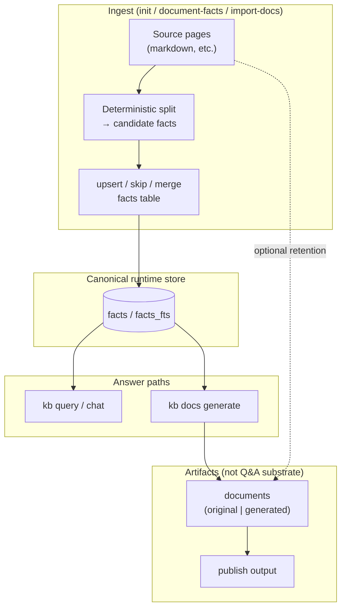

# Facts-first KB architecture

**Contract:** the KB answers questions and drives authoring from **atomic facts** in the `facts` store. **Markdown documents are not a retrieval substrate for Q&A.** They exist as human-readable artifacts: originals (with facts extracted from them) or generated synthesis, and they matter most at **publish** time.

This is the platform mental model for `kb query`, `kb docs generate`, ingest (`kb init` / `kb scan`), and `kb publish`.

---

## 1. Facts are the only “live” knowledge for answering

| Surface | Role |
|--------|------|
| **`facts` / `facts_fts`** | Canonical store for retrieval, dedupe keys (`normalized_text`), provenance (`source_kind`, `source_ref`, `git_repo` origin repo). |
| **`kb query` / chat** | **Target:** form answers **only** from retrieved facts (plus graph neighborhood over fact-linked entities)—not from full document bodies as evidence. Retrieval is **repo-scoped**: it lands in the repo the strongest hit belongs to (`git_repo`), exhausts that repo's pool, then walks cross-repo `fact_edges` to siblings. |
| **`kb docs generate`** | **Target:** generate documents **from facts** (questionnaire + LLM shaping), cite facts; documents are outputs, not inputs to retrieval. |

---

## 2. Ingest: init / `kb scan` → facts, not “index pages for hybrid search”

**Target pipeline** when reading source pages (README, docs, crawled markdown, etc.):

1. **Deterministic segmentation** — walk the page in order; each sentence or paragraph (configurable grain) becomes a **candidate fact** text. Open Knowledge Format (OKF) docs are recognized and their YAML frontmatter is stripped before segmentation, so metadata never becomes junk facts; the body is segmented like any markdown.
2. **Upsert policy** — for each candidate:
   - if **no** existing fact matches (normalized text / fuzzy policy TBD): **insert**;
   - if **duplicate**: **skip**;
   - if **mergeable** with an existing fact (same claim, tighter wording): **merge / update** the row (preserve lineage where the schema allows).
3. **Original documents** may still be stored for audit and publish, but **truth for automation** is the fact rows extracted from them.

Facts are written exclusively by automated ingest (`kb init` / `kb scan` AST and doc extraction); the same `upsert_fact` storage layer is used throughout.

---

## 3. Documents: two kinds, publish-facing

| Kind | Meaning |
|------|---------|
| **Original** | Authored or imported markdown representing source material; facts were (or will be) **extracted** from it. |
| **Generated** | Produced by tools such as **`kb docs generate`** (or init synthesis outputs treated as generated docs), grounded in facts + prompts. |

**Neither kind is used directly** to answer ad-hoc questions in the target architecture. Readers see them on **publish** (static site, export, “view doc”), not as chunks inside **`read_facts`** for chat. Sync semantics: [`publish/PUBLISH.md`](./publish/PUBLISH.md).

---

## 4. End-to-end (target) data flow

---

## 5. `kb docs generate` in this model

- **Inputs:** user prompt, questionnaire, optional chat transcript, **retrieved facts** for the session (by query built from prompt + answers).
- **Output:** a **generated** document; footer references fact ids.
- **Not in scope:** pulling markdown document chunks into the draft model as “evidence” (that would contradict facts-only retrieval).

**Implemented:** `buildDocgenFactContext` + injection **before** draft and revision LLM calls; **zero** supporting facts → **error** (no finalize); `## References` still appended from the same fact set. See `src/core/doc-generate-orchestrator.ts`.

---

## 6. Alignment with **this repository** (today)

| Area | Status |
|------|--------|
| **`kb query` / chat** | **`read_facts`** in **`createKBToolsRegistry`** → **`FactsDocumentReader`** / **`FactsQueryResearchOrchestrator`**. No workspace markdown fallback on the shared retrieval path (`runQueryTruthRetrieval`). |
| **`kb docs generate`** | Draft/revise user messages include a **KB facts** block; empty FTS → orchestrator throws; **`## References`** from the same grounded set. |
| **`kb facts`** | CLI + TUI **`/facts`** for list / search / show (`src/cli/facts-cli.ts`). |
| **Multi-repo bases** | A base tracks one or more git repos (git required). Each fact carries a `git_repo` origin; after per-repo indexing, an integration-ingest pass links facts across repos with cross-repo `fact_edges` (`depends_on_repo`, `cross_repo_symbol`, `references_repo`). Retrieval is repo-scoped (land, exhaust, walk edges). |
| **`kb docs merge`** | Removed (deterministic doc merge lived only in that CLI path). |
| **`kb init`** | Clones each `--git` repo, then per repo runs **`code-index`** (AST → `import_code` facts + edges, `git_repo` set), **`document-facts`** (markdown segmentation → `import_doc`), **`import-docs`** (verbatim originals) and **`write`**, followed by cross-repo reconciliation. **`SqliteDocumentWriter`** also indexes incremental fact rows from **derived** document bodies when they are persisted; **original/source docs are skipped** (their facts come from **`document-facts`**, not the writer). |
| **Publish** | Unchanged: reads stored documents for export. |

Remaining gap vs “gold”: optional **`read_documents`** naming cleanup for agents, and ongoing prompt/UI wording to say “fact” where the wire is fact-shaped.

---

## 7. Code roadmap (remaining)

### Phase A — Query / chat (done for default path)

Policy, workspace removal, **`read_facts`**, tests, and **`CHAT.md` / `QUERY_INTERNALS.md`** updates for the facts path are in place. Optional: env flag for any future non-fact evidence mode.

### Phase B — `kb docs generate` (done)

Fact block in prompts; refuse when no facts; **`acceptDraft`** guards zero **`supportingFactIds`**.

### Phase C — Ingest: deterministic + semantic facts from sources (**done**)

**Done:**
- **`document-facts`** init cycle runs after **`code-index`**, calling `ingestSourceMarkdownFilesAsFacts` (`src/core/scan-fact-ingest.ts`) over `context.sourceFiles` — same segmentation policy as document writer ingest, `source_ref` like `README.md#s0`. Each segment's triplet anchors to the nearest exported AST symbol (FTS over `import_code`/`exported_from` facts), falling back to a placeholder. When an OKF doc declares a `resource:` that resolves to a code file/dir, the anchor is scoped to that file/dir's exported symbols only, instead of the global pool.
- **`code-index`** runs deterministic AST indexing (`TreeSitterIndexer`, one WASM platform for every language) → `import_code` facts and `fact_edges`. No LLM code-facts fallback. Previously Swift/Kotlin were LLM-indexed when AST was unavailable — see `INIT.md` §Removed LLM code-facts fallback.

**Surface for refreshing sources:** **`kb scan`** — pulls + re-indexes every tracked repo and rebuilds cross-repo links.

**Cross-repo reconciliation** runs after the per-repo index loop (init / scan / auto-sync), bridging subgraphs via integration signals into one connected graph. See `INIT.md §Integration-ingest reconciliation`.

### Phase D — Documents as artifacts

Browse via **`kb docs`** / **`kb facts`**; query path does not read markdown chunks.

### Phase E — Docs, eval, dogfood

Keep **`facts-architecture.md`**, **`EVALUATION.md`**, and eval harness assertions aligned as behavior evolves.

### Exit criteria (“gold”)

- **Ingest** fills **`facts`** deterministically from markdown sources as the default bootstrap story.
- Tests + eval harness green; surfaces consistently describe **facts** as the live Q&A substrate.

## Related docs

- Behavioral spec → [`CORE.spec.md`](CORE.spec.md)
