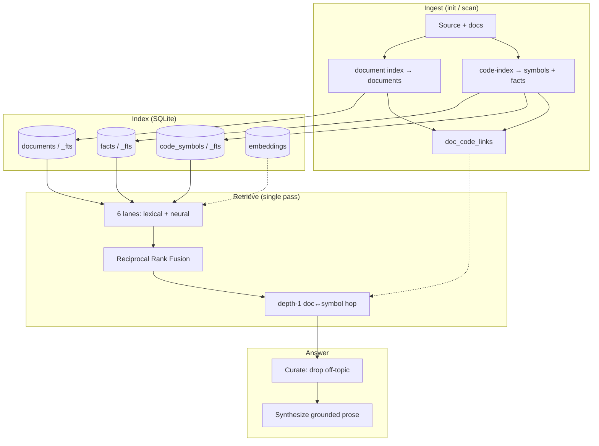

# Hybrid-retrieval KB architecture

**Contract:** `kb query` answers questions by retrieving over **three complementary
unit types** — whole markdown **documents**, exported **code symbols**, and curated
**facts** — through lexical (FTS5/BM25) and neural (embedding cosine) lanes fused with
**Reciprocal Rank Fusion (RRF)**, followed by a single depth-1 hop over
`doc_code_links`. A post-retrieval curator drops off-topic units before one-shot
synthesis writes a grounded prose answer.

This is the platform mental model for `kb query`, `kb docs generate`, and ingest
(`kb init` / `kb scan`).

> **History.** Earlier revisions were *facts-first*: sentence-level facts were the
> only retrieval substrate, documents were publish-only artifacts, and retrieval was
> a repo-scoped BFS that walked cross-repo `fact_edges`. That graph was removed in the
> indexing redesign. Documents and code symbols are now first-class retrieval units,
> and there is **no graph walk** — see [`tools/hybrid-retriever.ts`](../tools/hybrid-retriever.ts).

---

## 1. Three retrieval units, one fused pool

| Unit | Store | What it is |
|------|-------|------------|
| **Document** | `documents` / `documents_fts` | A whole markdown file indexed as one unit (README, guide, spec, generated doc). |
| **Code symbol** | `code_symbols` / `code_symbols_fts` | One exported AST symbol (function/class/type…) with its source text, extracted deterministically by tree-sitter. |
| **Fact** | `facts` / `facts_fts` | A curated atomic claim with provenance (`source_ref`, `git_repo`), extracted from source pages and AST. |

All three are **live evidence for answering**. Retrieval is a single bounded pass over
the union of the three, not a document-vs-facts choice.

---

## 2. Retrieval: six lanes → RRF → depth-1 hop

`retrieveHybrid` (`tools/hybrid-retriever.ts`) runs one pass:

1. **Six ranked lanes.** Each unit type is searched by a **lexical** lane (FTS5/BM25,
   `LANE_DEPTH = 40`) and a **neural** lane (embedding cosine). The neural lanes
   **re-rank the lexical candidate pool** rather than scanning every embedding — a full
   cosine table scan per query is unaffordable, and a unit no lexical lane surfaced is
   not one RRF would have promoted anyway.
2. **Reciprocal Rank Fusion.** The six ranked lists are fused with RRF
   (`score += 1 / (RRF_K + rank)`, `RRF_K = 60`), so a unit ranked well by several lanes
   rises above one that any single lane spikes.
3. **Depth-1 doc↔symbol hop.** For the top few fused documents, pull the code symbols
   they link to; for the top few fused symbols, pull the documents that describe them
   (`doc_code_links`, `HOP_LIMIT = 8`). `doc_code_links` is a **flat table** and the hop
   is **depth-1 by construction** — hop results enter *below* every directly-matched
   unit, enriching rather than displacing. Retrieval cost is bounded by the candidate
   pool, not by how densely the index is connected.
4. **Cap.** The fused-plus-hopped list is truncated to `limit`
   (`DEFAULT_FACT_LIMIT = 40`) and handed to curation/synthesis. A `detail` string
   (`hybrid:docs=…,symbols=…,facts=…,hops=…`) is surfaced on `retrieval.detail` for
   `--debug`.

> **Embeddings are optional.** With `KB_EMBEDDER=none` (or no configured embedder) the
> neural lanes fall back to a deterministic hash vector and contribute little; the
> lexical lanes then carry the result. Init and query both work without an embedder —
> neural lanes are a re-ranking boost, not a hard dependency.

The agent-facing tool is still named **`read_facts`** in the registry
(`tools/kb-tools-registry.ts`), but it retrieves all three unit types through the
hybrid pipeline (`FactsDocumentReader.queryDocuments` → `retrieveHybrid`), including a
bounded shallow/deep re-discovery fan-out that is itself re-fused with RRF.

---

## 3. `kb docs generate` in this model

- **Inputs:** user prompt, questionnaire, optional chat transcript, and **retrieved
  units** for the session (query built from prompt + answers) via the same hybrid
  retriever.
- **Output:** a **generated** document; footer references the supporting unit ids.
- **Refusal:** zero supporting units → **error**, no finalize. `## References` is
  appended from the same grounded set. See `src/core/doc-generate-orchestrator.ts`.

---

## 4. Documents: first-class retrieval units

| Kind | Meaning |
|------|---------|
| **Original** | Authored/imported markdown from source material; indexed as a `documents` unit and mined for `facts`. |
| **Generated** | Produced by `kb docs generate` (or init synthesis), grounded in retrieved units. |

Both kinds are indexed for retrieval and browsable via `kb docs`. Unlike the old
facts-first model, a document body is legitimate evidence a query can retrieve directly.

---

## 5. Ingest: init / `kb scan` → documents + symbols + facts

`kb init` clones each `--git` repo, then per repo runs the deterministic indexers, then
a cross-repo reconciliation pass:

1. **`code-index`** — `TreeSitterIndexer` (one WASM platform for every language) walks
   the AST and writes one `code_symbols` row per exported symbol (with `source_text` and
   `git_repo`), plus `import_code` facts. No LLM code-facts fallback.
2. **Document indexing** — each markdown/source page is written as one `documents` unit.
   OKF frontmatter is stripped before the body is stored/segmented so metadata never
   pollutes retrieval.
3. **`document-facts`** — deterministic segmentation of source pages into candidate
   `facts` (`source_ref` like `README.md#s0`), each anchored to the nearest exported AST
   symbol (or a resource-scoped subset when an OKF `resource:` resolves to a code
   file/dir).
4. **`doc_code_links`** — documents are linked to the symbols they describe, powering the
   depth-1 hop in §2.

**`kb scan`** pulls + re-indexes every tracked repo and rebuilds links.
`SqliteDocumentWriter` also indexes incremental facts from **derived** document bodies
when persisted; **original/source docs are skipped** (their facts come from
`document-facts`). See [`INIT.md`](./INIT.md).

---

## 6. End-to-end data flow

---

## 7. Alignment with **this repository** (today)

| Area | Status |
|------|--------|
| **`kb query` / chat** | `read_facts` → `FactsDocumentReader` → `retrieveHybrid`: six lexical/neural lanes over documents, symbols, and facts, fused by RRF, plus a depth-1 `doc_code_links` hop. Single bounded pass on the shared retrieval path (`runQueryTruthRetrieval`). |
| **`kb docs generate`** | Draft/revise prompts include the retrieved-unit block; empty retrieval → orchestrator throws; `## References` from the same grounded set. |
| **`kb facts`** | CLI + TUI `/facts` for list / search / show (`src/cli/facts-cli.ts`). |
| **Multi-repo bases** | A base tracks one or more git repos. Each unit carries a `git_repo` origin; retrieval fuses across repos in one pool (no repo-scoped walk, no `fact_edges`). |
| **`kb init`** | Per repo: `code-index` (AST → `code_symbols` + `import_code` facts), document indexing (`documents`), `document-facts` (segmentation → facts), and `doc_code_links`; followed by cross-repo reconciliation. |

---

## Related docs

- Behavioral spec → [`CORE.spec.md`](CORE.spec.md)
- Query internals → [`QUERY_INTERNALS.md`](QUERY_INTERNALS.md)
- Indexing pipeline → [`INIT.md`](INIT.md)
- Retriever source → [`../tools/hybrid-retriever.ts`](../tools/hybrid-retriever.ts)
