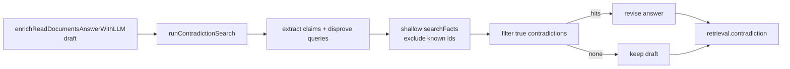

# Contradiction Search

After one-shot synthesis produces a draft answer, KB still only has *supporting*
evidence by construction. Contradiction search runs a separate adversarial pass
whose only goal is **disconfirming** facts, then revises the draft when real
conflicts appear. Distinct from the curator (which finds *missing* evidence) and
from confidence math (#153, blocked on this stage).

## Role in the stack

Wired after synthesis in `service/query-pipeline.ts` and the CLI intent path
(`kb-client` `cli/index.ts`). Skipped when `synthesize: false`, no draft, empty
evidence, or no LLM.

## Core pieces

- **`runContradictionSearch()`** — claims → shallow adversarial FTS → filter → optional revise.
- **`ContradictionTrace`** — `{ ran, found, used, hitCount?, queries?, factIds?, supportCount?,
  contradictCount?, confidenceBefore?, confidenceAfter? }` on `retrieval.contradiction` and
  `RunReport.retrieval` via `summarizeQueryRetrievalTrace`.
- **`confidenceFromSupportAndContradiction()`** (#153) — `base * support / (support + contradict)`
  when contradict > 0; writes `IntentResult.confidence` + `retrieval.confidence` for the evidence header.
- Stages: `*:contradiction-claims`, `*:contradiction-search`, `*:contradiction-revise`.

## Invariants

- Never deep-BFS; one shallow `searchFacts` pass per claim (budget ~12, exclude known ids).
- On any LLM/search error, keep the draft and still record `ran: true` / `found: false` / `used: false`.
- `used: true` only when contradiction hits were fed into a revise call.
- Confidence shrinks only when contradict count > 0; zero hits leave checkpoint confidence unchanged.

## Gotchas

- Eval harness may start `kb-server` **without** `--with-mcp` on ephemeral ports; Cursor MCP
  on `:38117` needs `pnpm run server:start` (which passes `--with-mcp`).
- Claim extract + filter + revise = up to three extra LLM calls per synthesized query.

## Related docs

- → [CONTRADICTION_SEARCH.spec.md](./CONTRADICTION_SEARCH.spec.md)
- [QUERY_INTERNALS.md](../core/QUERY_INTERNALS.md) — retrieval before synthesis
- [FACT_CURATOR.md](../tools/FACT_CURATOR.md) — gap re-discovery (not adversarial)
