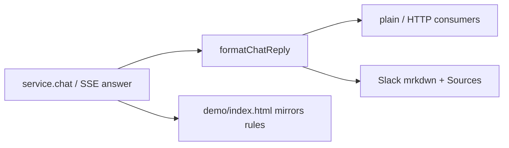

# Chat reply presentation

Turns a structured chat `answer` + `sources[]` into one user-visible message. Wire contract stays structured; this layer is presentation only — Slack, text CLIs, and the Pages demo all mirror the same rules.

## Role in the stack

Synthesis (`runChatSynthesis` / `chat-stream.ts`) emits `answer` + `sources`. Surfaces that post a single string call `formatChatReply`. Browser demos may reimplement the same strip/dedupe/link rules client-side.

## Core pieces

| File | Role |
|------|------|
| `chat-reply.ts` | `normalizeChatSources`, `formatChatSourcesFooter`, `formatChatReply` |
| `markdown-to-slack.ts` | Deterministic Markdown → Slack mrkdwn (headers, tables, `**`→`*`) |

`flavor: 'slack'` runs the answer body through `markdownToSlackMrkdwn` before the Sources footer. Optional `sourceRepoUrl` / `sourceBranch` build blob links; `stripPrefixes` defaults to `rosenjcb-kb`, `kb`.

## Integration

- Slack: `slack-handler.ts` → `formatChatReply(..., { flavor: 'slack', … })` (env `KB_SOURCE_REPO_URL` / `KB_SOURCE_BRANCH`)
- HTTP `/v1/chat`: structured SSE unchanged; consumers format locally or via this module
- Demo: `demo/index.html` mirrors strip/dedupe/GitHub links + local markdown render

## Invariants

- Deduplicate sources by case-insensitive `label#symbol` after prefix strip.
- Never prompt the model to emit Slack mrkdwn — convert deterministically.
- Empty sources → answer alone; empty answer + sources → footer alone.
- Drop non-`fact://` scheme paths from display normalization.

## Extension checklist

1. New surface posting one string → call `formatChatReply` (or mirror rules exactly).
2. New markdown construct for Slack → extend `markdown-to-slack.ts` + tests.
3. Keep strip defaults aligned with indexed git-repo path shapes.

## Gotchas

- Merging SSE `meta` into thinking progress wipes the stream — presentation here is post-answer only; event routing is client-side (`dispatchRemoteChatStreamEvent`).
- Slack tables become ` · `-separated rows; GFM pipes do not survive.

## Related docs

- Spec → [`CHAT_REPLY.spec.md`](./CHAT_REPLY.spec.md)
- Chat turn design → [`../core/CHAT.md`](../core/CHAT.md)
- Server Slack / CORS → [`../../../kb-server/src/SERVER.md`](../../../kb-server/src/SERVER.md)
- Pages demo → [`../../../../demo/README.md`](../../../../demo/README.md)
