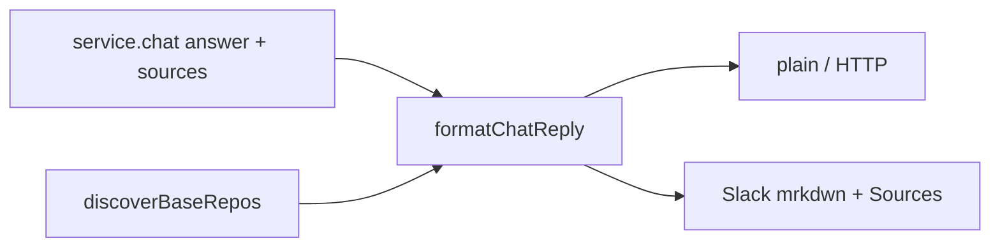

# Chat reply presentation

Turns a structured chat `answer` + `sources[]` into one user-visible message. Wire contract stays structured; this layer is presentation only.

## Role in the stack

Each tracked clone has its own primary branch: whatever it was cloned on (`url#branch`, `--branch`, or the remote's default HEAD). Blob links use that per-slug `gitUrl` + `gitBranch` — never a global `KB_SOURCE_BRANCH`.

## Core pieces

| File | Role |
|------|------|
| `chat-reply.ts` | `chatSourceReposFromBaseRepos`, `normalizeChatSources`, `formatChatReply` |
| `git-sync.ts` | `gitRemoteToBrowseUrl` (ssh/https → browse root) |
| `markdown-to-slack.ts` | Deterministic Markdown → Slack mrkdwn |

`sourceRepos` is required for clickable links. Multi-repo: labels keep `slug/path`; single-repo: strip slug from the label. Unknown slug / local remotes → path only, no href.

## Integration

- Slack: `discoverBaseRepos(service.baseDir)` → `formatChatReply({ flavor: 'slack', sourceRepos })`
- HTTP `/v1/chat`: structured SSE; consumers format with the same registry when they have a base dir
- Pages demo: static dogfood hardcode for `github.com/rosenjcb/kb` @ `main` (no volume registry in-browser)

## Invariants

- Deduplicate by case-insensitive `label#symbol`.
- Never prompt the model for Slack mrkdwn — convert deterministically.
- Empty sources → answer alone; empty answer + sources → footer alone.
- Primary branch for links = clone HEAD branch name (skip detached `HEAD`).

## Extension checklist

1. New text surface → pass `sourceRepos` from `discoverBaseRepos`.
2. New host shape for remotes → extend `gitRemoteToBrowseUrl`.
3. Do not reintroduce a global source-branch env.

## Gotchas

- Multi-repo bases cannot share one browse URL; always map by slug.
- Static demos cannot see the volume registry — document any hardcode as dogfood-only.

## Related docs

- Spec → [`CHAT_REPLY.spec.md`](./CHAT_REPLY.spec.md)
- Chat turns → [`../core/CHAT.md`](../core/CHAT.md)
- Server Slack → [`../../../kb-server/src/SERVER.md`](../../../kb-server/src/SERVER.md)
- Init / clone branch → [`../core/INIT.md`](../core/INIT.md)
