# Chat reply presentation

Turns a structured chat `answer` + `sources[]` into one user-visible message. Wire contract stays structured; this layer is presentation only.

## Role in the stack

```mermaid
flowchart LR
  A[service.chat answer + sources] --> B[formatChatReply]
  R[resolveBaseRepoRegistry\nclones, else snapshot manifest] --> B
  B --> C[plain / HTTP]
  B --> D[Slack mrkdwn + Sources]
```

Each tracked clone has its own primary branch: whatever it was cloned on (`url#branch`, `--branch`, or the remote's default HEAD). Blob links use that per-slug `gitUrl` + `gitBranch` — never a global `KB_SOURCE_BRANCH`.

## Core pieces

| File | Role |
|------|------|
| `chat-reply.ts` | `resolveSourceRepos`, `chatSourceReposFromBaseRepos`, `resolveChatSourceDisplay` |
| `base-repos.ts` | `resolveBaseRepoRegistry` (live clones, else snapshot provenance) |
| `source-grouping.ts` | `groupSources` + footer/reply rendering |
| `git-sync.ts` | `gitRemoteToBrowseUrl` (ssh/https → browse root) |
| `markdown-to-slack.ts` | Deterministic Markdown → Slack mrkdwn |

A citation carries three fields, all from `sourceRepos`, which the serializers **require** — a surface cannot omit it:

| Field | Value | For |
|---|---|---|
| `path` | `rosenjcb/kb/packages/kb-core/src/cli/help.ts` | display, everywhere |
| `repo` | `rosenjcb/kb` | which repo it came from |
| `relPath` | `packages/kb-core/src/cli/help.ts` | opening/grepping locally |
| `href` | `https://github.com/rosenjcb/kb/blob/main/…` | clicking |

`path` is **always** qualified — a base can hold many repos, so an unqualified path does not say which one a file came from. The `owner/repo` form is GitHub's `nameWithOwner`, the same shape `gh --repo OWNER/REPO` takes. No `@` prefix: that is npm scope notation and would read as a package.

The clone dir name (`rosenjcb-kb`, `kb-2026-08-15-1419-kb`) is provisioning detail and never appears in any form. Unknown slug / local remotes → bare `relPath`, no `repo`, no `href`.

## Integration

Every surface calls `resolveSourceRepos(svc.baseDir)` and hands the result to the serializer — Slack, `/v1/query`, `/v1/chat`, MCP, CLI. None of them resolve links themselves.

- Pages demo: renders the server-resolved `href` as-is. No in-browser registry, and no hardcode.
- `/v1/bases` advertises repos from the same `resolveBaseRepoRegistry`, so it can never list a repo the citation path cannot link.

## Invariants

- Deduplicate by case-insensitive `label#symbol`.
- Never prompt the model for Slack mrkdwn — convert deterministically.
- Empty sources → answer alone; empty answer + sources → footer alone.
- Primary branch for links = clone HEAD branch name (skip detached `HEAD`).

## Extension checklist

1. New text surface → pass `sourceRepos` from `resolveSourceRepos(baseDir)`. The type requires it.
2. New host shape for remotes → extend `gitRemoteToBrowseUrl`.
3. Do not reintroduce a global source-branch env.

## Gotchas

- Multi-repo bases cannot share one browse URL; always map by slug.
- A serve-only node prunes `repos/*` after hydrating from a snapshot. Resolve the registry through `resolveBaseRepoRegistry`, never `discoverBaseRepos` alone, or links vanish in production while they work locally.
- Never render the clone slug. It differs per node, so it points a user at a path that does not exist for them.

## Related docs

- Spec → [`CHAT_REPLY.spec.md`](./CHAT_REPLY.spec.md)
- Chat turns → [`../core/CHAT.md`](../core/CHAT.md)
- Server Slack → [`../../../kb-server/src/SERVER.md`](../../../kb-server/src/SERVER.md)
- Init / clone branch → [`../core/INIT.md`](../core/INIT.md)
