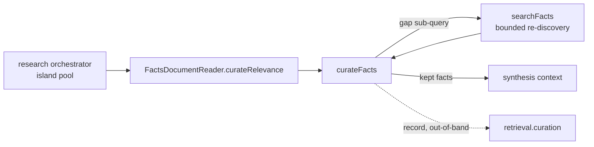

# Fact Curator

After `FactsQueryResearchOrchestrator` grows its BFS "islands" and dumps a scored fact
pool, that pool carries facts that are *reachable* but not *relevant* to the actual
question. The curator is the relevance gate that runs before synthesis: it keeps the
minimal set that answers the question, hard-drops the rest, and — because dropping is
aggressive — re-discovers anything it finds missing. It replaces the old
`facts-relevance-filter.ts` (a one-shot keep-list with a 15% floor).

## Role in the stack

The only production caller is `FactsDocumentReader.curateRelevance()`
(`facts-document-reader.ts`), reached on the **deep** path for both `kb query` and chat
QUERY turns. The curator is pure/injectable: the LLM and the re-discovery function are
passed in, so it carries no DB or network handle of its own.

## Core pieces

- **`curateFacts()`** — the loop: deterministic partition → structured LLM verdict →
  hard-drop → bounded re-discovery → re-judge, capped at `maxRounds`.
- **`shouldCurate()`** — skip gate; below `minResultsToCurate` (12) curation isn't worth a call.
- **`parseVerdict()`** — extracts `{keep, gaps, sufficient}` from the judge's JSON; throws on
  no-JSON so the caller's try/catch triggers the fail-safe.
- **`CurationRecord`** — the out-of-band audit (kept/dropped/re-queried/rounds), surfaced on
  `retrieval.curation` and the `detail` string. **Never** added to the synthesis prompt.

## Integration

- Judge keyed on the **raw user question**, not the graph-expanded retrieval string (the
  expansion is deliberately broad to grow islands — wrong yardstick for relevance).
- Re-discovery is a shallow `SqliteKbIndexer.searchFacts` pass excluding already-known ids
  **and** the caller's session `excludeIds`.
- Tunable via `CuratorOptions`; defaults live as `DEFAULT_*` constants in the module.
  Rank auto-keep preserves the orchestrator's top-N facts before the LLM judge; overlap
  auto-keep and a soft `minKeep` floor further protect answer-critical facts from over-drop.

## Invariants

- Never inject curator decisions or dropped-fact text into the synthesis context.
- On any LLM or JSON-parse error, return the original `results` **bounded to `maxJudgeCandidates`**
  (`fellBack = true`). Small pools pass through unchanged; only a pathologically large pool is
  capped, so a failed/truncated verdict can never flush hundreds of unpruned facts into synthesis.
- **Cap the judge input:** at most `maxJudgeCandidates` (default 100) candidates are sent to the
  LLM in one verdict; the lower-ranked tail is hard-dropped deterministically (reason
  `beyond curator candidate cap`). This keeps the verdict JSON from truncating on big pools — the
  root cause of the fail-safe-to-full-pool trap — and caps what can ever reach synthesis.
- Never return an empty set: if curation drops everything, fall back to deterministic top-K.
- Auto-kept (high-overlap) facts survive regardless of the judge's keep list and bypass the cap.
- Only issue re-discovery when the judge reports `gaps` AND `sufficient` is false.
- Bound every run: `maxRounds`, `maxRequeriesPerRound`, `requeryBudget`, `maxJudgeCandidates`.

## Extension checklist

- New relevance signal → fold into `overlapFraction` / the deterministic partition, not the prompt.
- New verdict field → extend `parseVerdict` and keep the no-JSON throw intact.
- Surfacing decisions → read `retrieval.curation`; do not route them back into context.

## Gotchas

- Lower `autoKeepOverlap` and more facts skip the judge (cheaper, less precise); raise it and
  the judge sees more (costlier, more aggressive drops).
- `requery` returning only known ids ends the loop (no new admissions) — intended.

## Related docs

- Behavioral spec → [`FACT_CURATOR.spec.md`](FACT_CURATOR.spec.md)

- `../core/QUERY_INTERNALS.md` — full deep-retrieval path and where the curator sits
- `./facts-query-research-orchestrator.ts` — the island pool the curator consumes
- `./facts-sufficiency-judge.ts` — the in-loop early-exit judge (a separate concern)
- `../EVALUATION.md` — relevance rubric axis and `curation_summary` in harvest artifacts
- `../core/CHAT.md` — chat synthesis pipeline
