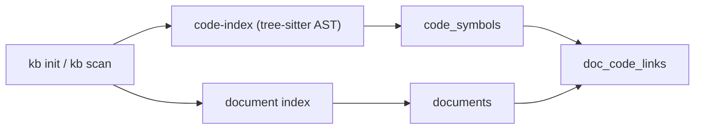

# Code graph

KB's "graph" is the **document ↔ code-symbol map**: exported code symbols
(`code_symbols`) and the whole documents that describe them (`documents`), joined by a
flat **`doc_code_links`** table. It is not a property graph of entities and typed
relationships — that model (and its `fact_edges` traversal) was removed in the indexing
redesign. There is **no edge walk**: `doc_code_links` is a flat, depth-1 join.

## What it does for you

**Navigation:** find an exported symbol by name and see the documents that describe it,
or vice versa — the same depth-1 hop the hybrid retriever uses (see
[`hybrid-retriever.ts`](hybrid-retriever.ts)).

**Inspection & export:** `kb graph` summarizes the map (symbol/document/link counts);
`kb graph --format dot|json` dumps it for visualization or analysis.

**Session override:** `--base <name>` on `kb graph` targets a specific base without
switching your active one.

## Storage

All of it lives in **`<base-dir>/.kb-index.sqlite`**:

- **`code_symbols`** (+ `code_symbols_fts`) — one exported AST symbol per row, with its
  source text, `kind`, and `git_repo` provenance.
- **`documents`** (+ `documents_fts`) — whole markdown files indexed as units.
- **`doc_code_links`** — flat `(doc_id, symbol_id, score, link_kind)` rows connecting a
  document to the symbols it describes.

## How it stays up to date



The `code-index` cycle runs during `kb init` and `kb scan` — deterministic, no LLM. It
walks the AST, writes one `code_symbols` row per exported symbol, and links documents to
symbols in `doc_code_links`. Per-file content hashes enable incremental skip on re-run.

## CLI

```
kb graph                       # Doc ↔ code map summary (counts + top-linked nodes)
kb graph --entity <name>       # Links for a named document or symbol
kb graph --format dot|json     # Export the map for visualization / analysis
kb graph --base <name> …       # Inspect a specific base
```

## Agent tools

The retrieval registry exposes the map to agents (`kb-tools-registry.ts`, backed by
[`code-graph-store.ts`](code-graph-store.ts)):

| Tool | Role |
|---|---|
| `search_code_symbols` | Full-text search over `code_symbols` by name / source text |
| `get_code_neighbors` | The documents linked to a symbol (depth-1 over `doc_code_links`) |
| `get_code_graph_summary` | Counts of symbols, documents, and links |

## Language support

Tree-sitter AST for every wired language (Go, TS/TSX, JS/JSX, Python, Rust, Ruby, Java,
C/C++, C#, CSS, Bash, PHP, Scala, HTML — see `LANG_CONFIGS` in
[`tree-sitter-indexer.ts`](tree-sitter-indexer.ts)). Text/config files (`.md`, `.yaml`,
`.json`, `.toml`, …) get a file node with no symbols. All WASM grammars ship as npm
package assets — no native compilation. Adding a language needs one `LANG_CONFIGS` +
`EXT_MAP` entry plus a WASM-shipping `tree-sitter-<lang>` package; see
[`TREE_SITTER_INDEXER.md`](TREE_SITTER_INDEXER.md).

## Implementation

| File | Role |
|---|---|
| `src/tools/code-graph-store.ts` | Read-only queries over `code_symbols` / `doc_code_links` |
| `src/tools/tree-sitter-indexer.ts` | `TreeSitterIndexer` — single-platform AST indexing for every language |
| `src/tools/sqlite-kb-index.ts` | `code_symbols` / `documents` / `doc_code_links` storage + FTS |
| `src/cli/graph-cli.ts` | `kb graph` parsing and output formatting |

## Related docs

- Behavioral spec → [`GRAPH.spec.md`](GRAPH.spec.md)
- Retrieval that uses the map → [`hybrid-retriever.ts`](hybrid-retriever.ts)
