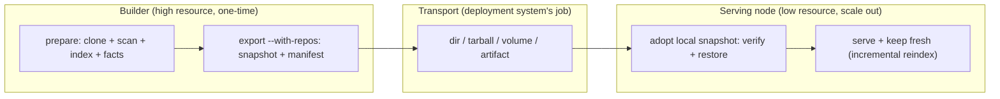

# Build-to-Serve Handoff Model

The expensive part of KB is the **initial build** — clone → scan → index → extract
facts → embed → write SQLite — which can cost far more memory and time than
steady-state serving. This document defines a **generic, vendor-agnostic** way to do
that heavy work **once** and then **warm-start any number of lightweight serving
nodes** from its output: a high-resource **builder** produces a **snapshot**, and a
serving node adopts it from a local path, skips the heavy build, and then runs
normally — serving requests **and keeping its index fresh** with cheap incremental
reindex.

Nothing here is tied to a cloud provider, container platform, or orchestrator. A
snapshot is a plain directory + a JSON manifest, so it moves by any transport you
already have — `cp`, `rsync`, `scp`, `tar`, an object store, a mounted volume, or a
CI artifact. The deployment system owns transport; `kb-server` only ever reads a
snapshot that is **already present on the local filesystem** at startup — it never
downloads the prepared state itself.

## Lifecycle: build once → hand off → warm-start many



| Phase | Command | Who | Cost |
|---|---|---|---|
| **Build** | `kb init` / `kb-server start` (auto) | builder | heavy (one-time) |
| **Export** | `kb-server export --with-repos` | builder | cheap (copy + hash) |
| **Warm-start + serve** | `kb-server start --from <dir>` | serving node | light |

`start --from <dir>` fuses "adopt the snapshot" and "serve it" into one startup, so a
serving node needs a single flag. It **defaults to the `auto` bootstrap policy**, so
after warm-starting the node behaves like any normal node: it serves and keeps its
index fresh via the incremental reindex scheduler. The expensive initial build is what
the snapshot skips — not the cheap ongoing refresh.

The explicit two-step path (`kb-server import --from <dir>` then `kb-server start`)
still exists when you want restore and serve as separate, independently observable
operations.

## Snapshot contract

A snapshot is a directory that mirrors a KB base, plus a manifest at its root. The
manifest — `kb-snapshot.json` — is what lets a node **locate**, **trust**, and
**verify** state produced elsewhere.

```
<snapshot>/
  kb-snapshot.json       # manifest: provenance, compat, digest (the contract)
  .kb-index.sqlite        # the built index — one consistent file, no WAL sidecars
  repos/<slug>/          # source working trees — ONLY in --with-repos snapshots
```

The index is captured with SQLite's `VACUUM INTO`, which takes a read
transaction and folds any write-ahead log back into a single file. So export is
**safe against a live builder** (no quiesce needed), the snapshot carries exactly
one `.kb-index.sqlite` with no `-wal`/`-shm` sidecars, and the manifest digest
covers the whole state. Repo provenance is read from each clone's `origin`
remote at export time and recorded in the manifest, so it travels even in a
serve-only snapshot that drops the working trees.

`kb-snapshot.json` shape (schema `1`, defined in
[`@kb/core/storage/snapshot.ts`](../kb-core/src/storage/snapshot.ts)):

```jsonc
{
  "kind": "kb-snapshot",          // discriminator — nothing else is a snapshot
  "schemaVersion": 1,             // manifest schema; consumers reject newer
  "createdAt": "2026-07-07T12:00:00.000Z",
  "producer": {
    "tool": "kb-server",
    "coreVersion": "1.2.3",       // @kb/core that built the on-disk format
    "toolVersion": "1.2.3"        // producing binary (optional)
  },
  "compat": {
    "indexSchema": 16             // highest DB migration; forward-only (see below)
  },
  "provenance": {
    "base": "myproject",
    "repos": [
      { "gitUrl": "...", "gitBranch": "main", "slug": "org-repo" }
    ]
  },
  "contents": {
    "index": [".kb-index.sqlite"],
    "includesRepos": true          // --with-repos ships the working trees
  },
  "digest": { "algorithm": "sha256", "index": "<hex>" }  // integrity
}
```

### Compatibility rule (forward-only)

The KB index schema is versioned by the highest applied SQLite migration
(`LATEST_SCHEMA_VERSION` in
[`db-migrations.ts`](../kb-core/src/core/db-migrations.ts)). Migrations only go
forward, so:

> A consumer may serve a snapshot **iff** its own `LATEST_SCHEMA_VERSION` ≥ the
> snapshot's `compat.indexSchema`, **and** it understands the manifest
> `schemaVersion`.

An older node refuses a newer snapshot rather than silently misreading it —
`checkSnapshotCompatibility()` returns the reason, and both `kb-server import` and
`kb-server start --from` fail with it. This is the required "snapshot adoption
failed / incompatible" signal.

### Builder vs serve-only snapshots (`--with-repos`)

What a snapshot must carry depends on what the node will do with it:

- **`kb-server export --with-repos`** → *builder* snapshot: the index **and** the
  `repos/<slug>/` working trees. A node that adopts it can serve **and keep indexing**
  — the scheduler `git fetch`es each clone and incrementally reindexes only the repos
  with new commits. **This is the snapshot for horizontally-scaled serving nodes.**
- **`kb-server export`** (default) → *serve-only* snapshot: index only, no working
  trees. Small. A node that adopts it serves a **frozen** index; there are no clones to
  pull, so it does not reindex. Pair it with `--bootstrap-policy snapshot-only` for a
  minimal, locked-down worker that needs no git access at all.

So: the index is always required; the checked-out source is what turns a serving node
from *frozen* into *self-refreshing*.

## Commands

### Export (on the builder)

```bash
# Build once (heavy), then snapshot the base with its source trees:
kb-server export --base myproject --with-repos --out ./myproject.kb
# Ship it however you like:
tar czf myproject.kb.tgz -C ./myproject.kb .
```

`kb-server export [--base <name>] --out <dir> [--with-repos] [--force]`
- Refuses when the base has no index (nothing to hand off).
- `--with-repos` includes the working trees so consumers can keep indexing; omit it
  for a small, frozen serve-only snapshot.
- Writes the manifest with provenance + a sha256 digest of the index.

### Warm-start a serving node

The deployment system places the snapshot on the node's disk (a mounted volume, an
unpacked tarball, a restored artifact). Then one command adopts it and serves:

```bash
tar xzf myproject.kb.tgz -C /mnt/kb-state
kb-server start --base myproject --from /mnt/kb-state
```

`kb-server start --from <dir>` (env `KB_SERVER_SNAPSHOT`):
- Adopts a snapshot **already on local disk** — it never downloads the prepared state.
  The serving runtime needs no object-store auth and no network fetch for the state.
- Verifies the manifest, checks compatibility, verifies the index sha256, then
  restores the index (+ manifest, + repos if the snapshot carries them) into the base.
- **Keeps the default `auto` policy**: after warm-starting, the node serves and — if
  the snapshot carried the working trees — keeps its index fresh with the incremental
  reindex scheduler. It skips only the expensive *initial* build.
- Is a **no-op on a warm restart**: if the base already has an index (a persistent
  volume survived the restart), `--from` is ignored so a reboot doesn't re-import.
- Fails **loudly before binding** on a malformed/incompatible/corrupt snapshot — an
  observable misconfiguration (non-zero exit) rather than a silent rebuild.

### Import + serve as two explicit steps (alternative)

When you prefer restore and serve as separate operations:

```bash
tar xzf myproject.kb.tgz -C ./incoming
kb-server import --from ./incoming --base myproject   # verify + restore only
kb-server start --base myproject
```

`kb-server import --from <dir> [--base <name>] [--force] [--no-verify]`
- Rejects a directory with no `kb-snapshot.json` (not a snapshot).
- Checks manifest compatibility, then verifies the index sha256 (`--no-verify`
  overrides), then restores the index + manifest (+ repos if present).
- Refuses to clobber an existing index unless `--force`.

`import` and `start --from` share one restore path (`adoptSnapshot`), so their
verification and safety guarantees are identical.

## Bootstrap policy: warm-start vs frozen

`kb-server start` takes `--bootstrap-policy` (or `KB_SERVER_BOOTSTRAP_POLICY`):

| Policy | Empty volume | Warm volume |
|---|---|---|
| `auto` (default) | build/scan from declared repos | serve + incrementally reindex tracked repos, fold in newly-declared ones |
| `snapshot-only` | **refuse**; surface "no snapshot available" | serve the existing index as-is; **no** boot-time or scheduled reindex |

`auto` is the default for a warm-started node: it does the cheap ongoing refresh but,
because the index is already present from the snapshot, it never re-runs the heavy
initial build.

`snapshot-only` is the **opt-in freeze** for a minimal serve-only worker: no reindex
scheduler, no git access needed. When no index is present (a `snapshot-only` node with
no snapshot supplied) the node still binds and `/healthz` responds, but reports **not
ready** with a `bootstrapError`, and `/v1/query` / `/v1/chat` return `503` — an
observable, safe failure instead of a silent heavy build.

### Observable states (in `/healthz` + logs)

| Condition | `/healthz` | `/v1/*` |
|---|---|---|
| Snapshot adopted / index present | `200 { ok: true }` | `200` |
| First build in progress (`auto`, empty volume) | `503 { indexing: true, bootstrapProgress }` | `503` indexing |
| `snapshot-only` with no index and no `--from` | `503 { bootstrapError: "no snapshot available…" }` | `503` |
| `--from` snapshot invalid / incompatible | non-zero exit before bind | — |

## Deployment shapes

- **Local** — `kb-server export --with-repos --out ./snapshot`; on the same or another
  machine `kb-server start --from ./snapshot`.
- **Docker** — a builder image runs `export --with-repos` to a shared volume or produces
  a tarball; serving images mount/unpack it and boot with `KB_SERVER_SNAPSHOT=/mnt/kb-state`.
  Scale the serving image horizontally; each replica warm-starts from the same snapshot.
- **VM** — build on a large VM, `scp`/`rsync` the snapshot to small VMs, `start --from`.
- **Kubernetes** — an init container / CSI volume places the snapshot at a mount path;
  the serving container starts with `--from <mount>`. Scale the Deployment out.
- **CI/CD artifact** — a CI job runs `export`, uploads `kb-snapshot.json` + the index as
  a build artifact; deploy workers download it *out of band* into a local path and
  `start --from`. Provenance (source SHAs, builder version) travels in the manifest.
- **Frozen / air-gapped serve** — `export` (serve-only) + `start --from <dir> --bootstrap-policy snapshot-only`
  for a worker that never touches git and only ever serves the shipped index.

In every shape, fetching the snapshot bytes is the deployment system's job; `kb-server`
only consumes a path that is already on local disk.

> **Single writer.** Multiple `auto` nodes each keep their **own** volume fresh (each
> owns its SQLite index); they do not share one index. Warm-start each from the snapshot
> and let each reindex independently — do not point several writers at one volume.

## Refresh

A warm-started `auto` node keeps **itself** fresh: the scheduler (`KB_REINDEX_INTERVAL`,
or `POST /v1/reindex`) `git fetch`es its clones and incrementally reindexes only the
repos with new commits — the same cheap path a normal node uses. This needs the working
trees, so it applies to nodes started from a `--with-repos` snapshot.

To roll out a larger change (schema bump, full rebuild, new repo set), re-run the builder,
re-`export` a fresh snapshot, and warm-start new nodes from it — the artifact/release flow.

`snapshot-only` **disables the reindex scheduler entirely** — a serve-only snapshot has
no source trees to pull, so a frozen node refreshes only by adopting a new snapshot, not
by rescanning.

## Design decisions

- **Canonical format?** A directory snapshot mirroring the base layout + a
  `kb-snapshot.json` manifest. Transport-agnostic; tar is one optional wrapper, not
  the format.
- **How does the node get the state?** It **adopts it from a local path** at startup
  (`start --from`) or via an explicit `import` — never by downloading. Transport is the
  deployment system's responsibility, so the serving runtime needs no cloud/object-store
  auth for the prepared state.
- **What does a warm-started node do after restore?** By default (`auto`) it serves and
  keeps its index fresh with cheap incremental reindex — it only skips the expensive
  *initial* build. `snapshot-only` is the opt-in freeze.
- **Adoption inside the server or a wrapper?** Both share one code path (`adoptSnapshot`):
  `start --from` runs it at boot for the one-command serving node; `import` runs it as a
  standalone step when you want restore observable before the node takes traffic.
- **Compatibility guarantees?** Forward-only index schema token + manifest schema
  version; consumers refuse anything newer than they understand.
- **Separate commands, binaries, or modes?** Subcommands/flags of the existing
  `kb-server` binary (`export`, `import`, `start --from`, `start --bootstrap-policy`) —
  no new binary, minimal surface.
- **Required vs optional state?** The index is required to serve; `repos/` working
  trees are optional — they are what let a serving node keep indexing rather than serve
  a frozen index.

## Future work (not in this cut)

- Let an `auto` node re-clone from the manifest's provenance when adopting a serve-only
  snapshot, so it can keep indexing without shipping the working trees.
- First-class tarball/object-store transports built into `export` (still
  deployment-owned by design, but a convenience wrapper).
- Incremental / delta snapshots instead of full snapshots.
- Signed manifests for stronger provenance/trust.

## Related docs

- Server → [`src/SERVER.md`](./src/SERVER.md) · Deploy → [`README.md`](./README.md)
- Contract → [`@kb/core/storage/snapshot.ts`](../kb-core/src/storage/snapshot.ts)
- Monorepo → [`../ARCHITECTURE.md`](../ARCHITECTURE.md)
