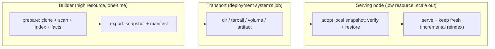

# Build-to-Serve Handoff Model

The expensive part of KB is the **initial build** — clone → scan → index → extract
facts → embed → write SQLite — which can cost far more memory and time than
steady-state serving. This document defines a **generic, vendor-agnostic** way to do
that heavy work **once** and then **warm-start any number of lightweight serving
nodes** from its output: a high-resource **builder** produces a **snapshot**, and a
serving node adopts it from a local path, skips the heavy build, and then runs
normally — serving requests **and keeping its index fresh** with cheap incremental
reindex across every tracked repo.

Nothing here is tied to a cloud provider, container platform, or orchestrator. A
snapshot is a plain directory + a JSON manifest, so it moves by any transport you
already have — `cp`, `rsync`, `scp`, `tar`, an object store, a mounted volume, or a
CI artifact. The deployment system owns transport; `kb-server` only ever reads a
snapshot that is **already present on the local filesystem** at startup — it never
downloads the prepared state itself.

## Lifecycle: build once → hand off → warm-start many



| Phase | Command | Who | Cost |
|---|---|---|---|
| **Build** | `kb init` / `kb-server start` (auto) | builder | heavy (one-time) |
| **Export** | `kb-server export` | builder | cheap (copy + hash) |
| **Scheduled reindex** | `kb-server scan --from <dir> --out <dir>` | batch job (cron) | one-shot; adopt → scan → export → exit |
| **Warm-start + serve** | `kb-server start --from <dir>` | serving node | light |

`start --from <dir>` fuses "adopt the snapshot" and "serve it" into one startup, so a
serving node needs a single flag. It **defaults to the `auto` bootstrap policy**, so
after warm-starting the node behaves like any normal node: it serves and keeps its
index fresh via the incremental reindex scheduler. The expensive initial build is what
the snapshot skips — not the cheap ongoing refresh.

The explicit two-step path (`kb-server import --from <dir>` then `kb-server start`)
still exists when you want restore and serve as separate, independently observable
operations.

## Snapshot contract

A snapshot is a **faithful copy of a base** — the consistent index plus every other
base file (scan/AST manifests, checkpoints, any settings) and, unless you opt out, the
repo working trees — with a manifest at its root. The manifest — `kb-snapshot.json` —
is what lets a node **locate**, **trust**, and **verify** state produced elsewhere.

```
<snapshot>/
  kb-snapshot.json         # manifest: provenance, compat, digest (the contract)
  .kb-index.sqlite          # the built index — one consistent file, no WAL sidecars
  source-files-manifest.json, ast-files-manifest.json, checkpoints/, …  # settings/state
  repos/<slug>/            # source working trees — omitted by `export --no-repos`
```

The index is captured with SQLite's `VACUUM INTO`, which takes a read
transaction and folds any write-ahead log back into a single file. So export is
**safe against a live builder** (no quiesce needed), the snapshot carries exactly
one `.kb-index.sqlite` with no `-wal`/`-shm` sidecars, and the manifest digest
covers the whole index. Per-repo provenance — the `origin` URL, branch, and the
**built SHA** (the commit the index reflects) — is read from each clone at export time
and recorded in the manifest, so it travels even in a `--no-repos` snapshot that drops
the working trees.

`kb-snapshot.json` shape (schema `1`, defined in
[`@kb/core/storage/snapshot.ts`](../kb-core/src/storage/snapshot.ts)):

```jsonc
{
  "kind": "kb-snapshot",          // discriminator — nothing else is a snapshot
  "schemaVersion": 1,             // manifest schema; consumers reject newer
  "createdAt": "2026-07-07T12:00:00.000Z",
  "producer": {
    "tool": "kb-server",
    "coreVersion": "1.2.3",       // internal @kb/core provenance (not user-facing)
    "toolVersion": "1.2.3"        // producing binary (optional)
  },
  "compat": {
    "indexSchema": 16             // highest DB migration; forward-only (see below)
  },
  "provenance": {
    "base": "myproject",
    "repos": [                    // multi-repo: one entry per tracked clone
      { "gitUrl": "...", "gitBranch": "main", "slug": "org-repo",
        "headSha": "abc123…" }    // the commit the index was built at
    ]
  },
  "contents": {
    "index": [".kb-index.sqlite"],
    "includesRepos": true          // working trees travel unless --no-repos
  },
  "digest": { "algorithm": "sha256", "index": "<hex>" }  // integrity
}
```

### Compatibility rule (forward-only)

The KB index schema is versioned by the highest applied SQLite migration
(`LATEST_SCHEMA_VERSION` in
[`db-migrations.ts`](../kb-core/src/core/db-migrations.ts)). Migrations only go
forward, so:

> A consumer may serve a snapshot **iff** its own `LATEST_SCHEMA_VERSION` ≥ the
> snapshot's `compat.indexSchema`, **and** it understands the manifest
> `schemaVersion`.

An older node refuses a newer snapshot rather than silently misreading it —
`checkSnapshotCompatibility()` returns the reason, and both `kb-server import` and
`kb-server start --from` fail with it. This is the required "snapshot adoption
failed / incompatible" signal.

### Full snapshot vs `--no-repos`

An export is faithful by default: it carries the working trees so a node has
everything to serve **and** keep indexing immediately. `--no-repos` trades that for
size:

- **`kb-server export`** (default) → the index, all base settings, **and** the
  `repos/<slug>/` working trees. A node serves and reindexes with no network round-trip.
- **`kb-server export --no-repos`** → index + settings only, no working trees. Small.
  The manifest still records each repo's `gitUrl` + built SHA, so an `auto` node
  **re-clones the repos from provenance** on warm-start (see below) and keeps indexing;
  a `snapshot-only` node serves the index frozen and never touches git.

The index is always required; the working trees are either shipped or re-cloned.

## Commands

### Export (on the builder)

```bash
# Build once (heavy), then snapshot the base (repos + all settings by default):
kb-server export --base myproject --out ./myproject.kb
# Ship it however you like:
tar czf myproject.kb.tgz -C ./myproject.kb .
```

When the builder runs in a container, [`scripts/export-snapshot.sh`](../../scripts/export-snapshot.sh)
does the whole builder-side dance in one command — `export --no-repos` inside the
container, copy the artifact out to the host, and report its size:

```bash
scripts/export-snapshot.sh --base myproject --out ./myproject.kb   # add --with-repos to keep trees
```

`kb-server export [--base <name>] --out <dir> [--no-repos] [--force]`
- Refuses when the base has no index (nothing to hand off).
- Copies the whole base faithfully; `--no-repos` drops only the working trees for a
  small, frozen serve-only artifact.
- Writes the manifest with provenance (incl. each repo's built SHA) + a sha256 digest.

### Scheduled reindex as a one-shot batch job

The refresh above is what a **long-lived** node does to keep itself current. But some
deployments have no persistent home for the index — it lives only in an object store,
and a **scheduled job** (Cloud Run Job + Cloud Scheduler, an ECS scheduled task, a
Kubernetes `CronJob`, a plain cron box) spins up periodically to rebuild it and exits.
For that shape, standing up the HTTP server just to `curl POST /v1/admin/scan` and then
`export` is pure orchestration overhead. `kb-server scan` collapses the whole dance into
one run-to-completion process — *adopt a local store → scan once → write the refreshed
store → exit* — with **no HTTP listener, no `/healthz` polling, no reindex scheduler, and
no `curl`**:

```bash
# The deployment stages the bytes in/out — kb-server only touches LOCAL paths.
<object-store> cp <remote>/snap  /snap        # gsutil / aws s3 / az — deploy's job
kb-server scan --from /snap --out /out --base myproject
<object-store> cp /out           <remote>     # deploy's job
```

`kb-server scan [--base <name>] [--from <dir>] [--out <dir>] [--force] [--no-verify] [--no-repos] [--json]`
- `--from <dir>` — adopt/restore a **local** snapshot into the base first (the `import`
  path; verifies compatibility + sha256 unless `--no-verify`, refuses to clobber an
  existing index unless `--force`).
- `--base <name>` — the base to scan (else the active / effective base).
- `--out <dir>` — export the refreshed snapshot to a **local** dir afterward (the
  `export` path; `--no-repos` for a small serve-only artifact). Emptiness is checked
  **up-front** (before adopt/scan) so a stale non-empty `--out` fails fast.
- `--force` — **one flag, two destructive behaviors:** (1) clobber an existing index
  on `--from` adopt, and (2) overwrite a non-empty `--out` on export. Batch jobs that
  only want export overwrite still opt into adopt-clobber; treat a surprise existing
  index as an upstream error and omit `--from`, or clear the base first, if you do not
  want (1).
- `--json` — emit a machine-readable summary on stdout (progress → stderr) so a
  scheduler can log/alert. Success:
  `{ ok: true, base, adopted, from, repos, exported, out, indexDigest }`. Failure:
  `{ ok: false, base, error }` on stdout **and** a non-zero exit (thrown after emit).
- Composes the exact standalone code paths `kb scan`, `kb-server import`, and
  `kb-server export` already use — same scan, same snapshot contract — just fused into a
  single process. One-shot mode has no interval scheduler to arm (equivalent to
  `KB_REINDEX_INTERVAL=0`), so there is no overlap with a periodic reindex.
- Exits non-zero on failure (an unreadable base, an incompatible/corrupt snapshot, a
  failed export), so a batch runner sees the failure.

**Cloud-agnostic guardrail:** `--from` / `--out` accept **local paths only**. The command
rejects `gs://` / `s3://` / any `scheme://` value loudly — it never learns about buckets,
object-store clients, or credentials. Staging the bytes to/from a store stays 100% the
deployment system's job, exactly like `start --from` (see *Transport* below). That keeps
the binary portable across GCP / AWS / Azure / bare metal.

This is the run-to-completion counterpart of the long-lived
[`scripts/export-snapshot.sh`](../../scripts/export-snapshot.sh), which drives a
*running* builder container; `kb-server scan` instead starts, does the work against local
dirs, and exits.

### Warm-start a serving node

The deployment system places the snapshot on the node's disk (a mounted volume, an
unpacked tarball, a restored artifact). Then one command adopts it and serves:

```bash
tar xzf myproject.kb.tgz -C /mnt/kb-state
kb-server start --base myproject --from /mnt/kb-state
```

`kb-server start --from <dir>` (env `KB_SERVER_SNAPSHOT`):
- Adopts a snapshot **already on local disk** — it never downloads the prepared state.
  The serving runtime needs no object-store auth and no network fetch for the state.
- Verifies the manifest, checks compatibility, verifies the index sha256, then
  restores the whole base — index, settings, and (if present) working trees.
- **Keeps the default `auto` policy**: after warm-starting, the node serves and keeps
  its index fresh with the incremental reindex scheduler. It skips only the expensive
  *initial* build.
- **Re-clones missing working trees from provenance.** For a `--no-repos` snapshot (or a
  lost clone), an `auto` node clones each repo from its recorded `gitUrl` and resets it
  to the **built SHA**, so the working tree matches the index and incremental reindex
  advances from there. This is what keeps a tiny serve-only snapshot self-refreshing.
- Is a **no-op on a warm restart**: if the base already has an index (a persistent
  volume survived the restart), `--from` is ignored so a reboot doesn't re-import.
- Fails **loudly before binding** on a malformed/incompatible/corrupt snapshot — an
  observable misconfiguration (non-zero exit) rather than a silent rebuild.

#### When a re-clone can't reconcile

Re-cloning depends on the remote still matching the snapshot. Both failure modes
**warn and keep serving the built index as-is** — they never crash the node or trigger
a heavy rebuild:

- **Remote unreachable** (network/auth) → `⚠ cannot reach <gitUrl> to restore <repo>;
  … will not refresh until the remote is reachable.` The index still serves; refresh
  resumes once the remote is back.
- **History diverged** — the built SHA is no longer on the branch (force-push /
  rewritten history) → `⚠ snapshot may be stale or corrupted for <repo>: the built
  commit … is not in <branch>'s history …; re-export from the builder to resync.`
  Reconcile relies on **linear history**: as long as the built commit is still an
  ancestor of the branch tip, the re-clone aligns cleanly and reindex fast-forwards.

### Import + serve as two explicit steps (alternative)

When you prefer restore and serve as separate operations:

```bash
tar xzf myproject.kb.tgz -C ./incoming
kb-server import --from ./incoming --base myproject   # verify + restore only
kb-server start --base myproject
```

`kb-server import --from <dir> [--base <name>] [--force] [--no-verify]`
- Rejects a directory with no `kb-snapshot.json` (not a snapshot).
- Checks manifest compatibility, then verifies the index sha256 (`--no-verify`
  overrides), then restores the base faithfully.
- Refuses to clobber an existing index unless `--force`.

`import` and `start --from` share one restore path (`adoptSnapshot`), so their
verification and safety guarantees are identical.

## Bootstrap policy: warm-start vs frozen

`kb-server start` takes `--bootstrap-policy` (or `KB_SERVER_BOOTSTRAP_POLICY`):

| Policy | Empty volume | Warm volume (index present) |
|---|---|---|
| `auto` (default) | build/scan from declared repos | re-clone missing trees from provenance, incrementally reindex, fold in newly-declared repos |
| `snapshot-only` | **refuse**; surface "no snapshot available" | serve the index frozen; **no** re-clone, no reindex, no git access |

`auto` is the default for a warm-started node: it does the cheap ongoing refresh but,
because the index is already present from the snapshot, it never re-runs the heavy
initial build.

`snapshot-only` is the **opt-in freeze** for a minimal serve-only worker: no git, no
reindex. When no index is present (a `snapshot-only` node with no snapshot supplied) the
node still binds and `/healthz` responds, but reports **not ready** with a
`bootstrapError`, and `/v1/query` / `/v1/chat` return `503` — an observable, safe
failure instead of a silent heavy build.

### Observable states (in `/healthz` + logs)

| Condition | `/healthz` | `/v1/*` |
|---|---|---|
| Snapshot adopted / index present | `200 { ok: true }` | `200` |
| First build in progress (`auto`, empty volume) | `503 { indexing: true, bootstrapProgress }` | `503` indexing |
| `snapshot-only` with no index and no `--from` | `503 { bootstrapError: "no snapshot available…" }` | `503` |
| `--from` snapshot invalid / incompatible | non-zero exit before bind | — |
| Re-clone remote unreachable / history diverged | `200` (serves), `⚠` in logs | `200` |

## Transport: getting the snapshot onto the node

The node adopts a snapshot **from local disk** — it never authenticates to or pulls
from a store itself. So the model is always **"place the bytes, then start,"** and the
"place" step is whatever your platform already does:

- **Mounted volume** (the common case): put the snapshot on a volume — a Docker
  named volume, a host bind mount, a Kubernetes `PersistentVolume`/CSI volume — and
  mount it into the serving container at a path like `/mnt/kb-state`. Start with
  `--from /mnt/kb-state`. Nothing about the runtime needs store credentials.
- **Unpacked artifact / tarball**: `tar xzf myproject.kb.tgz -C /mnt/kb-state`, then
  `--from /mnt/kb-state`.

Object storage (an S3/GCS bucket, an OCI/registry blob, a CI artifact store) is a fine
place to **keep** snapshots and version them behind a prefix (`.../snapshots/myproject/2026-07-07/`).
But that store is the deployment system's staging area, not something the server talks
to: your pipeline (an init container, a `cp`/`rsync`/download step, a volume-populating
job) fetches the bytes onto the node's disk **out of band**, and only then does
`kb-server start --from <local-path>` run. Keeping the download out of the server means
the serving runtime needs no object-store IAM, no bucket auth, and no network path to the
store — it just reads a directory.

## Deployment shapes

- **Local** — `kb-server export --out ./snapshot`; on the same or another machine
  `kb-server start --from ./snapshot`.
- **Docker** — a builder image runs `export` to a shared volume or produces a tarball;
  serving images mount/unpack it and boot with `KB_SERVER_SNAPSHOT=/mnt/kb-state`.
  Scale the serving image horizontally; each replica warm-starts from the same snapshot.
- **VM** — build on a large VM, `scp`/`rsync` the snapshot to small VMs, `start --from`.
- **Kubernetes** — an init container / CSI volume places the snapshot at a mount path;
  the serving container starts with `--from <mount>`. Scale the Deployment out.
- **CI/CD artifact** — a CI job runs `export --no-repos`, uploads the small snapshot as a
  build artifact; deploy workers download it *out of band* into a local path and
  `start --from`, which re-clones the repos from provenance to keep indexing.
- **Frozen / air-gapped serve** — `export --no-repos` + `start --from <dir> --bootstrap-policy snapshot-only`
  for a worker that never touches git and only ever serves the shipped index.

In every shape, fetching the snapshot bytes is the deployment system's job; `kb-server`
only consumes a path that is already on local disk.

> **Single writer.** Multiple `auto` nodes each keep their **own** volume fresh (each
> owns its SQLite index); they do not share one index. Warm-start each from the snapshot
> and let each reindex independently — do not point several writers at one volume.

## Refresh

A warm-started `auto` node keeps **itself** fresh: the scheduler (`KB_REINDEX_INTERVAL`,
or `POST /v1/reindex`) `git fetch`es every tracked repo — those shipped in the snapshot
and those re-cloned from provenance — and incrementally reindexes only the repos with
new commits.

To roll out a larger change (schema bump, full rebuild, new repo set), re-run the builder,
re-`export` a fresh snapshot, and warm-start new nodes from it — the artifact/release flow.

`snapshot-only` **disables the reindex scheduler entirely** — a frozen node refreshes only
by adopting a new snapshot, not by rescanning.

## Design decisions

- **Canonical format?** A faithful directory copy of the base + a `kb-snapshot.json`
  manifest. Transport-agnostic; tar is one optional wrapper, not the format.
- **How does the node get the state?** It **adopts it from a local path** at startup
  (`start --from`) or via an explicit `import` — never by downloading. Transport is the
  deployment system's responsibility, so the serving runtime needs no cloud/object-store
  auth for the prepared state.
- **What does a warm-started node do after restore?** By default (`auto`) it serves,
  re-clones any missing working trees from provenance, and keeps its index fresh with
  cheap incremental reindex — it only skips the expensive *initial* build. `snapshot-only`
  is the opt-in freeze.
- **What if the remote diverged from the snapshot?** Reconcile assumes linear history:
  the built SHA must still be an ancestor of the branch tip. If it is (or the remote is
  reachable at all), the node aligns and keeps indexing; otherwise it warns that the
  snapshot is stale/corrupted and serves the built index as-is.
- **Compatibility guarantees?** Forward-only index schema token + manifest schema
  version; consumers refuse anything newer than they understand.
- **Separate commands, binaries, or modes?** Subcommands/flags of the existing
  `kb-server` binary (`export`, `import`, `start --from`, `start --bootstrap-policy`) —
  no new binary, minimal surface.
- **Required vs optional state?** The index is required to serve; the working trees are
  either shipped (default) or re-cloned from provenance — they are what let a node keep
  indexing rather than serve a frozen index.

## Future work (not in this cut)

- First-class tarball/object-store transports built into `export` (still
  deployment-owned by design, but a convenience wrapper).
- Incremental / delta snapshots instead of full snapshots.
- Signed manifests for stronger provenance/trust.

## Related docs

- Server → [`src/SERVER.md`](./src/SERVER.md) · Deploy → [`README.md`](./README.md)
- Contract → [`@kb/core/storage/snapshot.ts`](../kb-core/src/storage/snapshot.ts)
- Monorepo → [`../ARCHITECTURE.md`](../ARCHITECTURE.md)
