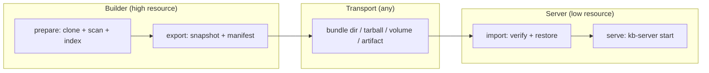

# Build-to-Serve Handoff Model

KB preparation (clone → scan → index → extract facts → write SQLite) can cost far
more memory and time than steady-state serving. This document defines a **generic,
vendor-agnostic** way to split those two phases: a high-resource **builder**
produces a prepared-state artifact, and a low-resource **server** consumes it and
serves requests **without repeating the heavy build**.

Nothing here is tied to a cloud provider, container platform, or orchestrator. The
prepared state is a plain directory + a JSON manifest, so it moves by any transport
you already have — `cp`, `rsync`, `scp`, `tar`, an object store, a mounted volume, or
a CI artifact.

## Lifecycle: four explicit phases



| Phase | Command | Who | Cost |
|---|---|---|---|
| **Prepare** | `kb init` / `kb-server start` (auto) | builder | heavy |
| **Export** | `kb-server export` | builder | cheap (copy + hash) |
| **Import** | `kb-server import` | server | cheap (copy + verify) |
| **Serve** | `kb-server start --bootstrap-policy prepared-only` | server | light |

The phases are deliberately decoupled: preparation is not a side effect of serving,
and refresh is an explicit operation (see [Refresh](#refresh-rebuild-is-explicit)).

## Prepared-state artifact contract

The prepared state is a directory that mirrors a KB base, plus a manifest at its
root. The manifest — `kb-prepared.json` — is what lets a server **locate**,
**trust**, and **verify** state produced elsewhere.

```
<bundle>/
  kb-prepared.json      # manifest: provenance, compat, digest (the contract)
  .kb-index.sqlite       # the built index — one consistent file, no WAL sidecars
  repos/<slug>/         # source working trees — ONLY in --with-repos bundles
```

The index is captured with SQLite's `VACUUM INTO`, which takes a read
transaction and folds any write-ahead log back into a single file. So export is
**safe against a live builder** (no quiesce needed), the bundle carries exactly
one `.kb-index.sqlite` with no `-wal`/`-shm` sidecars, and the manifest digest
covers the whole state. Repo provenance is read from each clone's `origin`
remote at export time and recorded in the manifest, so it travels even in a
serve-only bundle that drops the working trees.

`kb-prepared.json` shape (schema `1`, defined in
[`@kb/core/storage/prepared-state.ts`](../kb-core/src/storage/prepared-state.ts)):

```jsonc
{
  "kind": "kb-prepared-state",   // discriminator — nothing else is a bundle
  "schemaVersion": 1,             // manifest schema; consumers reject newer
  "createdAt": "2026-07-07T12:00:00.000Z",
  "producer": {
    "tool": "kb-server",
    "coreVersion": "1.2.3",       // @kb/core that built the on-disk format
    "toolVersion": "1.2.3"        // producing binary (optional)
  },
  "compat": {
    "indexSchema": 16             // highest DB migration; forward-only (see below)
  },
  "provenance": {
    "base": "myproject",
    "repos": [
      { "gitUrl": "...", "gitBranch": "main",
        "slug": "org-repo", "lastSyncedSha": "abc123", "lastSyncedAt": "..." }
    ]
  },
  "contents": {
    "index": [".kb-index.sqlite"],
    "includesRepos": false        // serve-only bundle drops the working trees
  },
  "digest": { "algorithm": "sha256", "index": "<hex>" }  // integrity
}
```

### Compatibility rule (forward-only)

The KB index schema is versioned by the highest applied SQLite migration
(`LATEST_SCHEMA_VERSION` in
[`db-migrations.ts`](../kb-core/src/core/db-migrations.ts)). Migrations only go
forward, so:

> A consumer may serve a bundle **iff** its own `LATEST_SCHEMA_VERSION` ≥ the
> bundle's `compat.indexSchema`, **and** it understands the manifest
> `schemaVersion`.

An older server refuses a newer bundle rather than silently misreading it —
`checkPreparedStateCompatibility()` returns the reason, and `kb-server import`
fails with it. This is the required "prepared state import failed / incompatible"
signal.

### Serve-only vs builder bundles

Serving needs only `.kb-index.sqlite`. The `repos/<slug>/` working trees are
needed **only** to refresh/reindex. So:

- **`kb-server export`** (default) → *serve-only* bundle: small, no working trees.
- **`kb-server export --with-repos`** → *builder* bundle: also carries the clones so
  the consumer can refresh in place.

This is the answer to "what parts of KB state are required for serving vs optional":
the index is required; the checked-out source is optional.

## Commands

### Export (on the builder)

```bash
# Build once (heavy), then snapshot the base:
kb-server export --base myproject --out ./myproject.kb
# Ship it however you like:
tar czf myproject.kb.tgz -C ./myproject.kb .
```

`kb-server export [--base <name>] --out <dir> [--with-repos] [--force]`
- Refuses when the base has no index (nothing to hand off).
- Writes the manifest with provenance + a sha256 digest of the index.

### Import + serve (on the server)

```bash
tar xzf myproject.kb.tgz -C ./incoming
kb-server import --from ./incoming --base myproject
kb-server start --base myproject --bootstrap-policy prepared-only
```

`kb-server import --from <dir> [--base <name>] [--force] [--no-verify]`
- Rejects a directory with no `kb-prepared.json` (not a bundle).
- Checks manifest compatibility, then verifies the index sha256 (`--no-verify`
  overrides), then restores the index + manifest (+ repos if present).
- Refuses to clobber an existing index unless `--force`.

## Bootstrap policy: serve without building

`kb-server start` takes `--bootstrap-policy` (or `KB_SERVER_BOOTSTRAP_POLICY`):

| Policy | Empty volume | Warm volume |
|---|---|---|
| `auto` (default) | build/scan from declared repos | fold in newly-declared repos |
| `prepared-only` | **refuse**; surface "no prepared state available" | serve the existing index as-is (no boot-time cloning/indexing) |

Under `prepared-only`, a lightweight worker can never accidentally do builder-sized
work. When no index is present the server still binds and `/healthz` responds, but
reports **not ready** with a `bootstrapError`, and `/v1/query` / `/v1/chat` return
`503` with the same message — an observable, safe failure instead of a silent heavy
rebuild.

### Safe failure modes (observable in `/healthz` + logs)

| Condition | `/healthz` | `/v1/*` |
|---|---|---|
| Prepared state ready | `200 { ok: true }` | `200` |
| Import in progress (`auto` first build) | `503 { indexing: true, bootstrapProgress }` | `503` indexing |
| No prepared state (`prepared-only`, no index) | `503 { bootstrapError: "no prepared state available…" }` | `503` |
| Import failed / incompatible | non-zero exit on `kb-server import` | — |

## Deployment shapes (all use the same contract)

- **Local** — `kb-server export --out ./bundle`; on the same or another machine
  `kb-server import --from ./bundle && kb-server start --bootstrap-policy prepared-only`.
- **Docker** — a builder image runs `export` to a shared volume or pushes a tarball;
  a slim serving image runs `import` then `start --bootstrap-policy prepared-only`.
  The serving image can drop git and build toolchains.
- **VM** — build on a large VM, `scp`/`rsync` the bundle to a small VM, serve.
- **Serverless / container service** — build in a large execution environment,
  publish the bundle to object storage, restore it into a low-cost serving env on
  cold start.
- **CI/CD artifact** — a CI job runs `export`, uploads `kb-prepared.json` + bundle as
  a build artifact; deploy workers `import` it. Provenance (source SHAs, builder
  version) travels in the manifest.

## Refresh / rebuild is explicit

Refreshing prepared state is a deliberate act, never an implicit startup side
effect:

- Re-run the builder and re-`export` a new bundle (artifact/release flow), **or**
- `POST /v1/reindex` (or `KB_REINDEX_INTERVAL`) on an `auto`-policy worker that has
  the working trees.

`prepared-only` **disables the periodic reindex scheduler entirely** — a serve-only
bundle has no source trees to pull, so refresh happens by importing a new bundle,
not by rescanning. This is what keeps the serving footprint minimal and avoids a
scheduler that would only ever error.

## Design decisions (resolving the ticket's open questions)

- **Canonical format?** A directory bundle mirroring the base layout + a
  `kb-prepared.json` manifest. Transport-agnostic; tar is one optional wrapper, not
  the format.
- **Import inside the server or a wrapper?** A separate `kb-server import` step
  (wrapper/bootstrap), so serving stays a pure consumer and import failures are
  observable before the server takes traffic.
- **Compatibility guarantees?** Forward-only index schema token + manifest schema
  version; consumers refuse anything newer than they understand.
- **Separate commands, binaries, or modes?** Separate **modes/subcommands** of the
  existing `kb-server` binary (`export`, `import`, `start --bootstrap-policy`) — no
  new binary, minimal surface.
- **Required vs optional state?** The index is required to serve; `repos/` working
  trees are optional, needed only to refresh.

## Future work (not in this cut)

- First-class tarball/object-store transports built into `export`/`import`.
- Incremental / delta bundles instead of full snapshots.
- A `kb-server prepare` mode that builds and exits (pure builder, never listens).
- Signed manifests for stronger provenance/trust.

## Related docs

- Server → [`src/SERVER.md`](./src/SERVER.md) · Deploy → [`README.md`](./README.md)
- Contract → [`@kb/core/storage/prepared-state.ts`](../kb-core/src/storage/prepared-state.ts)
- Monorepo → [`../ARCHITECTURE.md`](../ARCHITECTURE.md)
