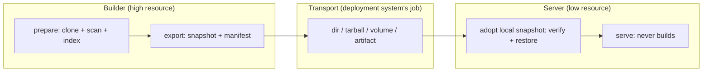

# Build-to-Serve Handoff Model

KB preparation (clone → scan → index → extract facts → write SQLite) can cost far
more memory and time than steady-state serving. This document defines a **generic,
vendor-agnostic** way to split those two phases: a high-resource **builder**
produces a **snapshot**, and a low-resource **server** adopts it from a local path
and serves requests **without repeating the heavy build** and **without downloading
anything**.

Nothing here is tied to a cloud provider, container platform, or orchestrator. A
snapshot is a plain directory + a JSON manifest, so it moves by any transport you
already have — `cp`, `rsync`, `scp`, `tar`, an object store, a mounted volume, or a
CI artifact. The deployment system owns transport; `kb-server` only ever reads a
snapshot that is **already present on the local filesystem** at startup.

## Lifecycle: build → hand off → serve



| Phase | Command | Who | Cost |
|---|---|---|---|
| **Prepare** | `kb init` / `kb-server start` (auto) | builder | heavy |
| **Export** | `kb-server export` | builder | cheap (copy + hash) |
| **Serve from local snapshot** | `kb-server start --from <dir> --bootstrap-policy snapshot-only` | server | light |

`start --from <dir>` fuses "adopt the snapshot" and "serve it" into one startup, so a
serving worker needs a single command. The explicit two-step path
(`kb-server import --from <dir>` then `kb-server start`) still exists when you want
restore and serve as separate, independently observable operations.

The phases are deliberately decoupled: preparation is not a side effect of serving,
and refresh is an explicit operation (see [Refresh](#refresh-rebuild-is-explicit)).

## Snapshot contract

A snapshot is a directory that mirrors a KB base, plus a manifest at its root. The
manifest — `kb-snapshot.json` — is what lets a server **locate**, **trust**, and
**verify** state produced elsewhere.

```
<snapshot>/
  kb-snapshot.json       # manifest: provenance, compat, digest (the contract)
  .kb-index.sqlite        # the built index — one consistent file, no WAL sidecars
  repos/<slug>/          # source working trees — ONLY in --with-repos snapshots
```

The index is captured with SQLite's `VACUUM INTO`, which takes a read
transaction and folds any write-ahead log back into a single file. So export is
**safe against a live builder** (no quiesce needed), the snapshot carries exactly
one `.kb-index.sqlite` with no `-wal`/`-shm` sidecars, and the manifest digest
covers the whole state. Repo provenance is read from each clone's `origin`
remote at export time and recorded in the manifest, so it travels even in a
serve-only snapshot that drops the working trees.

`kb-snapshot.json` shape (schema `1`, defined in
[`@kb/core/storage/snapshot.ts`](../kb-core/src/storage/snapshot.ts)):

```jsonc
{
  "kind": "kb-snapshot",          // discriminator — nothing else is a snapshot
  "schemaVersion": 1,             // manifest schema; consumers reject newer
  "createdAt": "2026-07-07T12:00:00.000Z",
  "producer": {
    "tool": "kb-server",
    "coreVersion": "1.2.3",       // @kb/core that built the on-disk format
    "toolVersion": "1.2.3"        // producing binary (optional)
  },
  "compat": {
    "indexSchema": 16             // highest DB migration; forward-only (see below)
  },
  "provenance": {
    "base": "myproject",
    "repos": [
      { "gitUrl": "...", "gitBranch": "main", "slug": "org-repo" }
    ]
  },
  "contents": {
    "index": [".kb-index.sqlite"],
    "includesRepos": false        // serve-only snapshot drops the working trees
  },
  "digest": { "algorithm": "sha256", "index": "<hex>" }  // integrity
}
```

### Compatibility rule (forward-only)

The KB index schema is versioned by the highest applied SQLite migration
(`LATEST_SCHEMA_VERSION` in
[`db-migrations.ts`](../kb-core/src/core/db-migrations.ts)). Migrations only go
forward, so:

> A consumer may serve a snapshot **iff** its own `LATEST_SCHEMA_VERSION` ≥ the
> snapshot's `compat.indexSchema`, **and** it understands the manifest
> `schemaVersion`.

An older server refuses a newer snapshot rather than silently misreading it —
`checkSnapshotCompatibility()` returns the reason, and both `kb-server import` and
`kb-server start --from` fail with it. This is the required "snapshot adoption
failed / incompatible" signal.

### Serve-only vs builder snapshots

Serving needs only `.kb-index.sqlite`. The `repos/<slug>/` working trees are
needed **only** to refresh/reindex. So:

- **`kb-server export`** (default) → *serve-only* snapshot: small, no working trees.
- **`kb-server export --with-repos`** → *builder* snapshot: also carries the clones so
  the consumer can refresh in place.

This is the answer to "what parts of KB state are required for serving vs optional":
the index is required; the checked-out source is optional.

## Commands

### Export (on the builder)

```bash
# Build once (heavy), then snapshot the base:
kb-server export --base myproject --out ./myproject.kb
# Ship it however you like:
tar czf myproject.kb.tgz -C ./myproject.kb .
```

`kb-server export [--base <name>] --out <dir> [--with-repos] [--force]`
- Refuses when the base has no index (nothing to hand off).
- Writes the manifest with provenance + a sha256 digest of the index.

### Serve from a local snapshot (on the server)

The deployment system places the snapshot on the serving host's disk (a mounted
volume, an unpacked tarball, a restored artifact). Then one command adopts it and
serves:

```bash
tar xzf myproject.kb.tgz -C /mnt/kb-state
kb-server start --base myproject --from /mnt/kb-state --bootstrap-policy snapshot-only
```

`kb-server start --from <dir>` (env `KB_SERVER_SNAPSHOT`):
- Adopts a snapshot **already on local disk** — it never downloads. This is the
  whole point: the serving runtime needs no object-store auth and no network fetch.
- Verifies the manifest, checks compatibility, verifies the index sha256, then
  restores the index (+ manifest, + repos if the snapshot carries them) into the base.
- Is a **no-op on a warm restart**: if the base already has an index (a persistent
  volume survived the restart), `--from` is ignored so a reboot doesn't re-import.
- Fails **loudly before binding** on a malformed/incompatible/corrupt snapshot — an
  observable misconfiguration (non-zero exit) rather than a silent rebuild.

Pair it with `--bootstrap-policy snapshot-only` for a worker that is *guaranteed*
never to do builder-sized work (see below).

### Import + serve as two explicit steps (alternative)

When you prefer restore and serve as separate operations:

```bash
tar xzf myproject.kb.tgz -C ./incoming
kb-server import --from ./incoming --base myproject   # verify + restore only
kb-server start --base myproject --bootstrap-policy snapshot-only
```

`kb-server import --from <dir> [--base <name>] [--force] [--no-verify]`
- Rejects a directory with no `kb-snapshot.json` (not a snapshot).
- Checks manifest compatibility, then verifies the index sha256 (`--no-verify`
  overrides), then restores the index + manifest (+ repos if present).
- Refuses to clobber an existing index unless `--force`.

`import` and `start --from` share one restore path (`adoptSnapshot`), so their
verification and safety guarantees are identical.

## Bootstrap policy: serve without building

`kb-server start` takes `--bootstrap-policy` (or `KB_SERVER_BOOTSTRAP_POLICY`):

| Policy | Empty volume | Warm volume |
|---|---|---|
| `auto` (default) | build/scan from declared repos | fold in newly-declared repos |
| `snapshot-only` | **refuse**; surface "no snapshot available" | serve the existing index as-is (no boot-time cloning/indexing) |

Under `snapshot-only`, a lightweight worker can never accidentally do builder-sized
work. When no index is present (and no `--from` snapshot supplied one) the server
still binds and `/healthz` responds, but reports **not ready** with a
`bootstrapError`, and `/v1/query` / `/v1/chat` return `503` with the same message —
an observable, safe failure instead of a silent heavy rebuild.

### Safe failure modes (observable in `/healthz` + logs)

| Condition | `/healthz` | `/v1/*` |
|---|---|---|
| Snapshot ready (adopted or already on volume) | `200 { ok: true }` | `200` |
| Import in progress (`auto` first build) | `503 { indexing: true, bootstrapProgress }` | `503` indexing |
| No snapshot (`snapshot-only`, no index, no `--from`) | `503 { bootstrapError: "no snapshot available…" }` | `503` |
| `--from` snapshot invalid / incompatible | non-zero exit before bind | — |

## Deployment shapes (all adopt from local disk)

- **Local** — `kb-server export --out ./snapshot`; on the same or another machine
  `kb-server start --from ./snapshot --bootstrap-policy snapshot-only`.
- **Docker** — a builder image runs `export` to a shared volume or produces a tarball;
  a slim serving image mounts/unpacks it and boots with
  `KB_SERVER_SNAPSHOT=/mnt/kb-state KB_SERVER_BOOTSTRAP_POLICY=snapshot-only`. The
  serving image can drop git and build toolchains.
- **VM** — build on a large VM, `scp`/`rsync` the snapshot to a small VM, serve with
  `--from`.
- **Kubernetes** — an init container / CSI volume places the snapshot at a mount path;
  the serving container starts with `--from <mount> --bootstrap-policy snapshot-only`.
- **CI/CD artifact** — a CI job runs `export`, uploads `kb-snapshot.json` + the index as
  a build artifact; deploy workers download it *out of band* into a local path and boot
  with `--from`. Provenance (source SHAs, builder version) travels in the manifest.

In every shape, fetching the bytes is the deployment system's job; `kb-server` only
consumes a path that is already on local disk.

## Refresh / rebuild is explicit

Refreshing a serving worker's state is a deliberate act, never an implicit startup
side effect:

- Re-run the builder, re-`export` a new snapshot, and roll the serving worker onto it
  (artifact/release flow), **or**
- `POST /v1/reindex` (or `KB_REINDEX_INTERVAL`) on an `auto`-policy worker that has
  the working trees.

`snapshot-only` **disables the periodic reindex scheduler entirely** — a serve-only
snapshot has no source trees to pull, so refresh happens by adopting a new snapshot,
not by rescanning. This is what keeps the serving footprint minimal and avoids a
scheduler that would only ever error.

## Design decisions (resolving the ticket's open questions)

- **Canonical format?** A directory snapshot mirroring the base layout + a
  `kb-snapshot.json` manifest. Transport-agnostic; tar is one optional wrapper, not
  the format.
- **How does the server get the state?** It **adopts it from a local path** at startup
  (`start --from`) or via an explicit `import` — never by downloading. Transport is the
  deployment system's responsibility, so the serving runtime needs no cloud/object-store
  auth.
- **Adoption inside the server or a wrapper?** Both share one code path (`adoptSnapshot`):
  `start --from` runs it at boot for the one-command serving worker; `import` runs it as a
  standalone step when you want restore observable before the server takes traffic.
- **Compatibility guarantees?** Forward-only index schema token + manifest schema
  version; consumers refuse anything newer than they understand.
- **Separate commands, binaries, or modes?** Subcommands/flags of the existing
  `kb-server` binary (`export`, `import`, `start --from`, `start --bootstrap-policy`) —
  no new binary, minimal surface.
- **Required vs optional state?** The index is required to serve; `repos/` working
  trees are optional, needed only to refresh.

## Future work (not in this cut)

- First-class tarball/object-store transports built into `export` (still deployment-owned
  by design, but a convenience wrapper).
- Incremental / delta snapshots instead of full snapshots.
- A `kb-server prepare` mode that builds and exits (pure builder, never listens).
- Signed manifests for stronger provenance/trust.

## Related docs

- Server → [`src/SERVER.md`](./src/SERVER.md) · Deploy → [`README.md`](./README.md)
- Contract → [`@kb/core/storage/snapshot.ts`](../kb-core/src/storage/snapshot.ts)
- Monorepo → [`../ARCHITECTURE.md`](../ARCHITECTURE.md)
