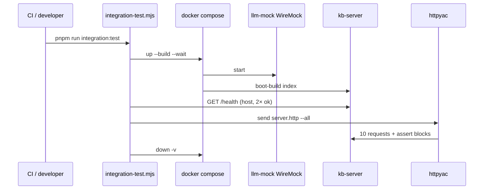

# HTTP Collection and Integration Suite

The `http/` directory is the **contract + black-box test harness** for `kb-server start`. `server.http` is both runnable examples (IDE/CLI) and the integration suite executed by `pnpm run integration:test`.

## Role in the stack

## Core pieces

| Artifact | Role |
|---|---|
| `server.http` | Named requests (`# @name health`, `query`, `chat`, …) with `{{ }}` post-response tests |
| `slack.http` | Slack webhook surface tests — unsigned rejection, URL-verification challenge, `app_mention`, DM; HMAC-SHA256 signatures computed in pre-request scripts |
| `openapi.yaml` | OpenAPI 3.0 for REST + MCP JSON-RPC |
| `.httpyac.js` | Environments: `local`, `docker`, `prod` (`baseUrl`, `apiKey`, `slackSigningSecret`) |
| `http-client.env.json` | JetBrains/httpyac env fallback for VS Code/Cursor extension |
| `package.json` | `"type": "commonjs"` — **workspace override** so httpyac loads CJS config in an ESM repo |
| `.httpyac.json` (repo root) | Same env values when running `pnpm exec httpyac` from root |

## Integration

- **Manual send:** `pnpm exec httpyac send packages/kb-server/http/server.http -n query --env local` (server already up on `:8080`).
- **Local full suite:** `kb-server start --with-mcp` with `KB_SERVER_API_KEY=testkey`.
- **Full suite:** `pnpm run integration:test` — see [`../INTEGRATION_TEST.md`](../INTEGRATION_TEST.md).
- **CI:** `.github/workflows/integration.yml` on merge to `main` — not on feature-branch pushes or PR checks.
- **LLM:** Integration always routes Gemini to WireMock — [`../docker/wiremock/WIREMOCK.md`](../docker/wiremock/WIREMOCK.md).

### Test philosophy

Assertions check **response structure** (status, JSON shape, SSE event names), not answer text — stable across `KB_GIT_REPOS` and mock LLM output.

Post-response scripts live in `{{ }}` blocks and must **`const assert = require('assert')`** inside each block (httpyac does not inject `assert` globally). Do **not** replace `{{` globally in `server.http` — that corrupts `{{baseUrl}}` / `{{apiKey}}` template variables.

## Invariants

- Every public HTTP route in `http-server.ts` must have a named request in `server.http` (or `slack.http` for Slack webhook routes) with at least one structural test.
- `apiKey` in httpyac env must match `KB_SERVER_API_KEY` on the server under test.
- `slackSigningSecret` in httpyac env must match `SLACK_SIGNING_SECRET` on the server under test; `slack.http` computes HMAC-SHA256 inline — never hardcode signatures.
- Integration suite path: `packages/kb-server/http/server.http` (from repo root).
- OpenAPI and `server.http` must agree on paths and auth scheme.

## Extension checklist

1. Add route in `packages/kb-server/src/http-server.ts`.
2. Add `# @name …` block to `server.http` (or `slack.http` for Slack routes) with shape tests.
3. Update `openapi.yaml`.
4. Run `pnpm run integration:test` locally before PR.

## Gotchas

- Root `"type": "module"` breaks httpyac loading `.httpyac.js` unless `http/package.json` forces CommonJS.
- First Docker boot may report `indexing: true` plus `bootstrapProgress` before the initial build finishes.
- `prod` env `baseUrl` is a placeholder; replace before real deploy smoke tests.

## Related docs

- Behavioral spec → [`HTTP.spec.md`](./HTTP.spec.md)

- [`../src/SERVER.md`](../src/SERVER.md) — server implementation
- [`README.md`](README.md) — quick commands
- [`../../../TESTING.md`](../../../TESTING.md) — unit vs integration split
