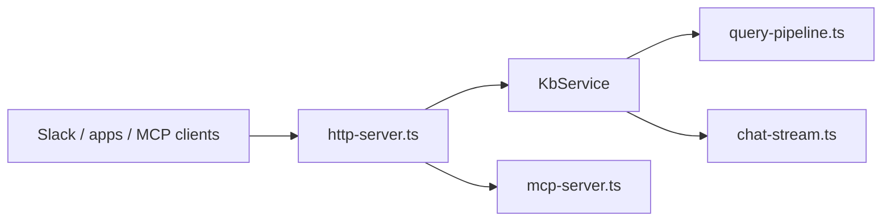

# KB HTTP, MCP, and Slack Server

Runs as a **central, long-lived HTTP service** (`kb-server`) so indexing happens once on durable storage and clients call REST (and optionally MCP / Slack) instead of re-bootstrapping a CLI per request. Entry point: `kb-server start [--with-mcp] [--with-slack]`.

For offloading the heavy one-time build from lightweight serving — build once on a
big worker, `kb-server export` a portable snapshot (index + settings + repos), then
warm-start small serving nodes with `kb-server start --from <dir>` (adopts a local
snapshot already on disk — never downloads; keeps the index fresh via incremental
reindex, re-cloning repos from provenance for `--no-repos` snapshots) — see the
[build-to-serve handoff model](../HANDOFF.md). Scheduled batch refresh without an
HTTP daemon: `kb-server scan --from <dir> --out <dir>` (adopt → scan → export → exit).

## Role in the stack



**Boundaries:** No git sync on each request (`runQueryPipeline` is stateless). Reindex is explicit (`POST /v1/reindex`) or scheduled (`KB_REINDEX_INTERVAL`). The scheduled reindex timer is armed only after the first background bootstrap index succeeds, so an empty-volume boot cannot overlap periodic rescans. Server reindex uses incremental auto-sync semantics: every tracked repo is polled, but only repos with new commits are re-indexed. Chat history is **in-memory** per `sessionId`; restart clears sessions.

## Core pieces

| File | Role |
|---|---|
| `server-cli.ts` | `kb-server start` (+ `--from` snapshot adopt)/`scan`/`export`/`import`; boot-build; scheduler; shutdown |
| `scan-cli.ts` | `kb-server scan` — one-shot adopt→scan→export batch reindex (no HTTP) |
| `snapshot-cli.ts` | `kb-server export`/`import` + `adoptSnapshot` — snapshot handoff mechanics |
| `@kb/core/storage/snapshot.ts` | Snapshot artifact contract (`kb-snapshot.json`) |
| `@kb/core/service/kb-service.ts` | Query, chat, readFacts, reindex, health |
| `http-server.ts` | `/healthz`, `/v1/*`, admin routes, optional MCP/Slack |
| `@kb/core/service/query-pipeline.ts` | Shared retrieval + synthesis |
| `chat-stream.ts` | `runChatSynthesis` → SSE (`reasoning` / `meta` / `answer`+`sources`) |
| `@kb/core/service/chat-reply.ts` | Shared answer + Sources footer (+ Slack mrkdwn) |
| `mcp-server.ts` | Streamable HTTP MCP handler |
| `reindex-scheduler.ts` | `KB_REINDEX_INTERVAL` |

## Integration

- **CLI:** `kb-server` binary → `runServerCommand` in `server-cli.ts`.
- **Boot-build:** missing `.kb-index.sqlite` now runs in the background after `listen()`. `/healthz` comes up immediately; `/v1/query`, `/v1/chat`, and `/mcp` return `503` with an indexing message until the first build finishes.
- **Docker:** `kb-server start --with-mcp` in Dockerfile CMD; Slack is enabled by `KB_SERVER_ENABLE_SLACK=true`.
- **Dev:** `pnpm run server:start` for a local process; `pnpm run server:up` for the guided Docker path.
- **Observability:** Every request emits a `request` line on entry and a `response` line on finish (`status`, `durationMs`), both keyed by a UUID `requestId` also returned as the `x-request-id` response header. Each route adds semantic logs: query/chat/reindex/mcp emit start/complete/error with timings; `/healthz` logs at `debug`; auth failures and unknown routes log at `warn`. Control verbosity via `LOG_LEVEL` (`debug|info|warn|error`; default `info`). Set in `.env` / `docker-compose.yml` `LOG_LEVEL` env var.

### MCP clients (Claude Code & Cursor Agent)

Start the server with MCP enabled (same `KB_SERVER_API_KEY` on server and client):

```bash
export KB_SERVER_API_KEY=testkey
# Point the thin client at this node (remote example):
# export KB_SERVER_URL=https://kb.example.com:38117
kb-server start --with-mcp
```

**Preferred setup** — sync agent MCP configs to the active connection (localhost by default):

```bash
# Uses whatever the CLI/TUI is connected to (localhost:38117 when unset)
kb mcp install
# or, from the TUI: /skills install

# Pin a host
kb mcp install --host localhost:38117
kb mcp install --host https://kb.example.com:38117

# Or set session env, then:
export KB_SERVER_URL=https://kb.example.com:38117
export KB_SERVER_API_KEY=testkey
kb mcp install
kb mcp status
```

That writes/updates the `kb` entry in:

| Client | File | Shape |
|---|---|---|
| Cursor | `~/.cursor/mcp.json` | `{ "url": "<server>/mcp", "headers": { "Authorization": "Bearer …" } }` |
| Claude Code | `~/.claude.json` (`mcpServers`) | `{ "type": "http", "url": "<server>/mcp", "headers": { … } }` |

URL follows the same host resolution as the CLI/TUI (`--host` / `KB_SERVER_URL` / `KB_HOST` / localhost default). Other MCP servers in those files are left alone. Reload MCP in the agent after sync, then use `kb_query` (agents: MCP connection only; humans: CLI/TUI). Verify with `claude mcp list` / `agent mcp list-tools kb` / `kb mcp status`.

**Manual fallback** (only if you cannot run the client):

```bash
claude mcp add --transport http -s user kb http://localhost:38117/mcp \
  --header "Authorization: Bearer ${KB_SERVER_API_KEY}"
```

**Tool exposed:** a single `kb_query` (`kb_`-prefixed on the wire). It is an
**agent-to-agent** channel: the client asks a direct natural-language question
and always gets an answer-first response — a synthesized answer plus the
**physical source files** the answer draws from (each result's `filePath` is an
openable path, not an opaque `fact://` id). No `synthesize` flag; it always
synthesizes. A fact-id drill-down tool may return later.

### Endpoints (`kb-server start [--with-mcp] [--with-slack]`)

| Method / path | Auth | Purpose |
|---|---|---|
| `GET /health` / `/healthz` | none | Liveness + `indexMtime` (SQLite mtime = last index write) + `version.server` (never `@kb/core`) + `indexing` / `bootstrapProgress` / `reindexing` |
| `POST /v1/query` | Bearer | Synthesized answer + sources; returns `503` with bootstrap progress while first indexing is still running |
| `POST /v1/chat` | Bearer | Multi-turn SSE chat |
| `POST /v1/reindex` | Bearer | Incremental rescan |
| `POST /mcp` | Bearer | MCP Streamable HTTP when `--with-mcp` |
| `GET /v1/bases` | Bearer | List the bases this server can serve (default + built bases under `~/.kb/sessions`) |
| `POST /slack/events` | Slack HMAC | Slack Events API webhook (when Slack mode is enabled) |

Auth: `Authorization: Bearer <KB_SERVER_API_KEY>` or `X-Api-Key`.

### Browser CORS (Pages / local chat demo)

CORS is **off by default**. Browser UIs (GitHub Pages `demo/`, `pnpm run demo`) must allow-list their origin:

```bash
# env (comma-separated) or repeatable CLI flags
KB_SERVER_ALLOWED_ORIGINS=http://localhost:8000,https://rosenjcb.github.io
kb-server start --allow-origin http://localhost:8000
```

`*` allows any origin (logs a warning). Preflight `OPTIONS` is answered without auth when an origin matches.

### Multi-base (one process, many bases)

The server resolves + bootstraps one **default** base at boot, but can serve any
already-built base on the same host — the psql/libpq postmaster model (one process,
many databases). The boot base name is `--base` > `KB_SERVER_BASE_NAME` / `KB_BASE` >
a locally-selected base (`kb base use`) > the golden default slug **`base`** (à la
Postgres's `postgres` maintenance DB) — so `kb-server start` never requires naming a
base. Selection is **per request** via the `X-KB-Base` header (or `?base=`
on `/healthz`, or a body `base` on `/v1/query` / `/v1/chat`):

- `service-registry.ts` keeps a `Map<baseDir, KbService>` — the default keeps its
  bootstrap/indexing lifecycle; other bases are created **lazily on first touch** and
  are **serve-only** (never built on connect).
- An omitted base ⇒ the default base. An unknown base (no `.kb-index.sqlite`) ⇒ `404`
  with `status: unknown_base` — base creation stays a `kb init` / scan concern.
- Bases are separate SQLite files, so cross-base reads are naturally concurrent and the
  reindex write-guard is per-base.

This lets one server back parallel `kb eval` suites (`scripts/eval-run.mjs` multi-suite
batch): the parent starts one process; each child attaches with its own `--base` /
`X-KB-Base` instead of spawning a server per port. See [`eval/EVAL.md`](../../../eval/EVAL.md).

### Slack integration (`KB_SERVER_ENABLE_SLACK` + secrets)

Set Slack mode plus both secrets to enable the webhook route:

```bash
export KB_SERVER_ENABLE_SLACK=true
export SLACK_SIGNING_SECRET=<from Slack app config>
export SLACK_BOT_TOKEN=xoxb-<bot token>
kb-server start --with-slack
```

Configure your Slack app's **Event Subscriptions** URL to `https://<your-host>/slack/events` and subscribe to:
- `app_mention` — bot @-mentioned in a channel

**Routing:**
- `app_mention` → multi-turn chat keyed on `thread_ts ?? event.ts`, replying in the same thread
- `message` (`channel_type=im`) → multi-turn chat keyed on the DM user/channel
- if bootstrap indexing is still running, Slack gets an immediate status reply with the same progress line the API exposes, then the final answer is posted once indexing settles
- replies use the same `service.chat` stream as `POST /v1/chat`: `formatChatReply({ flavor: 'slack', sourceRepos })` runs the answer through `markdownToSlackMrkdwn` and appends a deduped **Sources** footer. Clickable blob links come from `discoverBaseRepos` — each source slug maps to that clone's `gitUrl` + primary branch (`url#branch` / `--branch` / remote HEAD at clone time). There is no global `KB_SOURCE_BRANCH`.

Bot-posted events (`bot_id` or `subtype`) are silently ignored to prevent reply loops. Slack retries are deduplicated by `event_id`.

## Invariants

- Retrieval via `runQueryPipeline` or `streamChatTurn` only.
- `reindex` is single-flight (`isReindexing()`).
- MCP HTTP is stateless — fresh server + transport per request.
- Fresh-volume bootstrap runs after `listen()` so startup probes can pass during long first indexing.
- `kb-server scan` never opens an HTTP listener; `--from`/`--out` are local paths only; batch always replaces adopt index and overwrites `--out` (no `--force`).

## Extension checklist

1. Route in `http-server.ts` → add to `server.http` + `openapi.yaml` + `tests/server/`.
2. Log semantic events via `logger.ts`, keyed by `requestId`.
3. Changeset for affected `@kb/server` / `@kb/core` packages.

## Gotchas

- Chat SSE may fall back from Gemini stream to non-streaming.
- REST `synthesize` defaults true; MCP `kb_query` **always** synthesizes (answer + source files).

## Related docs

- Monorepo → [`../../ARCHITECTURE.md`](../../ARCHITECTURE.md) · Core → [`../../kb-core/CORE.md`](../../kb-core/CORE.md)
- Chat reply presentation → [`../../kb-core/src/service/CHAT_REPLY.md`](../../kb-core/src/service/CHAT_REPLY.md)
- Chat design → [`../../kb-core/src/core/CHAT.md`](../../kb-core/src/core/CHAT.md)
- Pages demo → [`../../../demo/README.md`](../../../demo/README.md)
- Build-to-serve handoff → [`../HANDOFF.md`](../HANDOFF.md)
- HTTP contract → [`../http/HTTP.md`](../http/HTTP.md) · Deploy → [`../README.md`](../README.md)
- Client wire base → [`../../kb-client/src/api/CONNECTION.md`](../../kb-client/src/api/CONNECTION.md)
- Eval multi-suite harness → [`../../../eval/EVAL.md`](../../../eval/EVAL.md)
- Behavioral spec → [`SERVER.spec.md`](SERVER.spec.md)
