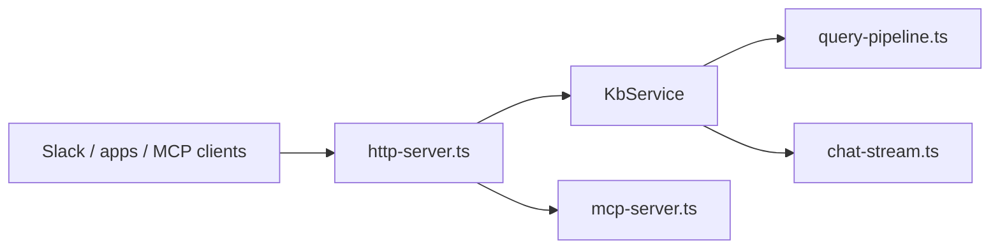

# KB HTTP, MCP, and Slack Server

Runs as a **central, long-lived HTTP service** (`kb-server`) so indexing happens once on durable storage and clients call REST (and optionally MCP / Slack) instead of re-bootstrapping a CLI per request. Entry point: `kb-server start [--with-mcp] [--with-slack]`.

For offloading the heavy one-time build from lightweight serving — build once on a
big worker, `kb-server export` a portable snapshot (index + settings + repos), then
warm-start small serving nodes with `kb-server start --from <dir>` (adopts a local
snapshot already on disk — never downloads; keeps the index fresh via incremental
reindex, re-cloning repos from provenance for `--no-repos` snapshots) — see the
[build-to-serve handoff model](../HANDOFF.md).

## Role in the stack



**Boundaries:** No git sync on each request (`runQueryPipeline` is stateless). Reindex is explicit (`POST /v1/reindex`) or scheduled (`KB_REINDEX_INTERVAL`). The scheduled reindex timer is armed only after the first background bootstrap index succeeds, so an empty-volume boot cannot overlap periodic rescans. Server reindex uses incremental auto-sync semantics: every tracked repo is polled, but only repos with new commits are re-indexed. Chat history is **in-memory** per `sessionId`; restart clears sessions.

## Core pieces

| File | Role |
|---|---|
| `server-cli.ts` | `kb-server start` (+ `--from` snapshot adopt)/`export`/`import`; boot-build; scheduler; shutdown |
| `snapshot-cli.ts` | `kb-server export`/`import` + `adoptSnapshot` — snapshot handoff mechanics |
| `@kb/core/storage/snapshot.ts` | Snapshot artifact contract (`kb-snapshot.json`) |
| `@kb/core/service/kb-service.ts` | Query, chat, readFacts, reindex, health |
| `http-server.ts` | `/healthz`, `/v1/*`, admin routes, optional MCP/Slack |
| `@kb/core/service/query-pipeline.ts` | Shared retrieval + synthesis |
| `chat-stream.ts` | `runChatSynthesis` → SSE |
| `mcp-server.ts` | Streamable HTTP MCP handler |
| `reindex-scheduler.ts` | `KB_REINDEX_INTERVAL` |

## Integration

- **CLI:** `kb-server` binary → `runServerCommand` in `server-cli.ts`.
- **Boot-build:** missing `.kb-index.sqlite` now runs in the background after `listen()`. `/healthz` comes up immediately; `/v1/query`, `/v1/chat`, and `/mcp` return `503` with an indexing message until the first build finishes.
- **Docker:** `kb-server start --with-mcp` in Dockerfile CMD; Slack is enabled by `KB_SERVER_ENABLE_SLACK=true`.
- **Dev:** `pnpm run server:start` for a local process; `pnpm run server:up` for the guided Docker path.
- **Observability:** Every request emits a `request` line on entry and a `response` line on finish (`status`, `durationMs`), both keyed by a UUID `requestId` also returned as the `x-request-id` response header. Each route adds semantic logs: query/chat/reindex/mcp emit start/complete/error with timings; `/healthz` logs at `debug`; auth failures and unknown routes log at `warn`. Control verbosity via `LOG_LEVEL` (`debug|info|warn|error`; default `info`). Set in `.env` / `docker-compose.yml` `LOG_LEVEL` env var.

### MCP clients (Claude Code & Cursor Agent)

Start the server with MCP enabled (same `KB_SERVER_API_KEY` on server and client):

```bash
export KB_SERVER_API_KEY=testkey
# Point the thin client at this node (remote example):
# export KB_SERVER_URL=https://kb.example.com:38117
kb-server start --with-mcp
```

**Preferred setup** — let the client rewrite agent MCP configs from the same connection profile:

```bash
kb skills install
# or any normal `kb` / `kb query` invocation — syncs fire-and-forget after env apply
```

That writes/updates the `kb` entry in:

| Client | File | Shape |
|---|---|---|
| Cursor | `~/.cursor/mcp.json` | `{ "url": "<server>/mcp", "headers": { "Authorization": "Bearer …" } }` |
| Claude Code | `~/.claude.json` (`mcpServers`) | `{ "type": "http", "url": "<server>/mcp", "headers": { … } }` |

URL comes from `KB_SERVER_URL` or `KB_HOST`/`KB_PORT` (same resolution as the CLI). Other MCP servers in those files are left alone. Verify with `claude mcp list` / `agent mcp list-tools kb`.

**Manual fallback** (only if you cannot run the client):

```bash
claude mcp add --transport http -s user kb http://localhost:38117/mcp \
  --header "Authorization: Bearer ${KB_SERVER_API_KEY}"
```

**Tools exposed:** `kb_query`, `kb_read_facts`, `kb_search_code_symbols`, `kb_get_code_neighbors`, `kb_get_code_graph_summary` (registry tools are `kb_`-prefixed on the wire).

### Endpoints (`kb-server start [--with-mcp] [--with-slack]`)

| Method / path | Auth | Purpose |
|---|---|---|
| `GET /health` / `/healthz` | none | Liveness + `indexMtime` + `indexing` + `bootstrapProgress` + `reindexing` |
| `POST /v1/query` | Bearer | Synthesized answer + sources; returns `503` with bootstrap progress while first indexing is still running |
| `POST /v1/chat` | Bearer | Multi-turn SSE chat |
| `POST /v1/reindex` | Bearer | Incremental rescan |
| `POST /mcp` | Bearer | MCP Streamable HTTP when `--with-mcp` |
| `POST /slack/events` | Slack HMAC | Slack Events API webhook (when Slack mode is enabled) |

Auth: `Authorization: Bearer <KB_SERVER_API_KEY>` or `X-Api-Key`.

### Slack integration (`KB_SERVER_ENABLE_SLACK` + secrets)

Set Slack mode plus both secrets to enable the webhook route:

```bash
export KB_SERVER_ENABLE_SLACK=true
export SLACK_SIGNING_SECRET=<from Slack app config>
export SLACK_BOT_TOKEN=xoxb-<bot token>
kb-server start --with-slack
```

Configure your Slack app's **Event Subscriptions** URL to `https://<your-host>/slack/events` and subscribe to:
- `app_mention` — bot @-mentioned in a channel

**Routing:**
- `app_mention` → multi-turn chat keyed on `thread_ts ?? event.ts`, replying in the same thread
- `message` (`channel_type=im`) → multi-turn chat keyed on the DM user/channel
- if bootstrap indexing is still running, Slack gets an immediate status reply with the same progress line the API exposes, then the final answer is posted once indexing settles

Bot-posted events (`bot_id` or `subtype`) are silently ignored to prevent reply loops. Slack retries are deduplicated by `event_id`.

## Invariants

- Retrieval via `runQueryPipeline` or `streamChatTurn` only.
- `reindex` is single-flight (`isReindexing()`).
- MCP HTTP is stateless — fresh server + transport per request.
- Fresh-volume bootstrap runs after `listen()` so startup probes can pass during long first indexing.

## Extension checklist

1. Route in `http-server.ts` → add to `server.http` + `openapi.yaml` + `tests/server/`.
2. Log semantic events via `logger.ts`, keyed by `requestId`.
3. Changeset for affected `@kb/server` / `@kb/core` packages.

## Gotchas

- Chat SSE may fall back from Gemini stream to non-streaming.
- REST `synthesize` defaults true; MCP `kb_query` defaults false.

## Related docs

- Monorepo → [`../../ARCHITECTURE.md`](../../ARCHITECTURE.md) · Core → [`../../kb-core/CORE.md`](../../kb-core/CORE.md)
- Build-to-serve handoff → [`../HANDOFF.md`](../HANDOFF.md)
- HTTP contract → [`../http/HTTP.md`](../http/HTTP.md) · Deploy → [`../README.md`](../README.md)
- Behavioral spec → [`SERVER.spec.md`](SERVER.spec.md)
