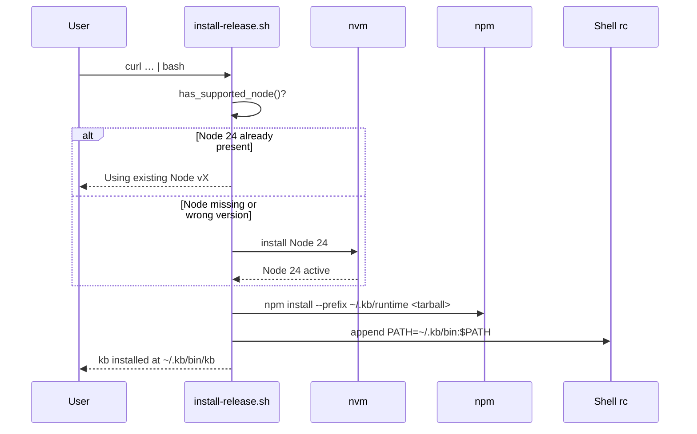

# Install / Uninstall Scripts

Shell scripts that manage the lifecycle of KB on a user's machine. The release installer runs once on first install; `uninstall-global.sh` is dev-only.

## Role in the stack



## Scripts

| Script | Purpose | Audience |
|---|---|---|
| `install-release.sh` | Fresh install from GitHub Releases tarball | End users |
| `install-global.sh` | Symlink dev build into `$PNPM_HOME/bin` | Contributors |
| `uninstall-global.sh` | Remove dev symlink and dist/ | Contributors |

Consumer uninstall is `kb uninstall` (see [`../src/cli/CLI.md`](../src/cli/CLI.md)) — not a shell script.

## Node 24 requirement

KB requires exactly **Node 24.x**. `install-release.sh` detects the version via `node -p "process.versions.node.split('.')[0]"` and compares against `NODE_MAJOR=24`.

Detection outcomes at install time:
- **No node** → logs "Node not found. Installing Node 24 via nvm." then installs.
- **Wrong version** → logs "Found Node vX, but KB requires Node 24.x. Installing Node 24 via nvm (your existing Node is not affected)." then installs.
- **Node 24** → logs "Using existing Node vX" and skips nvm.

nvm manages Node 24 as a **separate version**; existing Node installs are untouched. After install, `nvm alias default 24` sets Node 24 as the nvm default.

## `.nvmrc` and auto-switching

The repo ships `.nvmrc` (and `.node-version`) pinned to `24.15.0`. nvm does **not** auto-switch on `cd` by default — it is opt-in. Contributors who want auto-switching should add a shell hook:

**bash** — append to `~/.bashrc`:
```bash
cdnvm() { command cd "$@" && [ -f .nvmrc ] && nvm use --silent; }
alias cd=cdnvm
```

**zsh** — append to `~/.zshrc`:
```zsh
autoload -U add-zsh-hook
load-nvmrc() { [ -f .nvmrc ] && nvm use --silent; }
add-zsh-hook chpwd load-nvmrc
```

Without the hook, run `nvm use` once after entering the repo.

## Install layout (`~/.kb/`)

```
~/.kb/
  bin/kb          → symlink to runtime/node_modules/.bin/kb
  runtime/        npm package (kb-cli-node24.tgz unpacked)
  sessions/<base>/  SQLite + markdown + repos/<slug>/ clones per knowledge base
  config.json     LLM provider settings
```

`KB_INSTALL_ROOT` overrides `~/.kb` for all scripts and CLI commands.

## Dev uninstall (`uninstall-global.sh`)

Removes in order:
1. `$PNPM_HOME/bin/kb` dev symlink
2. `dist/` build output
3. Prompts interactively before deleting `~/.kb/`

## Related docs

- Behavioral spec → [`SCRIPTS.spec.md`](SCRIPTS.spec.md)

- [`INTEGRATION_TEST.md`](INTEGRATION_TEST.md) — `pnpm run integration:test` (Docker + httpyac)

## Invariants

- `install-release.sh` must explain **why** it is installing Node 24 before it does so — users with existing Node installs must not be surprised.
- `install-global.sh` requires `dist/bin/kb` to exist; always run `pnpm run build` first.
- `uninstall-global.sh` must never delete `~/.kb/` without a `[y/N]` prompt.
- Consumer uninstall logic lives in `src/cli/uninstall-cli.ts`, not in shell scripts — shell scripts are dev-only.
