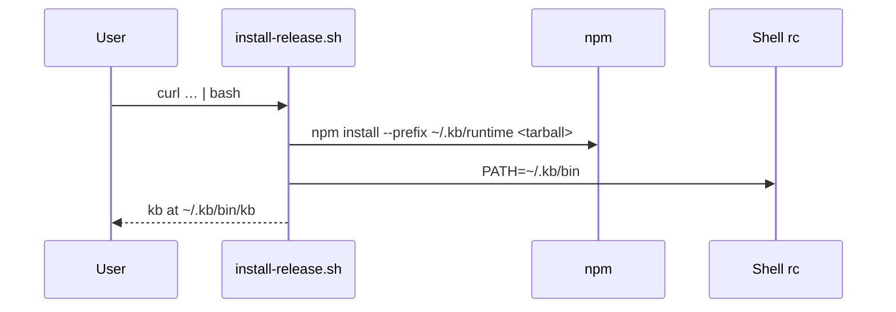

# Install / Uninstall Scripts

Shell scripts for KB lifecycle. Release install ships **`kb`** only (via tarball); contributors link **`kb`** and **`kb-server`** from a dev build.

## Role in the stack



## Scripts

| Script | Purpose | Audience |
|---|---|---|
| `install-release.sh` | Fresh install from GitHub Releases tarball (`kb` client) | End users |
| `install-global.sh` | Symlink `packages/kb-client/dist/bin/kb` **and** `packages/kb-server/dist/bin/kb-server` into `$PNPM_HOME/bin` | Contributors |
| `uninstall-global.sh` | Remove dev symlinks and dist/ | Contributors |

Consumer uninstall: `kb uninstall` → [`../packages/kb-client/src/cli/uninstall-cli.ts`](../packages/kb-client/src/cli/uninstall-cli.ts).

## Install layout (`~/.kb/`)

```
~/.kb/
  bin/kb            → release launcher (or dev symlink target)
  runtime/          npm package (kb-cli-node24.tgz)
  config.json       client connection profile + prefs
  sessions/<base>/  index + repo clones (server KB_HOME)
  logs/             RunReport NDJSON
```

`KB_INSTALL_ROOT` overrides `~/.kb`. **`KB_HOME`** (same default path) is the server's data root.

## Node 24

KB requires **Node 24.x**. `install-release.sh` bootstraps via nvm when missing. See `.nvmrc` (`24.15.0`).

## Dev install

```bash
pnpm run build && pnpm run install:global
command -v kb kb-server
```

Both binaries required for local client-server dev.

## Invariants

- `install-global.sh` requires built `packages/kb-client/dist/bin/kb` and `packages/kb-server/dist/bin/kb-server`.
- `uninstall-global.sh` never deletes `~/.kb/` without `[y/N]`.
- Release tarball is client-only; run `kb-server` via Docker or a future server release artifact.

## Related docs

- Architecture → [`../packages/ARCHITECTURE.md`](../packages/ARCHITECTURE.md)
- Server deploy → [`../packages/kb-server/README.md`](../packages/kb-server/README.md)
- Spec → [`SCRIPTS.spec.md`](SCRIPTS.spec.md)
