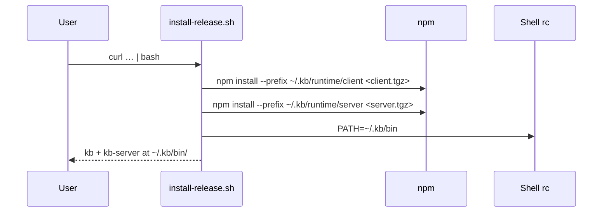

# Install / Uninstall Scripts

Shell scripts for KB lifecycle. Release install ships **`kb`** and **`kb-server`** as separate tarballs; `install-kb.sh` installs both by default.

## Role in the stack



## Scripts

| Script | Purpose | Audience |
|---|---|---|
| `install-release.sh` | Fresh install from GitHub Releases (`kb-client-node24.tgz` + `kb-server-node24.tgz`; `--client-only` / `--server-only`) | End users |
| `install-global.sh` | From a git checkout: `pnpm install`, `pnpm run build`, symlink `kb` + `kb-server` into `$PNPM_HOME/bin`, PATH hint | Contributors |
| `uninstall-global.sh` | Remove dev symlinks and dist/ | Contributors |

Consumer uninstall: `kb uninstall` → [`../packages/kb-client/src/cli/uninstall-cli.ts`](../packages/kb-client/src/cli/uninstall-cli.ts).

## Install layout (`~/.kb/`)

```
~/.kb/
  bin/kb            → runtime/client/node_modules/.bin/kb
  bin/kb-server     → runtime/server/node_modules/.bin/kb-server
  runtime/
    client/         @kb/client npm package
    server/         @kb/server npm package
  state/            session + default base names
  sessions/<base>/  index + repo clones (server KB_HOME)
  logs/             RunReport NDJSON
```

`KB_INSTALL_ROOT` overrides `~/.kb`. **`KB_HOME`** (same default path) is the server's data root.

## Node 24

KB requires **Node 24.x**. `install-release.sh` bootstraps via nvm when missing. See `.nvmrc` (`24.15.0`).

## Dev install

From the repo root (fresh clone or after pulling):

```bash
pnpm run install:global
command -v kb kb-server
kb --version && kb-server --version
```

Runs, in order: Node version check → `pnpm install` → `pnpm run build` → symlinks into `$PNPM_HOME/bin` → PATH entry in your shell rc (if missing).

Eval harvest (`pnpm run eval`) expects this checkout to stay intact — indexing runs via `scripts/eval-index.ts` with this tree's `node_modules`, not the cloned target repo under `~/.kb/evaluations/`.

Both binaries required for local client-server dev.

## Invariants

- `install-global.sh` requires built `packages/kb-client/dist/bin/kb` and `packages/kb-server/dist/bin/kb-server`.
- `uninstall-global.sh` never deletes `~/.kb/` without `[y/N]`.
- Release tarballs are split; `install-kb.sh` / `kb sync` install both unless you opt into one side only.

## Related docs

- Architecture → [`../packages/ARCHITECTURE.md`](../packages/ARCHITECTURE.md)
- Server deploy → [`../packages/kb-server/README.md`](../packages/kb-server/README.md)
- Spec → [`SCRIPTS.spec.md`](SCRIPTS.spec.md)
