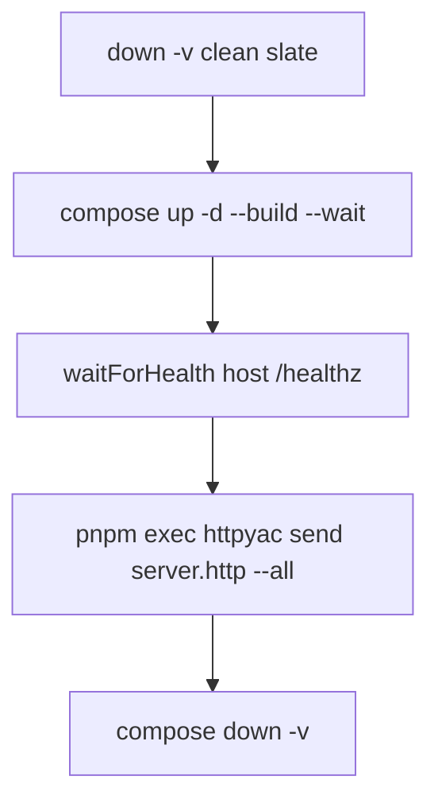

# Integration Test Runner

`pnpm run integration:test` runs `scripts/integration-test.mjs`: tear down any prior stack, build and start `kb-server` + `llm-mock`, wait until the index is live, execute all requests in `http/server.http`, then `docker compose down -v`. Exit code equals httpyac's result (CI gate).

## Role in the stack

Distinct from `pnpm run unit:test` (Vitest, no Docker). Complements `tests/server/*.test.ts` (in-process HTTP mocks).

## Environment (forced in script)

| Variable | Default | Notes |
|---|---|---|
| `KB_BASE` | `integration` | Base name inside container |
| `KB_GIT_REPOS` | `sindresorhus/is` | Small public repo for first-boot index |
| `KB_SERVER_API_KEY` | `testkey` | Must match httpyac `apiKey` |
| `KB_REINDEX_INTERVAL` | `0` | Disable scheduler noise in tests |
| `GEMINI_API_KEY` | `integration-mock-key` | Dummy |
| `GEMINI_API_BASE_URL` | `http://llm-mock:8080` | WireMock sidecar DNS |
| `ANTHROPIC_API_KEY` / `OPENAI_API_KEY` | cleared | Prevent auto-detect bypass |
| `KB_TEST_BASE_URL` | `http://localhost:8080` | Host-side health + httpyac target |

## Health wait

After compose `--wait` (container healthcheck), the script polls host `GET /healthz` until:

1. HTTP 200
2. JSON `ok: true` and `indexMtime` string present
3. **Two consecutive** successes (2s apart)

Timeout: 6 minutes (first boot clone + index). On failure, prints `docker compose logs --tail 80`.

## Integration

- **CI:** `.github/workflows/ci.yml` job `integration`, 20-minute timeout, no secrets.
- **httpyac:** `pnpm exec httpyac` from devDependency (not `dlx`).
- **Requirements:** Docker + `docker compose` only.

## Invariants

- Integration must use WireMock — no opt-out to real providers from shell env.
- Suite file path must remain `http/server.http`.
- Always `down -v` before and after to avoid stale volumes racing health checks.
- Do not shorten health wait below index boot time on cold CI runners.

## Related docs

- [`../http/HTTP.md`](../http/HTTP.md) — collection and assert conventions
- [`../docker/wiremock/WIREMOCK.md`](../docker/wiremock/WIREMOCK.md) — LLM stubs
- [`../src/server/SERVER.md`](../src/server/SERVER.md) — what is under test
