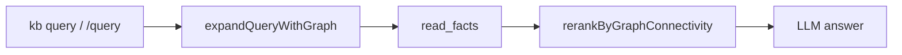
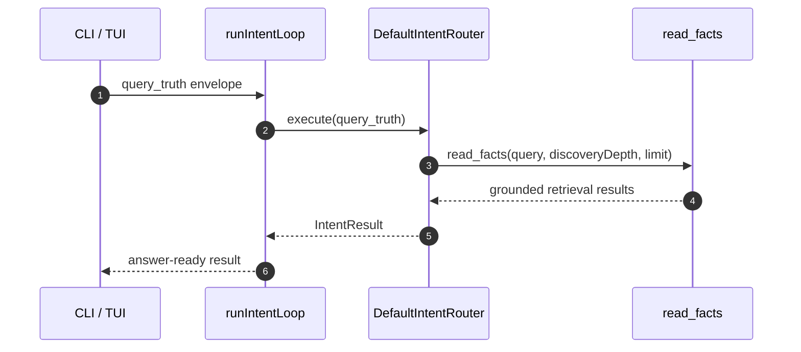

# Agent Loop Conventions

## Overview

KB uses three loop patterns:

1. **`runIntentLoop`** — the primary harness for the public KB query intent.
2. **Domain-specific cycle loops** — deterministic multi-pass orchestration for commands with a fixed lifecycle such as `kb init` and `kb publish`.
3. **`agentLoop`** — low-level async generator for autonomous tool-calling. Available for programmatic / SDK use; not used by the CLI.

The public KB query intent delegates to the router-owned retrieval path:

| Intent | Handler | Location |
|---|---|---|
| `query_truth` | Router-owned retrieval path | `src/intents/router.ts` |

This is the composition principle: `intent → router → tools`. `runIntentLoop` owns retry policy; CLI/TUI adapters stay thin.

## Intent Surface



Graph expansion runs in `index.ts` / `chat-cli.ts` before `runQueryTruthRetrieval()`. Optional rerank after retrieval.

## Part 1: Intent Loop

**File:** `src/core/intent-loop.ts`

`runIntentLoop` is the entry point for the public KB query intent.

### Signature

```typescript
runIntentLoop(
  envelope: ConsumerIntentEnvelope,
  toolExecutor: ToolExecutor,
  config?: IntentLoopConfig,
): Promise<IntentLoopResult>
```

```typescript
interface IntentLoopConfig {
  maxIterations?: number
  confidenceThreshold?: number
  provider?: LLMProvider
}

interface IntentLoopResult {
  result: IntentResult
  iterations: number
  escalated: boolean
}
```

### Per-intent behaviour

| Intent | Retry? | Strategy |
|---|---|---|
| `query_truth` | Yes, up to `maxIterations` | Router defaults to deep discovery; weak retrieval escalates to deep with a wider limit. |

Weak retrieval means zero results, fewer than two results, or a final retrieval checkpoint with `status: 'miss'` or `'error'`.

### Query sequence



### CLI wiring

The query intent goes through the intent loop. Answer enrichment runs afterward for the read intent.

## Part 2: Domain-Specific Cycle Loops

Some commands implement deterministic loops over named cycles. LLM is called directly via `provider.call()` because the command owns the orchestration.

### `kb init`

| Cycle | What happens | Output |
|---|---|---|
| `read-inputs` | Scan source files and collect repo inputs | `InitContext` |
| `pass1` | One LLM call per coverage topic in parallel | `CandidateDoc[]` |
| `pass2` | Coverage gap analysis, follow-up questions, refinement | Updated `CandidateDoc[]` |
| `pass-enrich` | Per-document enrichment in parallel | Enriched `CandidateDoc[]` |
| `pass3` | Final quality pass | Final `CandidateDoc[]` |
| `write` | Upsert to SQLite | Written document IDs |
| `ast-facts` | Deterministic source-code indexing and fact promotion | `facts` + `fact_edges` updates |

## Part 3: Choosing a Pattern

| Situation | Use |
|---|---|
| KB query intent | `runIntentLoop` |
| Fixed sequence of LLM passes with known inputs/outputs | Cycle loop |
| User interaction between LLM calls | Cycle loop |
| Autonomous open-ended tool use in SDK/programmatic context | `agentLoop` |
| Single LLM completion, no tools | `provider.call()` directly |

## See Also

- `src/core/intent-loop.ts` — primary intent harness
- `src/cli/intent-cli.ts` — public intent parsing and formatting
- `src/tools/GRAPH.md` — graph lifecycle and read semantics
