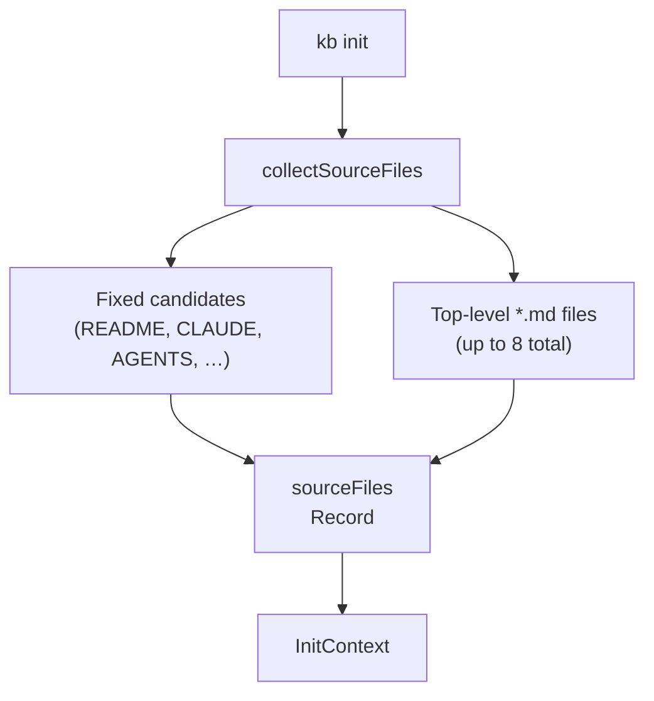
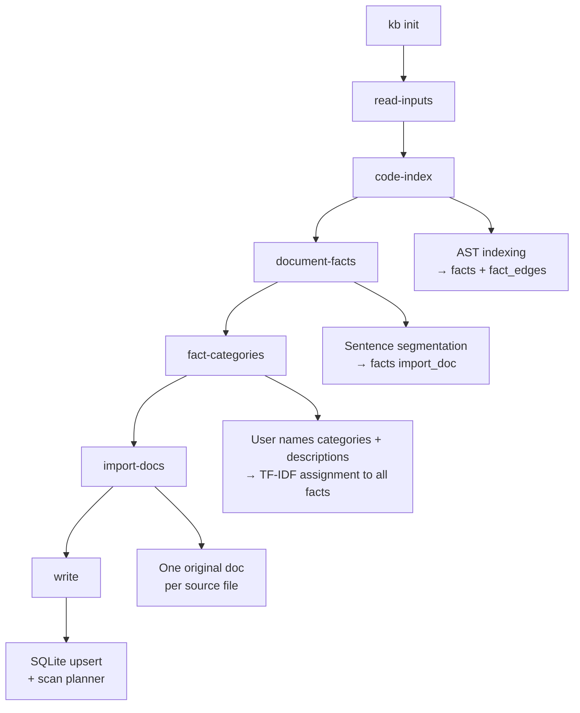

# KB Init Pipeline

`kb init` bootstraps a knowledge base from a repo. It runs **input collection** (README-like docs), **`code-index`** (deterministic AST indexing into `facts` + `fact_edges`), **`document-facts`** (sentence facts from markdown sources), **`fact-categories`** (interactive step: user defines named categories with descriptions, facts are then assigned via TF-IDF cosine similarity), **`import-docs`** (one verbatim original SQLite doc per discovered markdown file), and **`write`** (persist docs; with **`kb scan`** this stage also plans/applies claim mutations). Use **`kb scan`** to refresh sources against an existing base.

In the TUI, init/scan progress is rendered as a dedicated live status line instead of transcript history. Any phase that iterates over a collection of files, docs, facts, claims, or mutations emits incremental progress while that collection is being processed; only atomic operations stay start/finish-only. Progress lines include counts and, when useful, the current item. The long-running deterministic phases also yield cooperatively to the event loop between batches so the terminal can repaint and interrupts remain responsive during large scans.

## Input Collection

- `sourceFiles` — human-readable documentation files collected for **`import-docs`** (verbatim originals) and for **`document-facts`** / prompts.

## Init cycles

## Fact Categories

After `document-facts` (and AST `code-index`) have populated the facts table, `kb init` (interactive mode only, skipped on `kb scan`) prompts the user to define **fact categories** — named buckets that help organise retrieval.

**Flow:**

1. User enters a comma-separated list of category names (blank → skip).
2. The list is echoed back for review.
3. User types `/accept` or `/reject` (reject loops back to step 1).
4. On `/accept`, each category gets an optional description prompt — blank uses the default `"Facts about <name>"`.
5. Categories are saved to `fact_categories`; all facts are assigned via TF-IDF cosine similarity (`threshold = 0.3`) against each category's name + description text.

**Tables written:**

| Table | Content |
|---|---|
| `fact_categories` | id, name, description, status (`edited`), createdBy (`user`) |
| `fact_category_assignments` | fact_id → category_id with cosine similarity score |

**`kb scan` behaviour:** category prompting is skipped on rescan — categories defined at init time are preserved. Re-run `kb init` to redefine them.

**Future:** HDBSCAN-based auto-discovery (currently commented out in `src/cli/init-cli.ts`) will run before the manual step to suggest categories derived from the actual fact corpus.

## Jekyll Routing

After `kb publish jekyll`, documents are routed by provenance:

| `is_original` | Collection | Directory |
|---|---|---|
| `1` | `original_docs` | `_original_docs/` |
| `0` | `autogenerated_docs` | `_autogenerated_docs/` |

Originals are **frozen snapshots** of source files (we do not rewrite or “correct” them in the KB pipeline). Autogenerated docs are the **curated layer** we refine for retrieval and demos; they may overlap originals on purpose.

README.md is excluded from both — it is the site homepage (`docs/index.md`).

## Title Conventions

| Context | Rule | Example |
|---|---|---|
| Autogenerated docs | Cap Every Word (`toTitleCase`) | `"Project Overview"` |
| Original/source docs | Basename as-is (`basenameTitle`) | `"CLAUDE.md"` |
| Jekyll filenames | Slugified basename, no extension | `claude-instructions.md` |

## Facts extracted from written documents

When the init pipeline (or any path using **`SqliteDocumentWriter`**) persists markdown documents, the writer **indexes candidate facts** from document bodies (deterministic sentence segmentation, length filters, and capped inserts into the **`facts`** table). That is **incremental** fact growth alongside init; see **`facts-architecture.md`** §2 / §7 for the full ingest model.

## Code-derived facts (AST-only)

Source code facts come **only** from deterministic AST indexing (`TsMorphIndexer` + `TreeSitterIndexer`) during the **`code-index`** cycle. Supported languages get symbol facts and structural edges in `facts` / `fact_edges`. Languages without a wired WASM grammar are **not indexed** — there is no LLM fallback.

See **Language Support** below for the current AST matrix and the removed fallback list.

### Two indexers

| Indexer | Files | When it runs |
|---|---|---|
| `TsMorphIndexer` (`src/tools/code-graph-indexer.ts`) | `.ts`, `.tsx`, `.js`, `.jsx` | When `tsconfig.json` is found; uses the TypeScript compiler for type-aware analysis |
| `TreeSitterIndexer` (`src/tools/tree-sitter-indexer.ts`) | All other files | Always; uses WASM grammars via `web-tree-sitter` |

When both run (TS project with Go files), `TsMorphIndexer` runs first and produces richer TS data (type-aware import resolution, `EXTENDS`/`IMPLEMENTS` edges). `TreeSitterIndexer` then covers everything else and uses `ON CONFLICT DO UPDATE` so it never overwrites TsMorphIndexer's richer TS nodes.

### File handling by extension

`TreeSitterIndexer` uses an explicit **allowlist** — not a denylist:

- **AST-able** — extensions in `EXT_MAP` (`src/tools/tree-sitter-indexer.ts`): Go, TS/TSX, JS/JSX, Python, Rust, Ruby, Java, C/C++, C#, CSS, Bash, PHP, Scala, HTML, etc. → file node + symbol nodes + import/export edges where queries exist
- **Text/config** (`.md`, `.yaml`, `.json`, `.toml`, `.sql`, `.tf`, etc.) → file node only, `language='text'`, no symbols
- **Everything else** (images, binaries, lock files, compiled artifacts) → silently ignored

WASM grammars ship in `tree-sitter-*` npm packages — no native compilation, all platforms.

### What gets written

- **`facts`** (`source_kind='import_code'`) — one fact per exported symbol (`"Foo is a Class exported from src/foo.ts"`) with `source_text` set to the raw declaration (capped at 1500 chars)
- **`fact_edges`** — structural edges: `IMPORTS_FILE`, `EXPORTS_SYMBOL`, `EXTENDS`, `IMPLEMENTS`
- **`code_file_state`** — per-file content hash for incremental skip on re-run

### Incremental behaviour

Both indexers store a `content_hash` per file in `code_file_state`. On re-run (including `kb scan`), files whose hash hasn't changed are counted as `skipped` and not re-processed. Only changed or new files are re-indexed.

To keep the TUI responsive, the deterministic ingest/index loops yield back to the Node.js event loop between batches. That lets progress updates paint incrementally and gives `Ctrl-C` / terminal interrupts a chance to land between chunks instead of waiting for an entire repo walk to finish.

## Language Support

One pipeline indexes source code: **code-graph** (`TsMorphIndexer` / `TreeSitterIndexer`), deterministic AST-based.

| Language | Extensions | Code-graph (AST) |
|---|---|---|
| TypeScript | `.ts` `.tsx` `.mts` `.cts` | yes — TsMorphIndexer (type-aware) + TreeSitter |
| JavaScript | `.js` `.jsx` `.mjs` `.cjs` | yes — TsMorphIndexer + TreeSitter |
| Python | `.py` | yes |
| Go | `.go` | yes (uppercase-export convention) |
| Ruby | `.rb` | yes |
| Java | `.java` | yes |
| Rust | `.rs` | yes |
| C / C++ | `.c` `.h` `.cpp` `.cc` `.hpp` … | yes |
| C# | `.cs` | yes |
| PHP | `.php` | yes |
| Scala | `.scala` | yes |
| Bash | `.sh` `.bash` `.zsh` | yes |
| CSS | `.css` | yes (selectors) |
| HTML | `.html` `.htm` | yes (id elements) |
| Swift | `.swift` | **no** — no tree-sitter WASM grammar |
| Kotlin | `.kt` `.kts` | **no** — `tree-sitter-kotlin` is native-only |

Code-graph import/export edges: TS/JS have full import resolution; Go uses uppercase-initial convention; Python/Rust/Ruby/Java/C/C#/PHP/Scala/HTML extract exports but not imports (except Ruby `require` and PHP `require`/`include`).

**Text-only** (file node, no symbols): `.md`, `.yaml`, `.json`, `.toml`, `.sql`, `.tf`, `.proto`, `.graphql`, `.scss`, `.xml`, extensionless files (Makefile, Dockerfile).

**Ignored entirely**: images, binaries, lock files, compiled artifacts.

To add a language to code-graph: install `tree-sitter-<lang>`, add to `LANG_CONFIGS` + `EXT_MAP` in `src/tools/tree-sitter-indexer.ts`.

### Removed LLM code-facts fallback (historical)

Before removal, languages **without** AST support could be indexed via an LLM semantic pass (`code-fact-extract.ts`, prompt `code-fact-extract.md`). That path is **gone** — no AST module means the language is skipped.

**Languages actually crawled for LLM fallback** (allowlist `SOURCE_CODE_EXTENSIONS` in `init-cli.ts` at removal):

| Language | Extensions | Notes |
|---|---|---|
| Swift | `.swift` | No WASM tree-sitter grammar available |
| Kotlin | `.kt`, `.kts` | `tree-sitter-kotlin` has no WASM build |

**Not LLM-fallback targets** (despite labels in the extractor's internal `LANG_BY_EXT` map): TypeScript, JavaScript, Python, Go, Ruby, Java, Rust. Those extensions were excluded from the crawl because AST indexing already handled them — the LLM pass never ran on them in production.

**How the fallback worked:** `crawlSourceCode()` walked the repo for the extensions above (up to 200 files, 400 chars/file), then one LLM call per file produced `{ module_summary, facts[] }` rows as `source_kind='import_code'`. Incremental rescans tracked file hashes in `code-facts-manifest.json`.

## Configuration Constants

| Constant | Value | Purpose |
|---|---|---|
| `MAX_SOURCE_SIZE` | 20 000 chars | Per-file cap for documentation files |
| `INIT_SOURCE_SHARD_MAX_FILES` | (see code) | Max shards when expanding |
| `INIT_SOURCE_SHARD_MAX_CHARS` | 8 000 chars | Per-shard content cap |
