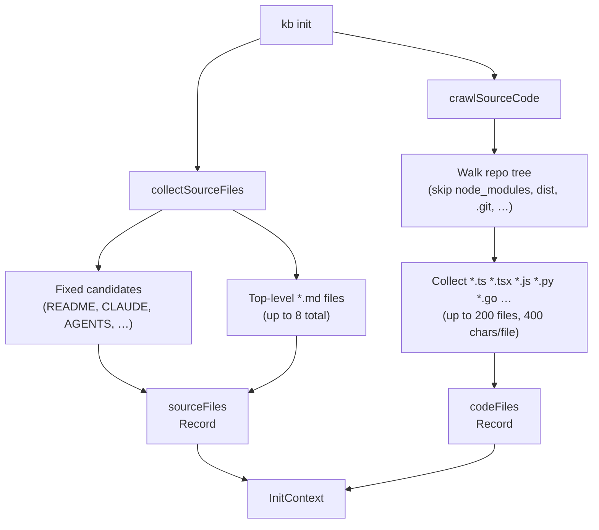
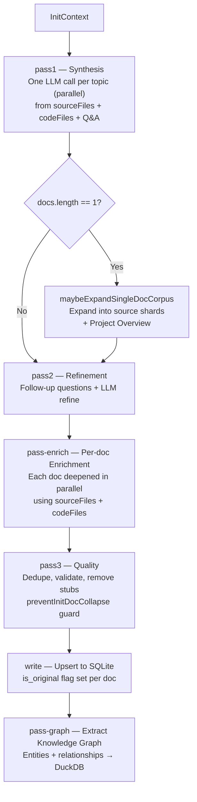
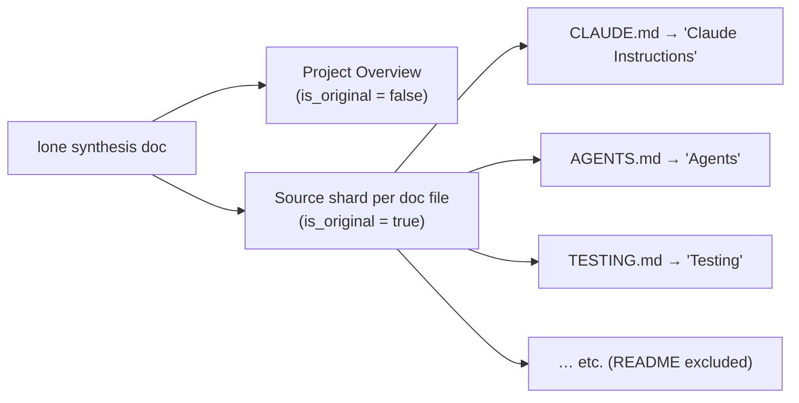

# KB Init Pipeline

`kb init` bootstraps a knowledge base from a repo. It runs in two phases: **input collection** (crawl docs + source code) and a **multi-pass LLM synthesis pipeline** that produces knowledge documents.

## Input Collection

- `sourceFiles` — human-readable documentation files. Become `is_original = 1` docs if the synthesis collapses to a single doc (see Shard Fallback below).
- `codeFiles` — structural index of source code. Fed into synthesis prompts so the LLM can reason about module layout, exports, and patterns.

## Synthesis Pipeline

## Shard Fallback

When pass1 produces exactly one synthesized document (common on small or tightly-scoped repos), `maybeExpandSingleDocCorpus` expands it:

Titles for source shards use `basenameTitle()` — the original filename, no path components.

## Jekyll Routing

After `kb publish jekyll`, documents are routed by provenance:

| `is_original` | Collection | Directory |
|---|---|---|
| `1` | `original_docs` | `_original_docs/` |
| `0` | `autogenerated_docs` | `_autogenerated_docs/` |

Originals are **frozen snapshots** of source files (we do not rewrite or “correct” them in the KB pipeline). Autogenerated docs are the **curated layer** we refine for retrieval and demos; they may overlap originals on purpose.

README.md is excluded from both — it is the site homepage (`docs/index.md`).

## Title Conventions

| Context | Rule | Example |
|---|---|---|
| Autogenerated docs | Cap Every Word (`toTitleCase`) | `"Project Overview"` |
| Original/source docs | Basename as-is (`basenameTitle`) | `"CLAUDE.md"` |
| Jekyll filenames | Slugified basename, no extension | `claude-instructions.md` |

## Collapse Prevention

`preventInitDocCollapse(previous, next)` guards both pass2 and pass3: if the LLM returns 1 doc when it received N > 1, the previous corpus is kept. This prevents accidental consolidation in the refinement and quality passes.

## Configuration Constants

| Constant | Value | Purpose |
|---|---|---|
| `MAX_SOURCE_SIZE` | 20 000 chars | Per-file cap for documentation files |
| `SOURCE_CODE_PER_FILE_CHARS` | 400 chars | Per-file snippet length for code crawl |
| `SOURCE_CODE_MAX_FILES` | 200 | Max source files indexed |
| `SOURCE_CODE_MAX_TOTAL_CHARS` | 60 000 chars | Total code index budget |
| `INIT_SOURCE_SHARD_MAX_FILES` | (see code) | Max shards when expanding |
| `INIT_SOURCE_SHARD_MAX_CHARS` | 8 000 chars | Per-shard content cap |
