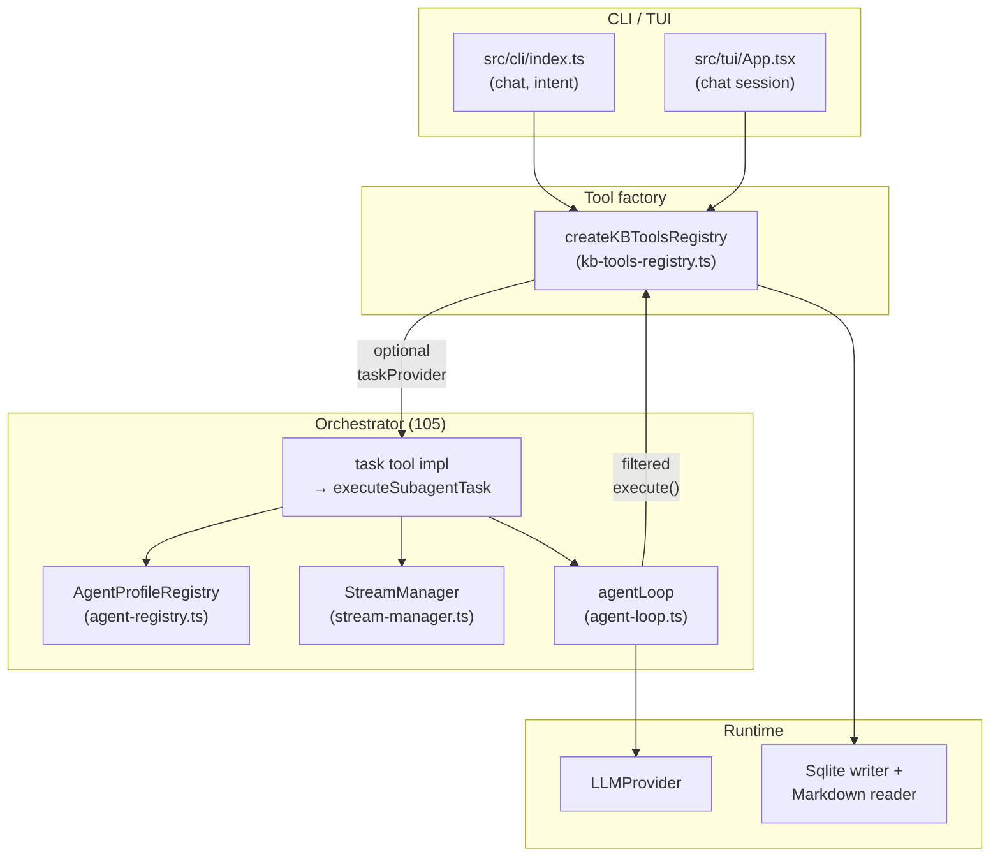
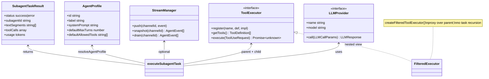
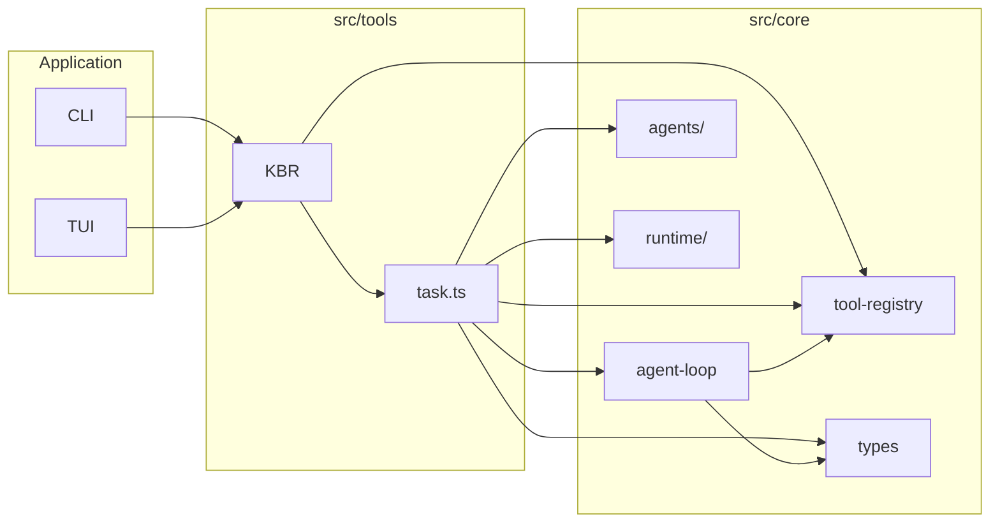

# Subagent orchestrator (Ticket 105)

In-repo architecture notes for the boss/worker **task** tool, nested **`agentLoop`**, and related types. **Mermaid diagrams** below are the primary UML-style views; keep them in sync when behavior changes.

**Source entrypoints**

- `src/tools/task.ts` — `executeSubagentTask`
- `src/tools/kb-tools-registry.ts` — registers `task` when `taskProvider` is passed
- `src/core/agent-loop.ts` — parent and nested loops
- `src/core/agents/agent-registry.ts` — worker profiles
- `src/core/runtime/stream-manager.ts` — optional event fan-in
- `src/core/types.ts` — `SubagentTaskSpec`, `SubagentTaskResult`, `AgentEvent`

---

## Component diagram (deployment view)

High-level placement: CLI/TUI builds a tool registry; when an LLM is available, the **`task`** tool is registered so any future autonomous loop can delegate work.



---

## Class diagram (structural)



---

## Sequence diagram (happy path: one delegated read)

```mermaid
sequenceDiagram
  autonumber
  participant P as Parent harness\n(agentLoop / future MCP)
  participant T as task tool\n(registry.execute)
  participant E as executeSubagentTask
  participant R as Agent profiles\n(resolveAgentProfile)
  participant F as Filtered ToolExecutor
  participant A as agentLoop
  participant L as LLMProvider
  participant B as Parent registry\n(read_documents, …)

  P->>T: ToolUse task { prompt, agent_profile_id?, … }
  T->>E: executeSubagentTask(parentRegistry, provider, input)
  E->>R: resolve profile + allowed tool names
  E->>F: wrap parent; strip task
  E->>A: agentLoop(prompt, provider, F, config)
  A->>L: call(messages, tools, systemPrompt)
  L-->>A: tool_use read_documents
  A->>F: execute(read_documents)
  F->>B: execute(same request)
  B-->>F: doc payload
  F-->>A: result
  A->>L: next turn (tool results in history)
  L-->>A: end_turn + summary text
  A-->>E: AgentEvent stream
  E-->>T: SubagentTaskResult
  T-->>P: tool_result JSON
```

---

## State diagram (`agentLoop` single turn)

One turn: call model → if tools, emit all `tool_start` → run tools (parallel by default) → emit `tool_result` each → append history → loop unless done.

```mermaid
stateDiagram-v2
  [*] --> TurnStart: userQuery / continued thread

  state TurnStart {
    [*] --> CallModel
    CallModel --> NoTools: response has no tool_uses
    CallModel --> EmitStarts: has tool_uses
    EmitStarts --> RunTools: yield tool_start each
    RunTools --> EmitResults: Promise.all or sequential
    EmitResults --> AppendHistory: yield tool_result each
    AppendHistory --> TurnStart: turnCount < maxTurns
    NoTools --> DoneNoTools: yield done
    DoneNoTools --> [*]
    AppendHistory --> MaxTurns: turnCount >= maxTurns
    MaxTurns --> DoneMax: yield done
    DoneMax --> [*]
  }
```

---

## Package / module dependency (layering)



---

## Notes

- **Isolation**: v1 uses a **forked message thread** and **shared storage**; nested `~/.kb/sessions/.../subagents/...` on-disk forks are not implemented here.
- **Rescan apply strategy**: Incremental `kb init --rescan` reconciliation strategy (claim extraction, evidence checks, mutation planning, apply/verify) is documented in ticket `108` at `tickets/linear/108-rescan-apply-orchestrator.md`.
- **Plan preview diffs**: Rescan plan output uses shared unified-diff helpers in `src/core/git-diff-preview.ts` so preview rendering is reusable by other orchestrators.

---

## Eval scenarios (Ticket 106)

Optional env for nested `task` / `agentLoop` A/B (does not change KB storage `--base` flags):

| `KB_SUBAGENT_SCENARIO` | Effect |
| ---------------------- | ------ |
| *(unset)* or any other value | Normal subagent loop: parallel tool calls; `agent_profile_id` or worker **`default`** profile. |
| `s1` | Sequential execution of tools returned in a single assistant turn. |
| `s2` | Hard cap of **3** `agentLoop` turns for this subagent run (after `max_turns` clamp 1–20). |
| `s3` | If `agent_profile_id` is omitted, default to the **`research`** profile. |

Implementation: `src/tools/subagent-eval-scenario.ts` and `executeSubagentTask` in `src/tools/task.ts`.

**Matrix artifact:** `WRITE_ORCHESTRATOR_MATRIX=1 npx vitest run tests/tools/subagent-scenario-matrix.test.ts` writes `evaluation/runs/<date>-orchestrator-scenario-matrix.json` (three rows `s1`–`s3`).

**`eval:kb-proper`:** still the path for init + `kb query` artifacts under `evaluation/runs/` (see `EVALUATION.md`). That flow does not call `task` today. The matrix above is only subagent loop tuning.
