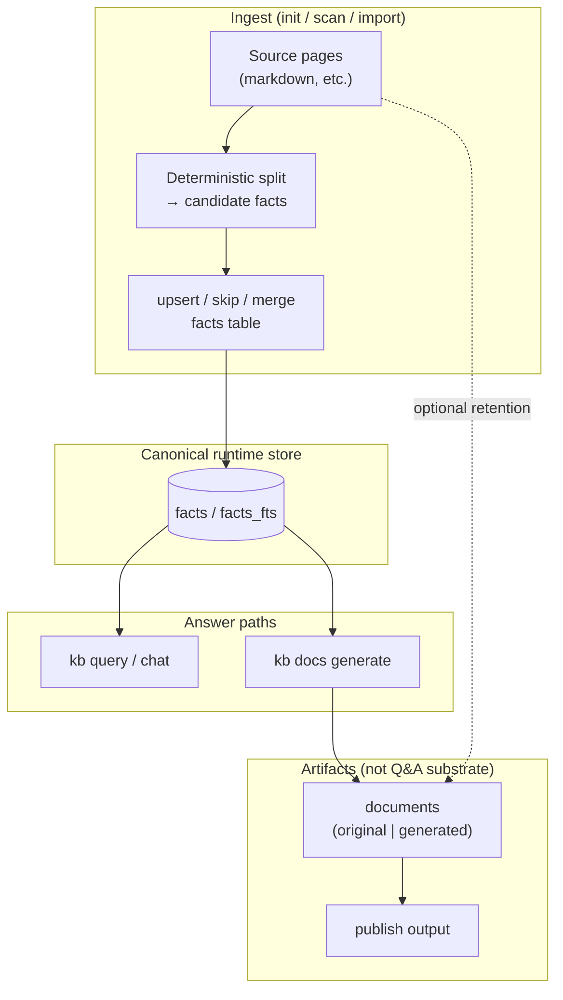

# Facts-first KB architecture

**Contract:** the KB answers questions and drives authoring from **atomic facts** in the `facts` store. **Markdown documents are not a retrieval substrate for Q&A.** They exist as human-readable artifacts: originals (with facts extracted from them) or generated synthesis, and they matter most at **publish** time.

This is the platform mental model for `kb query`, `kb docs generate`, ingest (`kb init` / rescan paths), and `kb publish`.

---

## 1. Facts are the only “live” knowledge for answering

| Surface | Role |
|--------|------|
| **`facts` / `facts_fts`** | Canonical store for retrieval, dedupe keys (`normalized_text`), provenance (`source_kind`, `source_ref`), tombstones, lanes. |
| **`kb query` / chat** | **Target:** form answers **only** from retrieved facts (plus optional graph over fact-linked entities)—not from full document bodies as evidence. |
| **`kb docs generate`** | **Target:** generate documents **from facts** (questionnaire + LLM shaping), cite facts; documents are outputs, not inputs to retrieval. |

---

## 2. Ingest: init / scan → facts, not “index pages for hybrid search”

**Target pipeline** when reading source pages (README, docs, crawled markdown, etc.):

1. **Deterministic segmentation** — walk the page in order; each sentence or paragraph (configurable grain) becomes a **candidate fact** text.
2. **Upsert policy** — for each candidate:
   - if **no** existing fact matches (normalized text / fuzzy policy TBD): **insert**;
   - if **duplicate**: **skip**;
   - if **mergeable** with an existing fact (same claim, tighter wording): **merge / update** the row (preserve lineage where the schema allows).
3. **Original documents** may still be stored for audit and publish, but **truth for automation** is the fact rows extracted from them.

`kb submit` / `upsert_fact` remain the interactive escape hatch for humans and agents; ingest should converge on the same store.

---

## 3. Documents: two kinds, publish-facing

| Kind | Meaning |
|------|---------|
| **Original** | Authored or imported markdown representing source material; facts were (or will be) **extracted** from it. |
| **Generated** | Produced by tools such as **`kb docs generate`** (or init synthesis outputs treated as generated docs), grounded in facts + prompts. |

**Neither kind is used directly** to answer ad-hoc questions in the target architecture. Readers see them on **publish** (static site, export, “view doc”), not as chunks inside `read_documents` for chat.

---

## 4. End-to-end (target) data flow

---

## 5. `kb docs generate` in this model

- **Inputs:** user prompt, questionnaire, optional chat transcript, **retrieved facts** for the session (by query built from prompt + answers).
- **Output:** a **generated** document; footer references fact ids.
- **Not in scope:** pulling markdown document chunks into the draft model as “evidence” (that would contradict facts-only retrieval).

The current orchestrator still uses an LLM pass **before** attaching a fact-backed `## References` section; tightening to “facts-in-prompt first” is an implementation step on this architecture, not a different product direction.

---

## 6. Alignment with **this repository** (today)

Honest deltas so implementers are not misled:

| Area | Target (above) | **Current code (approx.)** |
|------|------------------|-----------------------------|
| **`kb query` / chat` (default tool registry)** | Facts-only retrieval | **`createKBToolsRegistry`** wires **`read_documents`** → **`FactsDocumentReader`**, which uses **`searchFacts`** (+ concept frontier / semantic scores in **`FactsQueryResearchOrchestrator`** for `discoveryDepth: deep`). So the *primary* payload is already fact-shaped, though the tool name/schema still say “documents”. **Gaps:** **`augmentIntentResultWithWorkspaceFallback`** can append **raw workspace markdown** snippets; **`QueryResearchOrchestrator`** / **`MarkdownDocumentReader`** still exist for other / legacy paths—audit callers. |
| **`kb docs generate`** | Body grounded on facts | Draft/revise LLM sees **prompt + answers + transcript**; **`searchFacts`** runs **after** the body to build **`## References`**, not as the primary grounding bundle for the whole draft. |
| **`kb init`** | Sentence/paragraph → deterministic fact upsert | **Multi-pass LLM synthesis** writes **documents** to SQLite (`INIT.md`); not the deterministic per-sentence fact pipeline described in §2. |
| **Publish** | Docs for humans | Matches intent: publish reads stored documents. |

Closing the remaining gaps means: **no markdown evidence in Q&A** (remove or gate workspace fallback; retire document reader from query surfaces), **fact bundles in docgen LLM prompts**, **deterministic ingest** alongside or instead of synthesis docs, and **naming/schema/docs** that say “facts” where we mean facts.

---

## 7. Code roadmap (make the architecture “gold”)

Workstreams below can land in parallel after a short **inventory** commit (grep for `MarkdownDocumentReader`, `QueryResearchOrchestrator`, `augmentReadDocumentsWithWorkspaceFallback`, `includeContent`, eval fixtures). Order is dependency-aware but not strictly serial.

### Phase A — Query / chat: facts-only, honest surfaces

1. **Policy** — Define `KB_QUERY_EVIDENCE=facts` (default) vs legacy escape hatch if ever needed; chat + CLI both respect it.
2. **Workspace fallback** — Either **remove** `augmentIntentResultWithWorkspaceFallback` for query/chat, **replace** with “read files → segment → ephemeral fact candidates” (still stored only if user confirms), or **gate** behind an explicit `--workspace-context` flag default off.
3. **Retrieval metadata** — Unify `read_documents` response shape for facts: stable **`checkpoints` / confidence** for chat refusal (`shouldRefuseChatTurnOnRetrieval`) so behavior matches facts orchestrator, not markdown-era fields.
4. **Rename / alias tool** — Introduce **`read_facts`** (or rename in registry) with schema that matches fact query modes; keep thin **`read_documents`** shim for agents only if required, documented as deprecated.
5. **Prompts + UI copy** — `chat-system.md`, `sources>` lines, help text: “fact ids / fact URIs”, not “document” where the hit is a fact row.
6. **Tests** — Replace fixtures that assume long markdown bodies; assert fact id citations and refusal on empty/low-confidence fact retrieval.

### Phase B — `kb docs generate`: facts before and during draft

1. **Shared retrieval helper** — One function: `buildDocgenFactContext(session, limit)` = same query string as today’s `buildFactSearchQuery` + `searchFacts` / optional deep facts loop; returns capped text block for LLM.
2. **Orchestrator** — Call helper **before** `draftDocumentBody` and `draftDocumentRevision`; inject **“Retrieved facts (ground truth)”** into user payload; system prompts (`doc-draft-system.md`, `doc-edit-system.md`) require answers to cite only those facts unless questionnaire explicitly allows general knowledge.
3. **Footer** — Keep `## References` for ids; optional dedupe if facts already quoted verbatim in body.
4. **Empty / weak facts** — Product decision: refuse finalize, warn-only, or allow with explicit “ungrounded” banner; implement one policy consistently with chat refusal thresholds.
5. **Tests** — Orchestrator mocks assert fact block present in LLM user messages for initial + revision.

### Phase C — Ingest: deterministic facts from pages

1. **Segmenter** — Pure function: markdown → ordered sentences/paragraphs; config `KB_INGEST_SEGMENT=sentence|paragraph`.
2. **Upsert pipeline** — For each segment: normalize → `indexer.upsertFact` or skip-on-duplicate; `source_kind: import_doc`, `source_ref: path#line` or chunk hash; batch in transaction.
3. **CLI surface** — `kb scan` (or `kb init --extract-facts`) running over `sourceFiles` / rescan targets without LLM synthesis; idempotent reruns.
4. **`kb init` integration** — Option A: new early phase **before** synthesis that fills facts table from collected markdown; Option B: long-term replace pass1 synthesis with scan + light outline LLM only. Pick A first for lower risk.
5. **Backfill** — Document one-shot migration for existing bases: run scan over stored original docs.

### Phase D — Documents as artifacts only

1. **Schema / flags** — Ensure `is_original` (or equivalent) distinguishes originals vs generated; tag `docs-generate` already; align publish filters if needed.
2. **Browse vs answer** — `kb docs list/view` remain for humans; **no** automatic document fetch in query path once Phases A–B complete.
3. **Dead code removal** — After callers gone: shrink or delete **`MarkdownDocumentReader`** from query paths; keep only if publish / merge / specialized tools need it.

### Phase E — Docs, eval, dogfood

1. Update **`INIT.md`**, **`CHAT.md` / `AGENT_LOOP.md`**, **`EVALUATION.md`**, **`kb-tools-registry` header comment** to match post-migration reality.
2. Refresh **`facts-architecture.md` §6** after each phase (table should shrink to “done”).
3. **`kb submit`** dogfood entries for architectural decisions per repo rules.

### Exit criteria (“gold”)

- Default **`kb query` / chat** evidence path never injects raw repo markdown unless an explicit opt-in flag is set.
- **Docgen** LLM user messages always include a **retrieved-facts** section when the session is ready to draft; references footer stays consistent.
- **Ingest** can populate **`facts`** deterministically from markdown sources; **`kb init`** documents how synthesis and scan interact.
- Tests + eval harness green; no misleading “document retrieval” wording on the facts-only path.
